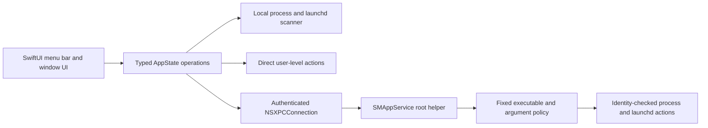

# Milo Public Preview handoff

This document is the operational handoff for the next agent working in this checkout. Read it before changing code or exercising privileged actions.

## 0. Document map

**This file is the single source of truth for project state.** If another document disagrees with
it, this one wins and the other is stale. Three documents support it; nothing else carries state.

| Document | Answers | Update when |
|---|---|---|
| `HANDOFF.md` (this file) | What is built, installed, verified, unfinished, and next — **right now** | Any session that changes verified state |
| `docs/decisions/` | **Why** a consequential choice was made and what it obligates | A decision constrains future work or leaves a known inconsistency |
| `CHANGELOG.md` | What shipped, per release | Any user-visible or release-affecting change |
| `README.md` | Public-facing product, install, and limitation guide | The product's public story changes |

`docs/archive/` holds superseded planning material (`July27plan.md`, the GPT-5 audit report). It is
gitignored, local-only, and **not instructions**. Read it for history; never treat it as the plan.

Starting a new session: read `CLAUDE.md`, then this file top to bottom, then
`docs/decisions/README.md`. Re-verify section 2 rather than trusting it — it is a snapshot and it
goes stale.

Before claiming anything is done, check section 11 ("What is intentionally not complete"), section
18 ("Next"), and the "Required external actions" of any decision record marked incomplete.

### Checkpoint: 2026-08-05

Milo **0.2.0-preview.2**, the first build under the gonggong name: a working local macOS menu bar
process manager, Apple Development signed, not notarized, no backend, no licensing, no paid users.

**Where things stand.** `0.2.0-preview.2` is **published** — a GitHub prerelease at `f2706e7`, build
`22`, DMG plus checksum sidecar attached. It is the first Milo release to clear the full section 19
live smoke check end to end, including the GUI steps. Evidence is in section 10. The rebrand (#26),
the verification checkpoint (#27), open discovery and uninstall (#28), the release re-cut (#29), and
the release-gate fix (#30) are all merged. Nothing is in review.

Open discovery and uninstall — the two items earlier checkpoints listed as open — are shipped.

**Merged since publication:** stale-helper detection (#32). Milo now measures whether the helper
answering it is the helper in its own bundle, and offers a password-free Restart Helper when it is
not. This closes the automated-detection gap the preview.2 release opened by observation. Measured
evidence, and the one path still unproven (Restart Helper's recovery, which needs a disposable VM),
are in section 10.

**Unreleased.** This is in `main`, not in any published build. The installed `/Applications/Milo.app`
is build `22` and predates it, so the feature cannot be demonstrated from the installed app — build
from `main`, or cut the next preview, before trying to see it work.

**Three things this release taught, all recorded because they will recur:**

1. **A prepared tag is not a correct tag.** The original `v0.2.0-preview.2` pointed at `08a799a`,
   which predates #28, while this file instructed the reader to publish it with "nothing else blocks
   it". That would have shipped a release whose own changelog described discovery and uninstall under
   "Unreleased" while the build contained neither. Re-cutting was safe only because the tag had never
   been pushed. **Do not rewrite a published tag.**
2. **The build number moved 21 → 22, and `Tools/release.sh` would not have caught it.** Its gate
   compares only against tags, so deleting the superseded tag would have let build 21 through a
   second time — but build 21 already existed as a DMG installed on this host, and section 10 carries
   evidence against "0.2.0 (`21`)". A marketing version may be re-cut before publication; a build
   number that has actually been built should not be.
3. **A release gate keyed to an exact pass count fails on good news.** `release.sh` demanded
   `6 passed, 0 failed` and aborted the cut when the suite had grown to 12. Fixed in #30: zero
   failures plus a minimum count, so additions pass and disappearances still block.

**The discovery design question is settled, not open.** Earlier checkpoints recorded it as an
unhad conversation. `b80b2b1` answered it: visibility and actionability are now separate concerns.
Everything on the process table is listed; what Milo may signal is decided from measured evidence —
kernel-reported pid and effective uid, the `anchor apple` code requirement, and the owning launchd
label — never from a display name. The policy is pure and lives in
`Packages/MiloKit/Sources/MiloDomain/ProcessSafetyPolicy.swift`, so the root helper enforces the
critical-service refusal from the same source rather than a copy. See section 7 for the invariant and
section 10 for the live evidence.

**Local environment caveats for anyone reading live results:** SIP is **disabled** on this host, so
it is not representative for validating System Tuning recipes. There is no durable local rollback
target; rebuild from a tag if one is needed. And after any install, confirm the running root helper
is not older than the bundle before trusting a helper observation — see section 10.

## 1. Mission and current boundary

The immediate product is an interview-ready **Public Preview** of Milo: a local-first macOS menu bar utility that scans for selected background processes and launch items, lets the user terminate chosen targets, reports CPU and memory usage, and exposes reviewed system-tuning actions.

The Public Preview deliberately unlocks the local Pro feature set without accounts, Paddle, Supabase, production licensing, or network updates. It must never be presented as the commercial release. The deferred commercial and public-distribution work is explicit in section 18 ("Next") below.

Non-negotiable engineering rules from the project agent directives still apply:

- no force unwraps, `try?`, or forced casts;
- no silent errors or undefined UI states;
- strict SwiftLint must pass;
- never print, request, stage, or expose ignored secrets;
- preserve macOS 13 compatibility unless the user explicitly changes the supported platform;
- do not treat compilation, a local launch, or this host's Gatekeeper state as public-release evidence;
- do not broaden a command allowlist or process match to make a failing test pass;
- when uncertain about a consequential change, stop and ask the user.

## 2. Exact repository and remote state

This table was re-verified on 2026-08-05. Confirm it again rather than trusting it.

| Item | Current value |
|---|---|
| Repository | `/Volumes/Internal HD/Developer/Milo` |
| Branch | `main` |
| Upstream | `main` in sync with `origin/main` |
| HEAD | `32a23fd`, the stale-helper detection merge. The published tag `v0.2.0-preview.2` is at `f2706e7`; HEAD is ahead of it by design, and **the installed `/Applications/Milo.app` (build `22`) predates stale-helper detection** — it cannot exercise the feature |
| Main implementation commit | `11e9caf feat: ship Milo Public Preview (#9)` |
| Preview delivery pull request | `#9 feat: ship Milo Public Preview`, **merged**; branch `fable/milo-test` no longer exists on `origin` |
| Later merged work | `#10` copyright terms, `#11` changelog, `#12` security policy, `#24` Public Preview rename, `#25` version scheme `0.2.0`, `#26` gonggong rebrand and single source of truth, `#27` preview.2 live-verification checkpoint, `#28` open discovery and uninstall, `#29` the preview.2 re-cut, `#30` release smoke-gate fix, `#31` the published-preview.2 record, `#32` stale-helper detection |
| Open pull request | None. `#27` and `#28` merged 2026-08-04; `#29`, `#30`, `#31` and `#32` merged 2026-08-05 |
| Published release | **`v0.2.0-preview.2`, published 2026-08-05** as a prerelease at `f2706e7`, build `22`, DMG SHA-256 `7d3e9dd9…88e6e91`. `v0.2.0-preview.1` remains published. The superseded preview.2 tag at `08a799a` (build `21`) was re-cut before publication and never pushed |
| Remotes | `origin` → `https://github.com/burakoskay/Milo.git`, the only remote. The `gitlab` mirror and its scheduled `--mirror` workflow were retired on 2026-08-04 (decision 0004); there is no off-GitHub copy |
| Tags | `origin` carries `v0.2.0-preview.1` and `v0.2.0-preview.2`. The local-only `v2.0.0-preview.1` was deleted on 2026-08-04: it recorded build `200` under the discarded numbering scheme, which would have permanently blocked the build-number check in `Tools/release.sh` |
| Repository visibility | Public |
| Release process | `Tools/release.sh`, section 19. Branch and PR for every change; never commit to `main` directly |

No PR is open. Open a new branch and PR for the next slice; never commit to `main` directly.

### Company rename

The company is now **gonggong** on **gonggong.tech**. Bundle identifiers, the helper mach service and
launchd plist, Keychain service names, the device-key tag, and the production origin all moved. The
rename is complete in this repository and verified.

Two external actions remain and block a **production** build only; the Preview builds and passes
today without them:

1. Apple Developer portal App IDs for `com.gonggong.milo` (with Sign in with Apple).
2. MLP endpoints and the appcast served from `gonggong.tech`.

A few `monomacaw` strings survive on purpose: the signed MLP-v1 golden fixture (the string is inside
signed material), the MLP protocol name, and historical changelog entries. No GitHub secret needs
renaming — every `MONOMACAW_*` secret and variable is now unreferenced and can simply be deleted. `docs/decisions/0001-rename-monomacaw-to-gonggong.md` lists each and why. Do not "finish the
rename" by grepping and replacing them.

## 3. Host and toolchain snapshot

The verified host is:

- macOS 27.0 Developer Beta 4, build `26A5388g`;
- Apple silicon (`arm64`);
- Xcode 27.0 beta, build `27A5228h`, at `/Applications/Xcode-beta.app`;
- Swift 6.4 (`swiftlang-6.4.0.27.1`);
- macOS 27 SDK;
- Sparkle pinned to 2.9.4, revision `b6496a74a087257ef5e6da1c5b29a447a60f5bd7`.

The global developer directory may select standalone Command Line Tools. Always set:

```bash
export DEVELOPER_DIR=/Applications/Xcode-beta.app/Contents/Developer
```

Without that override, SwiftLint can fail loading SourceKit and SwiftPM can fail resolving XCTest even though the project is valid.

Xcode 27 beta can emit an internal `DVTAssertions` warning about `IDELaunchSession` when running tests. The verified Milo test run still exited successfully; distinguish that Xcode beta diagnostic from Milo compiler warnings.

## 4. Delivered Public Preview

The completed preview slice includes:

- a distinct `Preview` Xcode configuration;
- bundle identifier `com.gonggong.milo.preview`;
- visible **Public Preview** labeling;
- local Pro access with no backend, payment, or account gate;
- preview update checks disabled;
- process scanning with CPU and memory measurements;
- locally available static/signed process rules;
- launch-item inspection and controls;
- process whitelist and local statistics;
- menu bar and dedicated-window presentation;
- DNS flush and memory purge through the privileged boundary;
- risk-labeled System Tuning with confirmation for consequential actions;
- broad user-cache deletion hidden until it can be redesigned safely;
- a reproducible signed preview DMG;
- a presentation README.

The old `sudoers` and AppleScript administrator-prompt paths were removed. There is no credential-prompt fallback.

## 5. Installed application state

The verified preview is installed at:

```text
/Applications/Milo.app
```

Installed identity, verified 2026-08-05 after installing the published `0.2.0-preview.2` DMG:

- version `0.2.0` (`22`);
- bundle `com.gonggong.milo.preview`;
- thin Apple-silicon binary;
- Apple Development signed;
- Team ID `8N738727QB`;
- hardened runtime enabled;
- runtime built against macOS 27.

**This matches HEAD.** The pre-rebrand `2.0.0` (`200`) bundle and the ad-hoc legacy backup were both
deleted from `/Applications`.

A drifted install is worthless as evidence, and this project has already been burned by it: the
`2.0.0` bundle sat in `/Applications` for eight days while `main` moved on, and its UI was mistaken
for a labelling regression that had in fact been fixed two PRs earlier. Reinstall before treating
anything observed in `/Applications/Milo.app` as evidence about HEAD.

The pre-rebrand bundle and the ad-hoc `Milo-legacy-backup-2026-07-26.app` were both deleted on
2026-08-04. The superseded build `21` bundle was moved out of `/Applications` rather than deleted
when `22` was installed, but it sits under `/private/tmp`, which macOS clears — treat it as gone.
There is no durable local rollback target; rebuild from a tag if one is needed.

The preview was not running when this handoff was written. Launch it with:

```bash
open -na /Applications/Milo.app
```

Confirm the exact installed process without matching unrelated Milo processes:

```bash
pgrep -fal '^/Applications/Milo.app/Contents/MacOS/Milo$'
```

## 6. Artifact state

The locally packaged artifact is:

```text
/Volumes/Internal HD/Developer/Milo/dist/Milo-Public-Preview.dmg
```

Its SHA-256 is recorded beside it, written by the build that produced it:

```text
/Volumes/Internal HD/Developer/Milo/dist/Milo-Public-Preview.dmg.sha256
```

```bash
shasum -a 256 -c dist/Milo-Public-Preview.dmg.sha256
```

No DMG hash is transcribed into this document, because none of them survive a rebuild. Two builds
of `fd6b7d3` on 2026-08-04 produced `86972f70…` and `44ac31be…`, and the published
`v0.2.0-preview.1` asset from the same commit is `c4742deb…`. Signing is not byte-reproducible
here, so a DMG hash identifies one specific build and never a commit. Verify a downloaded artifact
against the hash published with that artifact.

`dist/Milo-Development-Preview.dmg` is an abandoned pre-rename artifact from 2026-07-27 and is not
produced by any current script; ignore it or delete it.

`build/` and `dist/` are local artifact directories and are intentionally not committed. Rebuild the artifact rather than assuming it still corresponds to HEAD after any source change.

The canonical command is:

```bash
Tools/build-development-preview.sh
```

That script performs a clean Preview build, checks app/helper signatures and exact identifiers, runs the six-check deterministic packaged-app smoke suite, creates the DMG with the nondeprecated macOS 27 `diskutil image create` path, verifies the image checksum, and then writes and re-verifies the `dist/Milo-Public-Preview.dmg.sha256` sidecar for the image it just produced.

Until 2026-08-04 the script rewrote the DMG without rewriting that sidecar, so a rebuild left a
checksum file asserting the previous build's hash. Keep the sidecar generated by the same run that
produced the image.

## 7. Architecture and security boundaries

### Application flow



### Process-signal safety

Every target action carries a `ProcessIdentity` containing:

- PID;
- absolute executable path;
- kernel process-start seconds;
- kernel process-start microseconds.

The app revalidates that identity immediately before TERM and again before KILL. The helper independently repeats the validation before each privileged signal. A gone process is success; a changed or unreadable identity is a failure and receives no signal. Do not weaken this to PID-only logic.

### Privileged helper

Key properties:

- registered as an embedded `SMAppService.daemon`;
- service identifier `com.gonggong.milo.helper`;
- exact Team ID and signing-identifier checks in both directions;
- client must be the signed preview/production Milo app and must not be root;
- helper commands use direct argv execution, never a shell;
- fixed executable and argument grammar;
- bounded request size, output, deadline, and cleanup;
- registration is initiated only by the user's **Enable** action;
- no automatic registration loop;
- no recurring AppleScript/sudo password fallback;
- UI distinguishes not registered, approval required, enabled, and unavailable.

Service Management evidence measured on this host on 2026-08-04, after installing
`0.2.0-preview.2`:

- `launchctl` reports `system/com.gonggong.milo.helper` submitted by Service Management;
- parent bundle is `com.gonggong.milo.preview`, version `21`;
- `runs = 1`, `state = running`, `last exit code = (never exited)`.

**The privileged path is now proven end to end.** A DNS/memory-purge action launched the helper,
which accepted the XPC connection and executed the command as root under the new identifiers. This
is the first time that path has been exercised in this project, and it is the one failure mode no
headless check can reach: if the requirement strings in `PrivilegedHelperClient.swift`, the helper's
`main.swift`, and `Integrity.c` disagreed, the connection would be refused at click time rather than
failing the build.

A subsequent user-level termination left `runs = 1` untouched, confirming ordinary kills do not
cross the privilege boundary.

### Orphaned helper hazard, observed

Deleting `Milo.app` does **not** unregister its helper. `SMAppService` records live in macOS's
Background Task Management database, not in the bundle. On 2026-08-04 the pre-rebrand app was
deleted while its helper was registered, leaving `com.monomacaw.milo.helper` registered *and running
as root* with its executable already unlinked, and no in-app route to remove it. It was cleared via
System Settings > General > Login Items & Extensions (`sudo launchctl bootout system/<id>` is the
fallback; never `sfltool resetbtm`, which resets background items for every app on the machine).

**Milo now has an uninstall flow** (Settings > Uninstall, `UninstallManager.swift`). It unregisters
the helper *before* removing any file, so a partial failure can never leave a running root daemon
whose owning app has been dismantled, and it declines to move the bundle to the Trash at all if the
unregistration failed. Files are removed against an exact-path allowlist generated from an explicit
identifier table in `MiloUninstallPlan`, never a pattern match — the developer's own machine carries
`com.monomacaw.picoberry.prototype` and `com.monomacaw.squeaky.preview` from unrelated products, and
a vendor-name match would have destroyed both.

What Milo still cannot do is unregister a helper belonging to a *different* bundle identifier;
`SMAppService` only ever acts on the calling app's own records. Those are detected with a read-only
`launchctl print system/<id>` and reported with recovery steps instead.

### Runtime integrity

The previous self-referential executable hash was removed because it could not be embedded without changing the file being hashed and caused false compromise state. Runtime integrity now relies on Apple's code-signature validation against:

- Team ID `8N738727QB`; and
- bundle identifier `com.gonggong.milo` or `com.gonggong.milo.preview`.

The deterministic packaged-app smoke suite exercises the positive runtime-signature path. Public release work still needs a deliberate negative tamper test plus Developer ID/notarization validation.

## 8. Permission behavior the user cares about

The user's strongest usability complaint was repeated macOS permission/password prompts. Preserve this behavior:

1. Scanning and ordinary user-level actions work without helper approval.
2. Root-level actions show the helper banner.
3. The user clicks **Enable** once.
4. If macOS requires approval, Milo opens Login Items & Extensions and reports `requiresApproval`.
5. Milo refreshes status when its UI opens.
6. A denied or unavailable helper produces an actionable failure; it does not retry registration or ask for a password on every action.

Apple owns the final Background Items approval. Milo must not simulate, bypass, or auto-click it.

## 9. Key source map

| Path | Responsibility |
|---|---|
| `App/Milo/Runtime/DevelopmentPreview.swift` | Compile-time Preview identity |
| `Configurations/MiloPro.Preview.xcconfig` | Preview bundle/environment with empty backend and update keys |
| `Configurations/MiloPrivilegedHelper.Preview.xcconfig` | Preview helper configuration |
| `App/Milo/MiloPreview.entitlements` | Minimal preview entitlement surface |
| `App/Milo/Runtime/LicenseManager.swift` | Local preview license snapshot and production licensing boundary |
| `App/Milo/Runtime/MiloUpdateManager.swift` | Preview update disablement |
| `App/Milo/Runtime/PrivilegeManager.swift` | `SMAppService` registration/status state machine |
| `App/Milo/Runtime/PrivilegedHelperClient.swift` | Authenticated, bounded XPC client; also the helper freshness probe |
| `Packages/MiloKit/Sources/MiloDomain/HelperFreshnessPolicy.swift` | Pure freshness verdict from a code-validation status |
| `App/Milo/Runtime/HelperFreshnessInspector.swift` | Code-identity evidence for the freshness verdict |
| `Helper/MiloPrivilegedHelper/main.swift` | Root helper authentication and command policy |
| `App/Milo/Runtime/CommandRunner.swift` | Direct user/helper command routing with no sudo fallback |
| `App/Milo/Runtime/ProcessManager.swift` | Scanning and PID-reuse-safe termination |
| `Packages/MiloKit/Sources/MiloDomain/ProcessSafetyPolicy.swift` | Pure classification policy; shared source with the root helper |
| `App/Milo/Runtime/ProcessSafetyInspector.swift` | Code-signature, ancestry, and foreground-app evidence |
| `App/Milo/Runtime/BackgroundProcessScanner.swift` | Open discovery over the full process table |
| `App/Milo/Runtime/DiscoveredProcessesView.swift` | Discovery card shared by both surfaces |
| `Packages/MiloKit/Sources/MiloDomain/UninstallPlan.swift` | Exact-path uninstall allowlist and containment gate |
| `App/Milo/Runtime/UninstallManager.swift` | Ordered uninstall and orphaned-helper detection |
| `App/Milo/Runtime/AppState.swift` | Typed UI operation orchestration |
| `App/Milo/Runtime/ContentView.swift` | Menu bar preview/helper UI |
| `App/Milo/Runtime/DedicatedWindowView.swift` | Dedicated-window preview/helper UI |
| `App/Milo/Runtime/DebloatView.swift` | System Tuning confirmations and risk UI |
| `App/Milo/Runtime/SelfTestRunner.swift` | Deterministic artifact smoke and legacy opt-in diagnostics |
| `Packages/MiloKit/Sources/MiloHardening/Integrity.c` | Runtime code-signature validation |
| `Tests/integration/TargetBoundaryTests.swift` | Helper/preview/no-prompt regression assertions |
| `Tools/build-development-preview.sh` | Canonical Preview build, signing, smoke, and DMG pipeline |
| `App/Milo/Runtime/SharedUI.swift` | Panel geometry constants and sheet window rounding |
| `README.md` | Public product, install, architecture, and limitation guide |
| `Screenshots/` | README imagery |

`docs/archive/July27plan.md`, `build_app.sh`, `rebrand.py`, and `lldb_script.txt` are kept locally but are
no longer tracked; the repository is public.

`project.yml` is canonical for the Xcode project. After changing it, run:

```bash
Tools/generate-xcode-project.sh
git diff --check
```

Commit both `project.yml` and the regenerated `Milo.xcodeproj/project.pbxproj`.

## 10. Verification completed at this handoff

### Stale-helper detection, measured on 2026-08-05

Gates: `swiftlint --quiet` 0 violations; `swift test` (root) 29 tests, 0 failures; `swift test
--package-path Packages/MiloKit` 49 tests, 0 failures (was 41); `xcodebuild -scheme MiloPro test`
`** TEST SUCCEEDED **`, including the 5 new `HelperFreshnessStatusPinningTests`.

**What Milo compares.** The code identity of the helper process actually answering the XPC
connection, against the helper binary installed in Milo's own bundle. Not a version string the
helper could report wrongly, and not a timestamp that copying preserves. The pid comes from
`NSXPCConnection.processIdentifier` on the established connection that just answered, so the
verdict describes the helper that served the request.

**This is a correctness signal, not a security control.** A stale helper is genuinely signed Milo
helper code and satisfies the connection's code-signing requirement exactly as a current one does.
That requirement is still the security boundary. This answers a different question — *which build*
is answering — and it matters because the helper carries its own refusal of session-critical
executables, so an older helper enforces the policy it was compiled with.

| Claim | Evidence |
|---|---|
| An unprivileged app can read a running **root** helper's code identity | `cdhash H"…"` requirement built from `/Applications/Milo.app/…/MiloPrivilegedHelper` evaluated against running helper pid `14800`: **SATISFIED**. This is the `.current` path, proven against the real root helper |
| A deliberately wrong hash is rejected | Control requirement returned `-67050` (`errSecCSReqFailed`), proving the check can fail |
| Replacing a binary under a running process is detected | Disposable ad-hoc-signed fixture: SATISFIED before replacement, `-67034` (`errSecCSStaticCodeChanged`, *"the code on disk does not match what is running"*) after `mv`-ing a different binary over its path, while the process kept running the original. Fixture terminated; the real helper was never touched |
| The detector works end to end inside Milo | Debug build's self-test against the registered build-`22` Preview helper: `[FAIL] Privileged helper freshness: Helper does not match this copy of Milo`, with the password-free recovery. A genuine mismatch, and it proves `processIdentifier` resolved a real peer — a zero pid would have produced a skip, not a verdict |
| A failure to measure is never reported as staleness | Unrecognised statuses sweep to `undetermined` across the Code Signing range; `errSecCSSignatureFailed` stays undetermined |
| The hand-written OSStatus literals still mean what they say | `HelperFreshnessStatusPinningTests` asserts them equal `errSecSuccess`, `errSecCSStaticCodeChanged`, `errSecCSReqFailed` from the SDK |

**Not yet proven, and deliberately not attempted on this host:** that **Restart Helper** recovers a
stale helper end to end. Exercising it means unregistering the user's working helper and
re-registering, including the `requiresApproval` branch. That belongs on a disposable VM — see
section 18.

**A design correction this measurement forced.** The freshness check was first added to
`--preview-smoke-test` and had to be removed. That suite is the deterministic artifact gate
`Tools/release.sh` counts, and freshness is a property of the host: during a release the freshly
built bundle is never the one the running helper was registered from, so the check would have
failed **every** release cut on a machine with Milo installed. `MINIMUM_SMOKE_CHECKS` stays `12`
and the smoke suite still reports `12 passed, 0 failed`. This is the same trap as the exact-pass-count
gate in the section 0 checkpoint, reached from the other direction: section 15's rule that
host-dependent self-tests are unsuitable as artifact gates is the one that decides it.

### `0.2.0-preview.2` published on 2026-08-05

Cut from `f2706e7`, build `22`, DMG SHA-256 `7d3e9dd9…88e6e91`, published as a GitHub prerelease with
the DMG and its checksum sidecar attached.

The full section 19 live smoke check was run against the **installed** build before publication —
the first release to clear it end to end. Measured parts:

| Step | Result |
|---|---|
| Install from DMG | `0.2.0` (`22`), signature valid, satisfies its Designated Requirement |
| Launch | Survived `SecStaticCodeCheckValidity`; no `exit(173)` |
| Packaged smoke suite, run from `/Applications` | 12 passed, 0 failed, including *Runtime code signature* against the newly signed identity |
| Discovery lane | Discovered `milo-discovery-fixture` (pid 12809) as `userOwned` and terminated it **without the helper**; 307 classified, 112 actionable |
| Collateral damage | An unrelated `sleep 600` (pid 12778) running throughout was never touched |
| Widget detection | **PASS** in a packaged build — "Detected widget processes: WeatherWidget". The `73b6050` fix holds outside the test harness |
| Full self-test | 33 passed, 1 failed, 8 skipped |

Steps requiring the GUI — Public Preview badge and version, helper banner state, helper enable plus
one non-mutating XPC round trip, catalogued-target termination with a typed result, the discovery
lane exercised through **Other Background Processes**, absence of repeated permission prompts, and
the Settings › Uninstall plan listing only Milo's own paths — were all confirmed by the operator at
the keyboard. All passed.

The one self-test failure is `simdiskimaged detection`, still pre-existing and environmental.

### Helper version skew, observed live on 2026-08-05

Section 18 listed helper upgrade and version skew as an untested case. It appeared on its own during
an ordinary reinstall, which is worth recording because no exotic path was required to reach it.

Installing build `22` over build `21` left the **running** root helper as the old process — started
two hours before the new bundle was installed, executing the previous build's code from a bundle that
had already been moved aside. `launchctl print system/com.gonggong.milo.helper` reported `state =
running` throughout, so the registration looked healthy while the code behind it was stale.

This matters more than it did before PR #28, because the helper now carries its **own** independent
refusal of session-critical executables. A helper request issued in that window would have been
served by a helper that predates the refusal, while the app enforced it client-side — testing the old
binary and reporting a pass that describes code you are not shipping.

Restarting it needs root (`sudo launchctl kickstart -k system/com.gonggong.milo.helper`). The
password-free path, and the one used here, is Milo itself: disable the helper in Settings and
re-enable it, which makes `SMAppService` tear down the old process and start the installed binary.

**Do this before trusting any helper observation made after an install.** Verify it by comparing the
helper process start time against the bundle's install time; if the helper is older, it is stale.

### Open discovery and uninstall, verified on 2026-08-04

Measured on this host, macOS 27.0, against the Debug build. Gates: `swiftlint --quiet` 0 violations;
`swift test` (root) 0 failures; `swift test --package-path Packages/MiloKit` 41 tests, 0 failures;
`xcodebuild ... -scheme MiloPro test` `** TEST SUCCEEDED **`.

| Claim | Evidence |
|---|---|
| Discovery finds arbitrary background processes | 306–332 processes classified per scan, 120–152 actionable |
| **The case the previous handoff called impossible** | `sleep 900 &` → pid 90418, `/bin/sleep`, classified `userOwned`, actionable with no helper |
| Discovery terminates what it finds | Destructive self-test discovered its own fixture and terminated it at user level; process confirmed gone |
| Session-critical services stay read-only | No critical service was actionable on any run |
| The root helper is never offered Apple system software | No sealed-volume executable was routed to the privileged path |
| Milo does not signal itself or its ancestors | Milo absent from actionable rows |
| Kernel and launchd are protected | pid 0 and pid 1 never actionable |
| Every actionable row is PID-reuse safe | All carry pid, absolute path, and start time |
| Uninstall plan is correctly scoped | 11 real Milo artifacts matched on this host, including 6 legacy `com.monomacaw.milo*` ones |
| Uninstall refuses unrelated products | `picoberry`, both `squeaky` variants, and `~/Library`, `~/Library/Preferences`, `~` all rejected |

`/bin/sleep` is the load-bearing case: it is Apple-signed *and* on the sealed system volume, so a
naive "Apple binary is untouchable" rule would have kept it invisible. It is reachable because it
runs under the user's own account with no `com.apple.` launchd label — a job the user started, which
their uid could already signal without Milo.

One self-test failure remains and is **pre-existing**, confirmed by running the same suite on the
stashed pre-change tree: `simdiskimaged detection`. The daemon runs as root, so `proc_pidpath` is
unreadable from the user session and the scan falls back to the truncated `ps` comm column. It does
not involve discovery or uninstall.

`Widget detection` was the second such failure and is now fixed; see below.

### Widget liveness heuristic, corrected on 2026-08-04

`testScannerCoverage(with:)` decided widgets were live with
`rawProcesses.contains(".appex/contents/macos/") && rawProcesses.contains("widget")`, where
`rawProcesses` is the whole system's `ps -Axo command` output. Matching the two substrings
independently across one blob asks two unrelated questions, so the check fired when *any* process
was an app extension and *any other* process merely had "widget" somewhere in its argv. It reported
FAIL on three consecutive runs while zero widget processes were running.

Both substrings must now occur on the same process line. Verified in both directions: SKIP with no
widget-shaped process running, and PASS against a live fixture at
`Sample.appex/Contents/MacOS/SampleWidget` (which the run also detected alongside a real
`WeatherWidget`).

A caveat worth knowing before trusting this test: it still reads `ps` command lines, so a shell
command whose argv genuinely contains both strings on one line is indistinguishable from a widget.
That is how the first verification attempt of this very fix produced a false FAIL — the measuring
command contained both patterns. Capture the self-test to a file and inspect it in a *separate*
invocation.

### Verified at `0.2.0-preview.2` on 2026-08-04

The rebrand, the layout tidy, and the documentation consolidation were all verified together on
macOS 27.0 (`26A5388g`), Xcode 27.0 beta (`27A5228h`), Swift 6.4:

| Gate | Result |
|---|---|
| `swiftlint --strict --quiet` | 0 violations |
| `swift test` (root) | 18 red-team tests, 0 failures |
| `swift test --package-path Packages/MiloKit` | 29 tests (10 + 7 + 12), 0 failures, including `MLP1GoldenVectorTests` |
| `xcodebuild ... -scheme MiloPro test` | 18 + 1 + 16, `** TEST SUCCEEDED **` |
| `Tools/build-development-preview.sh` | Clean build, `6 passed, 0 failed`, DMG created and verified |
| Signed app identifier | `com.gonggong.milo.preview` |
| Signed helper identifier | `com.gonggong.milo.helper` |
| Built bundle version | `0.2.0` (`21`) |

The packaged *Runtime code signature* smoke check passing is the load-bearing evidence for the
rebrand: it proves the rewritten requirement in `MiloHardening/Integrity.c` matches the newly signed
identity. A mistake there produces a false compromise state at launch, not a build failure.

### Live smoke check passed on 2026-08-04

Run against the installed `0.2.0-preview.2` build, per section 19:

| Step | Result |
|---|---|
| Install and launch from the DMG | `com.gonggong.milo.preview`, `0.2.0` (`21`), running |
| Preview badge and version in UI | Reads **Public Preview** / **v0.2.0** |
| Helper registration | `com.gonggong.milo.helper` submitted, parent bundle version `21` |
| **Privileged XPC execution** | Memory purge launched the helper: `runs = 1`, `state = running`, never exited |
| User-level termination | A weather widget extension was terminated from the UI; the process is gone |
| Privilege boundary | The user-level kill left `runs = 1` untouched — it did not cross into the helper |
| Repeated permission prompts | None observed |

This closes the longest-standing unknown in the project. Everything before this date was static and
packaging evidence only.

### Earlier: re-verified against `fd6b7d3` on 2026-08-04

Every result below was produced in this checkout on that date, on macOS 27.0 (`26A5388g`) with
Xcode 27.0 beta (`27A5228h`) and Swift 6.4:

| Gate | Result |
|---|---|
| `swiftlint --strict --quiet` | 0 violations |
| `swift test` (root) | 18 red-team tests, 0 failures |
| `swift test --package-path Packages/MiloKit` | 29 tests across three suites (10 + 7 + 12), 0 failures |
| `xcodebuild ... -scheme MiloPro test` | `MiloRedTeamTests` 18, `MiloUnitTests` 1, `MiloIntegrationTests` 16; `** TEST SUCCEEDED **` |
| `Tools/build-development-preview.sh` | Clean Preview build, both designated-requirement checks, `6 passed, 0 failed` smoke suite, DMG created and `hdiutil verify` valid |
| Installed-bundle signature checks | `/Applications/Milo.app` valid on disk and satisfies its designated requirement; embedded helper satisfies the exact helper requirement |

`MiloUnitTests` legitimately contains a single test, so a full-run log prints `Executed 1 test`
(singular). A grep for `Executed [0-9]+ tests` misses that line and makes the target look empty.

Xcode 27 beta emitted its `DVTAssertions`/`IDELaunchSession` warning three times during the Xcode
test run. That is the documented beta diagnostic, not a Milo failure; the run still succeeded.

What was **not** re-verified on 2026-08-04: any live launch of the app, any helper XPC round trip,
and any process termination. Those remain untested at HEAD.

### Original Preview delivery evidence

The final Preview delivery passed:

- clean Preview Xcode build with compiler warnings fatal;
- strict SwiftLint with no violations;
- 18 root red-team tests;
- 29 MiloKit domain, licensing, hardening, subprocess, and update tests;
- MiloPro Xcode red-team, unit, and integration test targets;
- six deterministic packaged-app smoke checks;
- exact app and helper designated-requirement checks;
- DMG checksum and mounted-payload signature verification;
- live dedicated-window launch and visual inspection;
- live launch without a false integrity-compromise state;
- all three GitHub checks on PR #9.

Canonical verification commands:

```bash
export DEVELOPER_DIR=/Applications/Xcode-beta.app/Contents/Developer

swiftlint --strict --quiet
swift test
swift test --package-path Packages/MiloKit

xcodebuild -quiet \
  -workspace Milo.xcworkspace \
  -scheme MiloPro \
  -configuration Debug \
  -destination 'platform=macOS,arch=arm64' \
  CODE_SIGNING_ALLOWED=NO \
  test

Tools/build-development-preview.sh
```

Installed-path verification:

```bash
codesign --verify --deep --strict --verbose=2 /Applications/Milo.app

codesign --verify --strict \
  -R='anchor apple generic and identifier "com.gonggong.milo.preview" and certificate leaf[subject.OU] = "8N738727QB"' \
  /Applications/Milo.app

codesign --verify --strict \
  -R='anchor apple generic and identifier "com.gonggong.milo.helper" and certificate leaf[subject.OU] = "8N738727QB"' \
  /Applications/Milo.app/Contents/Resources/MiloPrivilegedHelper

LLVM_PROFILE_FILE='/tmp/MiloInstalledPreview-%p.profraw' \
  /Applications/Milo.app/Contents/MacOS/Milo --preview-smoke-test
```

Expected smoke result: `6 passed, 0 failed`.

## 11. What is intentionally not complete

Do not report these as implemented:

- Supabase production deployment and operational recovery;
- Paddle checkout/webhook/reconciliation;
- production device enrollment and account lifecycle;
- production signed license refresh, revocation, quota, and offline policy;
- production dynamic telemetry-rule service;
- public Sparkle update feed and staged rollout;
- Universal Developer ID archive;
- notarization, stapling, public Gatekeeper validation, or release provenance;
- Mac App Store Lite submission;
- clean-VM destructive system-tuning matrix;
- independent security, privacy, accessibility, performance, and soak review.

These are in section 18 ("Next"). The preview DMG is an Apple Development-signed local artifact, not a redistributable public installer.

## 12. Highest-value next actions

Unless the user changes direction, resume in this order:

1. Read the active project agent directives, this file (including the checkpoint in section 0 and
   section 18), and `docs/decisions/README.md`.
2. Confirm `git status -sb`, HEAD, and the release state in section 2 rather than trusting this
   snapshot.
3. `v0.2.0-preview.2` is published; there is no release in flight. The next release starts from
   section 19, and the checkpoint in section 0 lists the three traps this one hit.
5. To work on which processes Milo surfaces and how it handles them, start from
   `Packages/MiloKit/Sources/MiloDomain/ProcessSafetyPolicy.swift` (the classification policy, shared
   with the root helper), then `BackgroundProcessScanner.swift` (open discovery) and
   `ProcessManager.swift` (grouping and PID-reuse-safe termination). `ProcessData.swift` is now only
   the reviewed-rule catalogue, not the visibility gate.

The install-and-live-verify steps that used to sit here are done; their results are in section 10.
The remaining runtime unknowns are the **rejection** paths, not the happy path:

- a negative tamper test for the runtime signature check;
- helper PID/path/start-time rejection against a disposable root-owned fixture, built in a controlled
  environment rather than improvised on this host;
- helper decline and recovery behaviour, tested without repeatedly unregistering and re-registering.

Record actual results in section 10. Do not mark a path complete from static inspection alone.

If the user asks to continue toward commercial release, work from section 18 ("Next"), not from `docs/archive/July27plan.md`. That archived plan predates the gonggong rename and the decision to defer licensing to 1.0; it is history, not a checklist.

## 13. Safe manual presentation flow

For the interview demonstration:

1. Open the installed app and show the Public Preview badge.
2. Show local scanning and resource metrics.
3. Explain that scan is read-only and termination is user initiated.
4. Show confirmation before a selected or bulk action.
5. Explain the PID/path/start-time revalidation before TERM and KILL.
6. Show the helper status and explain one-time macOS approval instead of repeated passwords.
7. Open System Tuning and show risk, SIP, confirmation, and revert affordances without applying unfamiliar system changes.
8. Switch between menu bar and dedicated-window modes.
9. Use `README.md` and section 18 to distinguish today's working local product from deferred commercial infrastructure.

Use disposable test processes. Do not kill arbitrary Apple services, disable SIP, or apply unfamiliar tuning during the interview.

## 14. Rollback and recovery

If the installed Preview must be rolled back:

1. Quit only `/Applications/Milo.app` after resolving its exact PID.
2. Unregister the helper through Milo/`SMAppService` if it was enabled; do not delete launchd database files manually.
3. Preserve the Preview bundle until diagnostics are captured.
4. Restore `/Applications/Milo-legacy-backup-2026-07-26.app` to `/Applications/Milo.app` only after confirming the target paths.

The backup is ad hoc signed, uses the pre-rebrand production bundle identifier `com.monomacaw.milo`, and is not release evidence. Restoration is only a local rollback.

## 15. Known pitfalls

- Running Swift tools without the Xcode beta `DEVELOPER_DIR` produces false SourceKit/XCTest failures.
- Moving or renaming the checkout invalidates SwiftPM's artifact cache, which stores **absolute** paths. The symptom is `There is no XCFramework found at <old path>/…/Sparkle.xcframework`. Delete `.build`, `Packages/MiloKit/.build`, and `build/` and rebuild; they are gitignored artifacts.
- Running SwiftLint without excluding `build` can follow the DMG's `/Applications` symlink and lint Xcode/vendor sources. `.swiftlint.yml` now excludes generated artifacts.
- Host-dependent self-tests are unsuitable as artifact gates. Use `--preview-smoke-test` for deterministic packaging verification.
- `SMAppService.register()` can report already registered or user denied. Map those results to UI state; do not loop.
- A submitted launchd job does not prove that XPC peer authentication or a privileged command succeeded.
- A PID is not a process identity. Never remove executable-path and start-time checks.
- Installing over an existing build leaves the **previously running** root helper alive and serving requests from the old binary, while `launchctl print` still reports `state = running`. Observed live on 2026-08-05, section 10. **Milo now detects this itself** — it compares the code identity of the helper answering it against the helper in its own bundle, and offers Restart Helper. The manual check (comparing the helper's process start time against the bundle's install time) is now a fallback, not the only route. Note that a **Debug build will correctly report stale** whenever a Preview-installed helper is the registered one; that is a real mismatch, not a false positive.
- This host's security configuration is not a public Gatekeeper/notarization oracle.
- Do not inspect or print `App/Milo/Runtime/Secrets.swift`; it is ignored and outside Preview needs.

## 16. Authoritative external references

- Apple Service Management and `SMAppService`: <https://developer.apple.com/documentation/servicemanagement/smappservice>
- Apple `SMAppService.register()`: <https://developer.apple.com/documentation/servicemanagement/smappservice/register()>
- Apple helper migration and status guidance: <https://developer.apple.com/documentation/servicemanagement/updating-helper-executables-from-earlier-versions-of-macos>
- Apple macOS 27 release notes index: <https://developer.apple.com/documentation/macos-release-notes>
- Apple Xcode 27 beta release notes: <https://developer.apple.com/documentation/xcode-release-notes/xcode-27-release-notes?changes=latest_minor>

At this snapshot, Apple's documentation confirms that macOS 13 and later uses `SMAppService` for bundled launch daemons, registration is subject to user approval, and status should be read from the service rather than inferred from repeated registration attempts. Xcode 27 beta includes Swift 6.4 and the macOS 27 SDK.

## 17. Definition of a successful pickup

The next agent has successfully picked up the work when it has:

- verified the checkout and remote state;
- read the Preview/commercial boundary;
- preserved the security and permission invariants;
- reproduced the relevant tests before changing behavior;
- tested the next unknown with a bounded, disposable fixture;
- updated documentation and the tracked plan with evidence;
- avoided claiming public-release readiness from the local Public Preview.

## 18. Next

Direction without dates. Nothing here is implemented. Items move out of this section only when their
acceptance gate passes and the evidence is recorded in section 10.

The boundary this section exists to keep explicit: **what Milo does today is local process and launch
item management.** Everything commercial — accounts, payment, licensing, updates, telemetry rules —
is deferred, and the UI must not imply otherwise.

### Nearest priorities

1. Notarized Developer ID distribution, so first launch does not require a Gatekeeper override.
2. Disabling a launchd job directly from the process row that reported the restart, as a labelled and
   confirmed action rather than a side effect of terminating the process.
3. Clean-VM validation of the System Tuning matrix on every supported macOS release.
4. A negative tamper test for the runtime signature check, plus rejection cases for the helper's
   PID/path/start-time revalidation against a disposable root-owned fixture. The positive path is now
   proven; the rejection paths are not.

### Process-control reliability

- Re-verify the discovery classification on a clean VM per supported macOS release. The
  `criticalExecutablePaths` list is keyed on absolute paths, and Apple moves binaries between
  releases; a path that no longer exists silently stops contributing its second gate. (The
  primary gate — Apple signature plus effective uid — does not depend on the path list.)
- Expand typed per-target results for exited, replaced, protected, denied, timed out, and launchd-respawned processes.
- Add disposable-VM integration coverage for system launchd services, reboot, denial, and uninstall. Helper upgrade/version skew is **no longer hypothetical** — it was observed on 2026-08-05 from an ordinary reinstall (section 10) — and automated detection now ships; see section 10 for the measured evidence. What remains for a VM is the part this host cannot prove: that **Restart Helper** recovers a genuinely stale helper end to end, including the `requiresApproval` branch, without repeatedly unregistering and re-registering on a working machine.
- Version the local rule catalogue and add reviewed compatibility fixtures for supported macOS releases.
- Add user-visible action history with privacy-preserving, local-only diagnostics and export.

### Safe system tuning

- Replace legacy "debloat" terminology and rules with reviewed, reversible tuning recipes.
- Add an exact before/after preview and rollback record for every setting.
- Validate each recipe on clean macOS virtual machines with default SIP and security settings.
- Remove recipes that cannot be made deterministic, reversible, and supportable.
- Replace broad user-cache deletion with an explicit, app-scoped preview and per-item rollback-safe result model before restoring it to the UI.

### Distribution and operations

- Produce Universal Developer ID builds with hardened runtime.
- Automate archive signing, notarization, stapling, DMG verification, SBOM, provenance, and immutable release records.
- Validate quarantined installation and Gatekeeper behavior on clean default-security Macs.
- Complete privacy review, threat model, independent security assessment, accessibility audit, performance profiling, and long-running soak tests.
- Establish support diagnostics, incident response, signing-key rotation, rollback, and vulnerability disclosure procedures.

### Deferred to 1.0: the commercial stack

Licensing is **out of scope until 1.0** (decided 2026-08-04). No backend is deployed, no device is
enrolled, and there are no paid users. The MLP-v1 client code and its golden fixtures remain in
MiloKit as dormant, tested code. Treat the whole list below as one coordinated body of work, not as
individually shippable items:

- browser-approved device enrollment and signed device-key authentication;
- transactional Supabase migrations, RLS policies, device quota enforcement, revocation, and audit events;
- Paddle product allowlisting, webhook signature verification, idempotency, ordering, refunds, cancellations, and reconciliation;
- signed license-envelope verification, offline policy, clock handling, key rotation, and recovery;
- signed dynamic telemetry rules with anti-rollback, staged rollout, emergency disable, and local cache recovery;
- authenticated update discovery, signed Sparkle feeds, rollout control, and rollback policy;
- restoring the cross-repository MLP contract check in CI against whichever repository then owns the contract.

### Milo Lite

- Validate the sandboxed scanner against Mac App Store review constraints.
- Keep Lite read-only, networkless where practical, and free of Pro helper, updater, payment, and licensing implementation.
- Add clear capability education and a browser handoff to the Pro product page.
- Complete App Store privacy, accessibility, metadata, receipt, archive, and review testing.

### Product experience

- Continue macOS-native visual polish for menu bar and dedicated-window modes.
- Add comprehensive VoiceOver, keyboard, reduced-motion, high-contrast, and localization coverage.
- Add safe onboarding that adapts to helper status without nagging or permission loops.
- Add a concise in-app explanation of target confidence, impact, and recovery for every action.

## 19. Release process

Policy and rationale: `docs/decisions/0003-release-and-development-process.md`.

### Rules

- **Versioning.** `MAJOR.MINOR.PATCH[-preview.N]`. Marketing version stays `0.2.0` across the preview
  series; `CFBundleVersion` increments by one per published release and must exceed every released
  build. Both `Info.plist` files carry the same numbers. Tags are `v<version>`. Releases are
  immutable — never move a published tag.
- **Branching.** Every change goes through a branch and a PR. No direct commits to `main`; that
  bypasses the `unit-tests`, `conventional-commits`, and `changelog-check` gates. Release from `main`
  after the merge.
- **Publishing.** A human runs the publish commands. CI never builds releases, because it cannot
  reproduce the local signing identity.

### Cutting a release

1. Bump `CFBundleVersion` in `App/Milo/Info.plist` and `App/MiloLite/Info.plist`.
2. Write the `## [<version>]` section in `CHANGELOG.md`.
3. Merge to `main` through a PR.
4. Run the preparation script, which stops before publishing:

```bash
Tools/release.sh 0.2.0-preview.3
```

5. Run the live smoke check below.
6. Run the `git push` and `gh release create` commands the script printed.

### The live smoke check

**Required before every publish.** The mechanical gates cannot catch these failures: a wrong
code-signing requirement, a helper that registers but never launches, and a rejected XPC peer all
build, sign, lint, and test cleanly, then fail on first real use.

1. Install the built DMG over the current `/Applications/Milo.app`.
   If the previous install used different bundle identifiers, first unregister its helper from the
   **old** app and confirm with `launchctl print system/<old helper id>` failing. See decision 0001.
2. Launch it and confirm the visible **Public Preview** badge and the version you just built.
3. Confirm the helper banner reports the real Service Management state, not a stale one.
4. Enable the helper once, then exercise **one non-mutating** allowlisted request. Confirm the helper
   launches, authenticates the app, returns within its deadline, and goes idle.

   Then confirm **no stale-helper banner is showing**. Installing over a running Milo leaves the
   previous helper alive, and Milo now measures that directly, so this is the step that replaces
   comparing process start times by hand. If the banner appears, use **Restart Helper** and confirm
   it clears — a banner that survives the restart is a real finding, not noise. This is also the
   only place freshness is gated: it is deliberately absent from `--preview-smoke-test`, which
   must stay host-independent.
5. Terminate one **low-consequence catalogued target** and confirm Milo reports a typed result
   rather than failing silently. A widget extension is the right choice: macOS respawns it on
   demand and no data is lost.

   This step covers the *reviewed-rule* lane only. It is the lane that may act on Apple system
   software, so it is still the one that must be exercised by hand. Do not broaden a catalogue
   match to make it pass.
6. Exercise the *discovery* lane, which does list arbitrary background processes. Start
   `sleep 600 &` in a shell, rescan, and confirm it appears under **Other Background
   Processes** as an actionable row, then terminate it and confirm it is gone.

   Earlier revisions of this document told the reader that an arbitrary process could never
   appear. That was true of the catalogue and is no longer true of Milo: discovery classifies
   every process by measured evidence and shows the ones it can act on. What has not changed is
   the boundary — a process that is Apple-signed system software is listed read-only unless a
   reviewed rule names it.
7. Confirm no repeated permission or password prompts appeared at any point.
8. Open **Settings › Uninstall** and confirm the plan lists only Milo's own paths. Do not run it
   unless you intend to remove the install.

Record what actually happened in section 10. A path is not verified because it was read.

### After publishing

Update section 2 (release row), section 5 (installed application state), and section 10 (evidence)
in this file. An installed app that has drifted from HEAD makes every later live observation
worthless — that is exactly how the `2.0.0` build lingered in `/Applications` while the source had
moved on.
