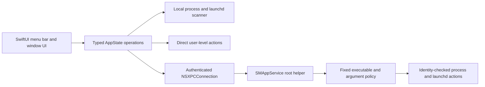

# Milo Public Preview handoff

This document is the operational handoff for the next agent working in this checkout. Read it before changing code or exercising privileged actions.

## 1. Mission and current boundary

The immediate product is an interview-ready **Public Preview** of Milo: a local-first macOS menu bar utility that scans for selected background processes and launch items, lets the user terminate chosen targets, reports CPU and memory usage, and exposes reviewed system-tuning actions.

The Public Preview deliberately unlocks the local Pro feature set without accounts, Paddle, Supabase, production licensing, or network updates. It must never be presented as the commercial release. The deferred commercial and public-distribution work is explicit in `ROADMAP.md` and the larger release program in `July27plan.md`.

Non-negotiable engineering rules from the project agent directives still apply:

- no force unwraps, `try?`, or forced casts;
- no silent errors or undefined UI states;
- strict SwiftLint must pass;
- never print, request, stage, or expose ignored secrets;
- preserve macOS 13 compatibility unless the user explicitly changes the supported platform;
- do not treat compilation, a local launch, or this host's Gatekeeper state as public-release evidence;
- do not broaden a command allowlist or process match to make a failing test pass;
- when uncertain about a consequential change, stop and ask the user.

## 2. Exact repository and remote state

| Item | Current value |
|---|---|
| Repository | `/Volumes/Internal HD/Developer/Pkill` |
| Branch | `fable/milo-test` |
| Upstream | `origin/fable/milo-test` |
| Verified implementation baseline | `2cc15c7 fix: correct surface lifecycle, CPU measurement, and kill reporting` |
| Main implementation commit | `11e9caf feat: ship Milo Public Preview (#9)` |
| Handoff commit | The commit containing this document; confirm current HEAD with `git log -1 --oneline` |
| Pull request | `#9 feat: ship Milo Public Preview` |
| PR URL | `https://github.com/burakoskay/Milo/pull/9` |
| PR base/head | `main` ← `fable/milo-test` |
| PR state | Draft, merge state clean |
| Remote checks | `unit-tests`, `conventional-commits`, and `changelog-check` all passing |
| Expected working tree after handoff publication | Clean |
| Repository visibility | Public |

Do not create a replacement PR or a parallel branch without user direction. Continue PR #9 if the next work belongs to this preview slice.

## 3. Host and toolchain snapshot

The verified host is:

- macOS 27.0 Developer Beta 4, build `26A5388g`;
- Apple silicon (`arm64`);
- Xcode 27.0 beta, build `27A5228h`, at `/Applications/Xcode-beta.app`;
- Swift 6.4 (`swiftlang-6.4.0.27.1`);
- macOS 27 SDK;
- Sparkle pinned to 2.9.4, revision `b6496a74a087257ef5e6da1c5b29a447a60f5bd7`.

The global developer directory may select standalone Command Line Tools. Always set:

```bash
export DEVELOPER_DIR=/Applications/Xcode-beta.app/Contents/Developer
```

Without that override, SwiftLint can fail loading SourceKit and SwiftPM can fail resolving XCTest even though the project is valid.

Xcode 27 beta can emit an internal `DVTAssertions` warning about `IDELaunchSession` when running tests. The verified Milo test run still exited successfully; distinguish that Xcode beta diagnostic from Milo compiler warnings.

## 4. Delivered Public Preview

The completed preview slice includes:

- a distinct `Preview` Xcode configuration;
- bundle identifier `com.monomacaw.milo.preview`;
- visible **Public Preview** labeling;
- local Pro access with no backend, payment, or account gate;
- preview update checks disabled;
- process scanning with CPU and memory measurements;
- locally available static/signed process rules;
- launch-item inspection and controls;
- process whitelist and local statistics;
- menu bar and dedicated-window presentation;
- DNS flush and memory purge through the privileged boundary;
- risk-labeled System Tuning with confirmation for consequential actions;
- broad user-cache deletion hidden until it can be redesigned safely;
- a reproducible signed preview DMG;
- a presentation README and timeless roadmap.

The old `sudoers` and AppleScript administrator-prompt paths were removed. There is no credential-prompt fallback.

## 5. Installed application state

The verified preview is installed at:

```text
/Applications/Milo.app
```

Installed identity:

- version `0.2.0` (`20`);
- bundle `com.monomacaw.milo.preview`;
- thin Apple-silicon binary;
- Apple Development signed;
- Team ID `8N738727QB`;
- hardened runtime enabled;
- runtime built against macOS 27.

The previous ad-hoc production-ID build was preserved, not deleted:

```text
/Applications/Milo-legacy-backup-2026-07-26.app
```

The preview was not running when this handoff was written. Launch it with:

```bash
open -na /Applications/Milo.app
```

Confirm the exact installed process without matching unrelated Milo processes:

```bash
pgrep -fal '^/Applications/Milo.app/Contents/MacOS/Milo$'
```

## 6. Artifact state

The locally packaged artifact is:

```text
/Volumes/Internal HD/Developer/Pkill/dist/Milo-Public-Preview.dmg
```

SHA-256:

```text
dcfc7f30fed731bec8e68d3fc70ac6f24eac3599d02c11997f2f132f866e7adf
```

`build/` and `dist/` are local artifact directories and are intentionally not committed. Rebuild the artifact rather than assuming it still corresponds to HEAD after any source change.

The canonical command is:

```bash
Tools/build-development-preview.sh
```

That script performs a clean Preview build, checks app/helper signatures and exact identifiers, runs the six-check deterministic packaged-app smoke suite, creates the DMG with the nondeprecated macOS 27 `diskutil image create` path, and verifies the image checksum.

## 7. Architecture and security boundaries

### Application flow



### Process-signal safety

Every target action carries a `ProcessIdentity` containing:

- PID;
- absolute executable path;
- kernel process-start seconds;
- kernel process-start microseconds.

The app revalidates that identity immediately before TERM and again before KILL. The helper independently repeats the validation before each privileged signal. A gone process is success; a changed or unreadable identity is a failure and receives no signal. Do not weaken this to PID-only logic.

### Privileged helper

Key properties:

- registered as an embedded `SMAppService.daemon`;
- service identifier `com.monomacaw.milo.helper`;
- exact Team ID and signing-identifier checks in both directions;
- client must be the signed preview/production Milo app and must not be root;
- helper commands use direct argv execution, never a shell;
- fixed executable and argument grammar;
- bounded request size, output, deadline, and cleanup;
- registration is initiated only by the user's **Enable** action;
- no automatic registration loop;
- no recurring AppleScript/sudo password fallback;
- UI distinguishes not registered, approval required, enabled, and unavailable.

Current Service Management evidence:

- `launchctl` reports `system/com.monomacaw.milo.helper` submitted by Service Management;
- parent bundle is `com.monomacaw.milo.preview`, version `200`;
- Launch Weight Code Requirement records helper signing identifier `com.monomacaw.milo.helper` and Team ID `8N738727QB`;
- the helper is currently idle;
- run count is zero and it has never exited.

Registration is therefore confirmed, but a real post-install XPC request has not yet proved helper launch and the privileged execution path. That is the highest-value next test.

### Runtime integrity

The previous self-referential executable hash was removed because it could not be embedded without changing the file being hashed and caused false compromise state. Runtime integrity now relies on Apple's code-signature validation against:

- Team ID `8N738727QB`; and
- bundle identifier `com.monomacaw.milo` or `com.monomacaw.milo.preview`.

The deterministic packaged-app smoke suite exercises the positive runtime-signature path. Public release work still needs a deliberate negative tamper test plus Developer ID/notarization validation.

## 8. Permission behavior the user cares about

The user's strongest usability complaint was repeated macOS permission/password prompts. Preserve this behavior:

1. Scanning and ordinary user-level actions work without helper approval.
2. Root-level actions show the helper banner.
3. The user clicks **Enable** once.
4. If macOS requires approval, Milo opens Login Items & Extensions and reports `requiresApproval`.
5. Milo refreshes status when its UI opens.
6. A denied or unavailable helper produces an actionable failure; it does not retry registration or ask for a password on every action.

Apple owns the final Background Items approval. Milo must not simulate, bypass, or auto-click it.

## 9. Key source map

| Path | Responsibility |
|---|---|
| `App/Milo/Runtime/DevelopmentPreview.swift` | Compile-time Preview identity |
| `Configurations/MiloPro.Preview.xcconfig` | Preview bundle/environment with empty backend and update keys |
| `Configurations/MiloPrivilegedHelper.Preview.xcconfig` | Preview helper configuration |
| `App/Milo/MiloPreview.entitlements` | Minimal preview entitlement surface |
| `App/Milo/Runtime/LicenseManager.swift` | Local preview license snapshot and production licensing boundary |
| `App/Milo/Runtime/MiloUpdateManager.swift` | Preview update disablement |
| `App/Milo/Runtime/PrivilegeManager.swift` | `SMAppService` registration/status state machine |
| `App/Milo/Runtime/PrivilegedHelperClient.swift` | Authenticated, bounded XPC client |
| `Helper/MiloPrivilegedHelper/main.swift` | Root helper authentication and command policy |
| `App/Milo/Runtime/CommandRunner.swift` | Direct user/helper command routing with no sudo fallback |
| `App/Milo/Runtime/ProcessManager.swift` | Scanning and PID-reuse-safe termination |
| `App/Milo/Runtime/AppState.swift` | Typed UI operation orchestration |
| `App/Milo/Runtime/ContentView.swift` | Menu bar preview/helper UI |
| `App/Milo/Runtime/DedicatedWindowView.swift` | Dedicated-window preview/helper UI |
| `App/Milo/Runtime/DebloatView.swift` | System Tuning confirmations and risk UI |
| `App/Milo/Runtime/SelfTestRunner.swift` | Deterministic artifact smoke and legacy opt-in diagnostics |
| `Packages/MiloKit/Sources/MiloHardening/Integrity.c` | Runtime code-signature validation |
| `Tests/integration/TargetBoundaryTests.swift` | Helper/preview/no-prompt regression assertions |
| `Tools/build-development-preview.sh` | Canonical Preview build, signing, smoke, and DMG pipeline |
| `App/Milo/Runtime/SharedUI.swift` | Panel geometry constants and sheet window rounding |
| `README.md` | Public product, install, architecture, and limitation guide |
| `ROADMAP.md` | Timeless deferred-product roadmap |
| `Screenshots/` | README imagery |

`July27plan.md`, `build_app.sh`, `rebrand.py`, and `lldb_script.txt` are kept locally but are
no longer tracked; the repository is public.

`project.yml` is canonical for the Xcode project. After changing it, run:

```bash
Tools/generate-xcode-project.sh
git diff --check
```

Commit both `project.yml` and the regenerated `Milo.xcodeproj/project.pbxproj`.

## 10. Verification completed at this handoff

The final Preview delivery passed:

- clean Preview Xcode build with compiler warnings fatal;
- strict SwiftLint with no violations;
- 18 root red-team tests;
- 29 MiloKit domain, licensing, hardening, subprocess, and update tests;
- MiloPro Xcode red-team, unit, and integration test targets;
- six deterministic packaged-app smoke checks;
- exact app and helper designated-requirement checks;
- DMG checksum and mounted-payload signature verification;
- live dedicated-window launch and visual inspection;
- live launch without a false integrity-compromise state;
- all three GitHub checks on PR #9.

Canonical verification commands:

```bash
export DEVELOPER_DIR=/Applications/Xcode-beta.app/Contents/Developer

swiftlint --strict --quiet
swift test
swift test --package-path Packages/MiloKit

xcodebuild -quiet \
  -workspace Milo.xcworkspace \
  -scheme MiloPro \
  -configuration Debug \
  -destination 'platform=macOS,arch=arm64' \
  CODE_SIGNING_ALLOWED=NO \
  test

Tools/build-development-preview.sh
```

Installed-path verification:

```bash
codesign --verify --deep --strict --verbose=2 /Applications/Milo.app

codesign --verify --strict \
  -R='anchor apple generic and identifier "com.monomacaw.milo.preview" and certificate leaf[subject.OU] = "8N738727QB"' \
  /Applications/Milo.app

codesign --verify --strict \
  -R='anchor apple generic and identifier "com.monomacaw.milo.helper" and certificate leaf[subject.OU] = "8N738727QB"' \
  /Applications/Milo.app/Contents/Resources/MiloPrivilegedHelper

LLVM_PROFILE_FILE='/tmp/MiloInstalledPreview-%p.profraw' \
  /Applications/Milo.app/Contents/MacOS/Milo --preview-smoke-test
```

Expected smoke result: `6 passed, 0 failed`.

## 11. What is intentionally not complete

Do not report these as implemented:

- Supabase production deployment and operational recovery;
- Paddle checkout/webhook/reconciliation;
- production device enrollment and account lifecycle;
- production signed license refresh, revocation, quota, and offline policy;
- production dynamic telemetry-rule service;
- public Sparkle update feed and staged rollout;
- Universal Developer ID archive;
- notarization, stapling, public Gatekeeper validation, or release provenance;
- Mac App Store Lite submission;
- clean-VM destructive system-tuning matrix;
- independent security, privacy, accessibility, performance, and soak review.

These are in `ROADMAP.md` and `July27plan.md`. The preview DMG is an Apple Development-signed local artifact, not a redistributable public installer.

## 12. Highest-value next actions

Unless the user changes direction, resume in this order:

1. Read the active project agent directives, this file, `README.md`, `ROADMAP.md`, and the Public Preview delivery track in `July27plan.md`.
2. Confirm `git status -sb`, HEAD, PR #9, and CI rather than trusting this snapshot.
3. Launch `/Applications/Milo.app` and verify the visible Public Preview badge.
4. Confirm the helper banner reports the actual Service Management state.
5. Exercise the helper health/XPC path with one nonmutating allowlisted request. Confirm the helper launches, authenticates the app, returns within its deadline, and becomes idle afterward.
6. Test a user-level termination only against a disposable synthetic process. Never use a real system or user application as the first target.
7. If a privileged termination test is necessary, construct a disposable root-owned fixture in a controlled environment and verify PID/path/start-time rejection cases. Do not improvise on the live host.
8. Test decline/recovery behavior without repeatedly unregistering or re-registering the helper.
9. Record actual results in the plan or PR; do not mark an end-to-end path complete based only on static inspection.

If the user instead asks to continue toward commercial release, stop treating the Preview delivery checklist as the active plan and resume the ordered phases and gates in `July27plan.md`. Backend work belongs in the canonical website checkout named there; reconcile the contract before editing either side.

## 13. Safe manual presentation flow

For the interview demonstration:

1. Open the installed app and show the Public Preview badge.
2. Show local scanning and resource metrics.
3. Explain that scan is read-only and termination is user initiated.
4. Show confirmation before a selected or bulk action.
5. Explain the PID/path/start-time revalidation before TERM and KILL.
6. Show the helper status and explain one-time macOS approval instead of repeated passwords.
7. Open System Tuning and show risk, SIP, confirmation, and revert affordances without applying unfamiliar system changes.
8. Switch between menu bar and dedicated-window modes.
9. Use `README.md` and `ROADMAP.md` to distinguish today's working local product from deferred commercial infrastructure.

Use disposable test processes. Do not kill arbitrary Apple services, disable SIP, or apply unfamiliar tuning during the interview.

## 14. Rollback and recovery

If the installed Preview must be rolled back:

1. Quit only `/Applications/Milo.app` after resolving its exact PID.
2. Unregister the helper through Milo/`SMAppService` if it was enabled; do not delete launchd database files manually.
3. Preserve the Preview bundle until diagnostics are captured.
4. Restore `/Applications/Milo-legacy-backup-2026-07-26.app` to `/Applications/Milo.app` only after confirming the target paths.

The backup is ad hoc signed, uses production bundle identifier `com.monomacaw.milo`, and is not release evidence. Restoration is only a local rollback.

## 15. Known pitfalls

- Running Swift tools without the Xcode beta `DEVELOPER_DIR` produces false SourceKit/XCTest failures.
- Running SwiftLint without excluding `build` can follow the DMG's `/Applications` symlink and lint Xcode/vendor sources. `.swiftlint.yml` now excludes generated artifacts.
- Host-dependent self-tests are unsuitable as artifact gates. Use `--preview-smoke-test` for deterministic packaging verification.
- `SMAppService.register()` can report already registered or user denied. Map those results to UI state; do not loop.
- A submitted launchd job does not prove that XPC peer authentication or a privileged command succeeded.
- A PID is not a process identity. Never remove executable-path and start-time checks.
- This host's security configuration is not a public Gatekeeper/notarization oracle.
- Do not inspect or print `App/Milo/Runtime/Secrets.swift`; it is ignored and outside Preview needs.

## 16. Authoritative external references

- Apple Service Management and `SMAppService`: <https://developer.apple.com/documentation/servicemanagement/smappservice>
- Apple `SMAppService.register()`: <https://developer.apple.com/documentation/servicemanagement/smappservice/register()>
- Apple helper migration and status guidance: <https://developer.apple.com/documentation/servicemanagement/updating-helper-executables-from-earlier-versions-of-macos>
- Apple macOS 27 release notes index: <https://developer.apple.com/documentation/macos-release-notes>
- Apple Xcode 27 beta release notes: <https://developer.apple.com/documentation/xcode-release-notes/xcode-27-release-notes?changes=latest_minor>

At this snapshot, Apple's documentation confirms that macOS 13 and later uses `SMAppService` for bundled launch daemons, registration is subject to user approval, and status should be read from the service rather than inferred from repeated registration attempts. Xcode 27 beta includes Swift 6.4 and the macOS 27 SDK.

## 17. Definition of a successful pickup

The next agent has successfully picked up the work when it has:

- verified the checkout and remote state;
- read the Preview/commercial boundary;
- preserved the security and permission invariants;
- reproduced the relevant tests before changing behavior;
- tested the next unknown with a bounded, disposable fixture;
- updated documentation and the tracked plan with evidence;
- avoided claiming public-release readiness from the local Public Preview.
