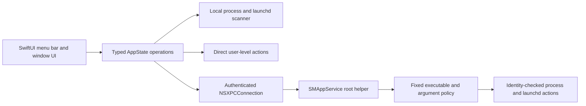

# Milo Public Preview handoff

This document is the operational handoff for the next agent working in this checkout. Read it before changing code or exercising privileged actions.

## 0. Document map

**This file is the single source of truth for project state.** If another document disagrees with
it, this one wins and the other is stale. Three documents support it; nothing else carries state.

| Document | Answers | Update when |
|---|---|---|
| `HANDOFF.md` (this file) | What is built, installed, verified, unfinished, and next — **right now** | Any session that changes verified state |
| `docs/decisions/` | **Why** a consequential choice was made and what it obligates | A decision constrains future work or leaves a known inconsistency |
| `CHANGELOG.md` | What shipped, per release | Any user-visible or release-affecting change |
| `README.md` | Public-facing product, install, and limitation guide | The product's public story changes |

`docs/archive/` holds superseded planning material (`July27plan.md`, the GPT-5 audit report). It is
gitignored, local-only, and **not instructions**. Read it for history; never treat it as the plan.

Starting a new session: read `CLAUDE.md`, then this file top to bottom, then
`docs/decisions/README.md`. Re-verify section 2 rather than trusting it — it is a snapshot and it
goes stale.

Before claiming anything is done, check section 11 ("What is intentionally not complete"), section
18 ("Next"), and the "Required external actions" of any decision record marked incomplete.

### Current state in one line

Milo **0.2.0-preview.2**, the first build under the gonggong name: a working local macOS menu bar
process manager, Apple Development signed, not notarized, no backend, no licensing, no paid users.

## 1. Mission and current boundary

The immediate product is an interview-ready **Public Preview** of Milo: a local-first macOS menu bar utility that scans for selected background processes and launch items, lets the user terminate chosen targets, reports CPU and memory usage, and exposes reviewed system-tuning actions.

The Public Preview deliberately unlocks the local Pro feature set without accounts, Paddle, Supabase, production licensing, or network updates. It must never be presented as the commercial release. The deferred commercial and public-distribution work is explicit in section 18 ("Next") below.

Non-negotiable engineering rules from the project agent directives still apply:

- no force unwraps, `try?`, or forced casts;
- no silent errors or undefined UI states;
- strict SwiftLint must pass;
- never print, request, stage, or expose ignored secrets;
- preserve macOS 13 compatibility unless the user explicitly changes the supported platform;
- do not treat compilation, a local launch, or this host's Gatekeeper state as public-release evidence;
- do not broaden a command allowlist or process match to make a failing test pass;
- when uncertain about a consequential change, stop and ask the user.

## 2. Exact repository and remote state

This table was re-verified on 2026-08-04. Confirm it again rather than trusting it.

| Item | Current value |
|---|---|
| Repository | `/Volumes/Internal HD/Developer/Milo` |
| Branch | `refactor/gonggong-rebrand`, branched from `main` |
| Upstream | `main` is in sync with `origin/main`; the rebrand branch is local only and unpushed |
| HEAD | the rebrand branch tip; confirm with `git log -1 --oneline` |
| Main implementation commit | `11e9caf feat: ship Milo Public Preview (#9)` |
| Preview delivery pull request | `#9 feat: ship Milo Public Preview`, **merged**; branch `fable/milo-test` no longer exists on `origin` |
| Later merged work | `#10` copyright terms, `#11` changelog, `#12` security policy, `#24` Public Preview rename, `#25` version scheme `0.2.0` |
| Published release | `v0.2.0-preview.1`, GitHub pre-release at `fd6b7d3`, DMG asset SHA-256 `c4742debfb7dee4f4991fcb04698454bf15ff08b46516f91d171cb4b6c473eee` |
| Remotes | `origin` → `https://github.com/burakoskay/Milo.git`; `gitlab` → `git@gitlab.com:burakoskay-group/burakoskay-project.git` |
| Tags | `origin` carries `v0.2.0-preview.1` only. The local-only `v2.0.0-preview.1` was deleted on 2026-08-04: it recorded build `200` under the discarded numbering scheme, which would have permanently blocked the build-number check in `Tools/release.sh` |
| Repository visibility | Public |
| Release process | `Tools/release.sh`, section 19. Branch and PR for every change; never commit to `main` directly |

The Public Preview slice is merged, so there is no open PR to continue. Open a new branch and PR for
the next slice; do not reopen `#9` or resurrect `fable/milo-test`.

### Company rename

The company is now **gonggong** on **gonggong.tech**. Bundle identifiers, the helper mach service and
launchd plist, Keychain service names, the device-key tag, and the production origin all moved. The
rename is complete in this repository and verified.

Two external actions remain and block a **production** build only; the Preview builds and passes
today without them:

1. Apple Developer portal App IDs for `com.gonggong.milo` (with Sign in with Apple).
2. MLP endpoints and the appcast served from `gonggong.tech`.

A few `monomacaw` strings survive on purpose: the signed MLP-v1 golden fixture (the string is inside
signed material), the MLP protocol name, one GitHub secret pending rename, and historical changelog
entries. `docs/decisions/0001-rename-monomacaw-to-gonggong.md` lists each and why. Do not "finish the
rename" by grepping and replacing them.

## 3. Host and toolchain snapshot

The verified host is:

- macOS 27.0 Developer Beta 4, build `26A5388g`;
- Apple silicon (`arm64`);
- Xcode 27.0 beta, build `27A5228h`, at `/Applications/Xcode-beta.app`;
- Swift 6.4 (`swiftlang-6.4.0.27.1`);
- macOS 27 SDK;
- Sparkle pinned to 2.9.4, revision `b6496a74a087257ef5e6da1c5b29a447a60f5bd7`.

The global developer directory may select standalone Command Line Tools. Always set:

```bash
export DEVELOPER_DIR=/Applications/Xcode-beta.app/Contents/Developer
```

Without that override, SwiftLint can fail loading SourceKit and SwiftPM can fail resolving XCTest even though the project is valid.

Xcode 27 beta can emit an internal `DVTAssertions` warning about `IDELaunchSession` when running tests. The verified Milo test run still exited successfully; distinguish that Xcode beta diagnostic from Milo compiler warnings.

## 4. Delivered Public Preview

The completed preview slice includes:

- a distinct `Preview` Xcode configuration;
- bundle identifier `com.gonggong.milo.preview`;
- visible **Public Preview** labeling;
- local Pro access with no backend, payment, or account gate;
- preview update checks disabled;
- process scanning with CPU and memory measurements;
- locally available static/signed process rules;
- launch-item inspection and controls;
- process whitelist and local statistics;
- menu bar and dedicated-window presentation;
- DNS flush and memory purge through the privileged boundary;
- risk-labeled System Tuning with confirmation for consequential actions;
- broad user-cache deletion hidden until it can be redesigned safely;
- a reproducible signed preview DMG;
- a presentation README.

The old `sudoers` and AppleScript administrator-prompt paths were removed. There is no credential-prompt fallback.

## 5. Installed application state

The verified preview is installed at:

```text
/Applications/Milo.app
```

Installed identity as measured on 2026-08-04:

- version `2.0.0` (`200`);
- bundle `com.monomacaw.milo.preview` — the **pre-rebrand** identifier;
- thin Apple-silicon binary;
- Apple Development signed;
- Team ID `8N738727QB`;
- hardened runtime enabled;
- runtime built against macOS 27.

The installed bundle therefore **predates the `0.2.0` version rename in `fd6b7d3`**; it is not the
build the current source produces. `launchctl` also reports the registered helper's parent bundle
version as `200`, matching this installed bundle rather than HEAD. Reinstall from a freshly built
DMG before treating anything observed in `/Applications/Milo.app` as evidence about HEAD.
Its signature was re-verified on 2026-08-04: valid on disk, satisfies its designated requirement,
and the embedded helper satisfies the exact helper identifier and Team ID requirement.

The previous ad-hoc production-ID build was preserved, not deleted:

```text
/Applications/Milo-legacy-backup-2026-07-26.app
```

The preview was not running when this handoff was written. Launch it with:

```bash
open -na /Applications/Milo.app
```

Confirm the exact installed process without matching unrelated Milo processes:

```bash
pgrep -fal '^/Applications/Milo.app/Contents/MacOS/Milo$'
```

## 6. Artifact state

The locally packaged artifact is:

```text
/Volumes/Internal HD/Developer/Milo/dist/Milo-Public-Preview.dmg
```

Its SHA-256 is recorded beside it, written by the build that produced it:

```text
/Volumes/Internal HD/Developer/Milo/dist/Milo-Public-Preview.dmg.sha256
```

```bash
shasum -a 256 -c dist/Milo-Public-Preview.dmg.sha256
```

No DMG hash is transcribed into this document, because none of them survive a rebuild. Two builds
of `fd6b7d3` on 2026-08-04 produced `86972f70…` and `44ac31be…`, and the published
`v0.2.0-preview.1` asset from the same commit is `c4742deb…`. Signing is not byte-reproducible
here, so a DMG hash identifies one specific build and never a commit. Verify a downloaded artifact
against the hash published with that artifact.

`dist/Milo-Development-Preview.dmg` is an abandoned pre-rename artifact from 2026-07-27 and is not
produced by any current script; ignore it or delete it.

`build/` and `dist/` are local artifact directories and are intentionally not committed. Rebuild the artifact rather than assuming it still corresponds to HEAD after any source change.

The canonical command is:

```bash
Tools/build-development-preview.sh
```

That script performs a clean Preview build, checks app/helper signatures and exact identifiers, runs the six-check deterministic packaged-app smoke suite, creates the DMG with the nondeprecated macOS 27 `diskutil image create` path, verifies the image checksum, and then writes and re-verifies the `dist/Milo-Public-Preview.dmg.sha256` sidecar for the image it just produced.

Until 2026-08-04 the script rewrote the DMG without rewriting that sidecar, so a rebuild left a
checksum file asserting the previous build's hash. Keep the sidecar generated by the same run that
produced the image.

## 7. Architecture and security boundaries

### Application flow



### Process-signal safety

Every target action carries a `ProcessIdentity` containing:

- PID;
- absolute executable path;
- kernel process-start seconds;
- kernel process-start microseconds.

The app revalidates that identity immediately before TERM and again before KILL. The helper independently repeats the validation before each privileged signal. A gone process is success; a changed or unreadable identity is a failure and receives no signal. Do not weaken this to PID-only logic.

### Privileged helper

Key properties:

- registered as an embedded `SMAppService.daemon`;
- service identifier `com.gonggong.milo.helper`;
- exact Team ID and signing-identifier checks in both directions;
- client must be the signed preview/production Milo app and must not be root;
- helper commands use direct argv execution, never a shell;
- fixed executable and argument grammar;
- bounded request size, output, deadline, and cleanup;
- registration is initiated only by the user's **Enable** action;
- no automatic registration loop;
- no recurring AppleScript/sudo password fallback;
- UI distinguishes not registered, approval required, enabled, and unavailable.

Service Management evidence measured on this host on 2026-08-04. Every identifier below is the
**pre-rebrand** one, because the registered helper came from the installed pre-rebrand build:

- `launchctl` reports `system/com.monomacaw.milo.helper` submitted by Service Management;
- parent bundle is `com.monomacaw.milo.preview`, version `200`;
- Launch Weight Code Requirement records helper signing identifier `com.monomacaw.milo.helper` and Team ID `8N738727QB`;
- the helper is currently idle;
- run count is zero and it has never exited.

Registration is therefore confirmed, but a real post-install XPC request has not yet proved helper launch and the privileged execution path. That is the highest-value next test.

After the `com.gonggong.*` rebrand this registration is **stale and orphaned**: a rebranded build
registers `system/com.gonggong.milo.helper` as a separate Background Item, and the `com.monomacaw`
entry survives independently. See `docs/decisions/0001-rename-monomacaw-to-gonggong.md` for the
required unregister-then-reinstall order.

### Runtime integrity

The previous self-referential executable hash was removed because it could not be embedded without changing the file being hashed and caused false compromise state. Runtime integrity now relies on Apple's code-signature validation against:

- Team ID `8N738727QB`; and
- bundle identifier `com.gonggong.milo` or `com.gonggong.milo.preview`.

The deterministic packaged-app smoke suite exercises the positive runtime-signature path. Public release work still needs a deliberate negative tamper test plus Developer ID/notarization validation.

## 8. Permission behavior the user cares about

The user's strongest usability complaint was repeated macOS permission/password prompts. Preserve this behavior:

1. Scanning and ordinary user-level actions work without helper approval.
2. Root-level actions show the helper banner.
3. The user clicks **Enable** once.
4. If macOS requires approval, Milo opens Login Items & Extensions and reports `requiresApproval`.
5. Milo refreshes status when its UI opens.
6. A denied or unavailable helper produces an actionable failure; it does not retry registration or ask for a password on every action.

Apple owns the final Background Items approval. Milo must not simulate, bypass, or auto-click it.

## 9. Key source map

| Path | Responsibility |
|---|---|
| `App/Milo/Runtime/DevelopmentPreview.swift` | Compile-time Preview identity |
| `Configurations/MiloPro.Preview.xcconfig` | Preview bundle/environment with empty backend and update keys |
| `Configurations/MiloPrivilegedHelper.Preview.xcconfig` | Preview helper configuration |
| `App/Milo/MiloPreview.entitlements` | Minimal preview entitlement surface |
| `App/Milo/Runtime/LicenseManager.swift` | Local preview license snapshot and production licensing boundary |
| `App/Milo/Runtime/MiloUpdateManager.swift` | Preview update disablement |
| `App/Milo/Runtime/PrivilegeManager.swift` | `SMAppService` registration/status state machine |
| `App/Milo/Runtime/PrivilegedHelperClient.swift` | Authenticated, bounded XPC client |
| `Helper/MiloPrivilegedHelper/main.swift` | Root helper authentication and command policy |
| `App/Milo/Runtime/CommandRunner.swift` | Direct user/helper command routing with no sudo fallback |
| `App/Milo/Runtime/ProcessManager.swift` | Scanning and PID-reuse-safe termination |
| `App/Milo/Runtime/AppState.swift` | Typed UI operation orchestration |
| `App/Milo/Runtime/ContentView.swift` | Menu bar preview/helper UI |
| `App/Milo/Runtime/DedicatedWindowView.swift` | Dedicated-window preview/helper UI |
| `App/Milo/Runtime/DebloatView.swift` | System Tuning confirmations and risk UI |
| `App/Milo/Runtime/SelfTestRunner.swift` | Deterministic artifact smoke and legacy opt-in diagnostics |
| `Packages/MiloKit/Sources/MiloHardening/Integrity.c` | Runtime code-signature validation |
| `Tests/integration/TargetBoundaryTests.swift` | Helper/preview/no-prompt regression assertions |
| `Tools/build-development-preview.sh` | Canonical Preview build, signing, smoke, and DMG pipeline |
| `App/Milo/Runtime/SharedUI.swift` | Panel geometry constants and sheet window rounding |
| `README.md` | Public product, install, architecture, and limitation guide |
| `Screenshots/` | README imagery |

`docs/archive/July27plan.md`, `build_app.sh`, `rebrand.py`, and `lldb_script.txt` are kept locally but are
no longer tracked; the repository is public.

`project.yml` is canonical for the Xcode project. After changing it, run:

```bash
Tools/generate-xcode-project.sh
git diff --check
```

Commit both `project.yml` and the regenerated `Milo.xcodeproj/project.pbxproj`.

## 10. Verification completed at this handoff

### Verified at `0.2.0-preview.2` on 2026-08-04

The rebrand, the layout tidy, and the documentation consolidation were all verified together on
macOS 27.0 (`26A5388g`), Xcode 27.0 beta (`27A5228h`), Swift 6.4:

| Gate | Result |
|---|---|
| `swiftlint --strict --quiet` | 0 violations |
| `swift test` (root) | 18 red-team tests, 0 failures |
| `swift test --package-path Packages/MiloKit` | 29 tests (10 + 7 + 12), 0 failures, including `MLP1GoldenVectorTests` |
| `xcodebuild ... -scheme MiloPro test` | 18 + 1 + 16, `** TEST SUCCEEDED **` |
| `Tools/build-development-preview.sh` | Clean build, `6 passed, 0 failed`, DMG created and verified |
| Signed app identifier | `com.gonggong.milo.preview` |
| Signed helper identifier | `com.gonggong.milo.helper` |
| Built bundle version | `0.2.0` (`21`) |

The packaged *Runtime code signature* smoke check passing is the load-bearing evidence for the
rebrand: it proves the rewritten requirement in `MiloHardening/Integrity.c` matches the newly signed
identity. A mistake there produces a false compromise state at launch, not a build failure.

Still not verified under the new identifiers: any live launch, helper XPC round trip, or privileged
action. Section 12 covers how to test those safely.

### Earlier: re-verified against `fd6b7d3` on 2026-08-04

Every result below was produced in this checkout on that date, on macOS 27.0 (`26A5388g`) with
Xcode 27.0 beta (`27A5228h`) and Swift 6.4:

| Gate | Result |
|---|---|
| `swiftlint --strict --quiet` | 0 violations |
| `swift test` (root) | 18 red-team tests, 0 failures |
| `swift test --package-path Packages/MiloKit` | 29 tests across three suites (10 + 7 + 12), 0 failures |
| `xcodebuild ... -scheme MiloPro test` | `MiloRedTeamTests` 18, `MiloUnitTests` 1, `MiloIntegrationTests` 16; `** TEST SUCCEEDED **` |
| `Tools/build-development-preview.sh` | Clean Preview build, both designated-requirement checks, `6 passed, 0 failed` smoke suite, DMG created and `hdiutil verify` valid |
| Installed-bundle signature checks | `/Applications/Milo.app` valid on disk and satisfies its designated requirement; embedded helper satisfies the exact helper requirement |

`MiloUnitTests` legitimately contains a single test, so a full-run log prints `Executed 1 test`
(singular). A grep for `Executed [0-9]+ tests` misses that line and makes the target look empty.

Xcode 27 beta emitted its `DVTAssertions`/`IDELaunchSession` warning three times during the Xcode
test run. That is the documented beta diagnostic, not a Milo failure; the run still succeeded.

What was **not** re-verified on 2026-08-04: any live launch of the app, any helper XPC round trip,
and any process termination. Those remain untested at HEAD.

### Original Preview delivery evidence

The final Preview delivery passed:

- clean Preview Xcode build with compiler warnings fatal;
- strict SwiftLint with no violations;
- 18 root red-team tests;
- 29 MiloKit domain, licensing, hardening, subprocess, and update tests;
- MiloPro Xcode red-team, unit, and integration test targets;
- six deterministic packaged-app smoke checks;
- exact app and helper designated-requirement checks;
- DMG checksum and mounted-payload signature verification;
- live dedicated-window launch and visual inspection;
- live launch without a false integrity-compromise state;
- all three GitHub checks on PR #9.

Canonical verification commands:

```bash
export DEVELOPER_DIR=/Applications/Xcode-beta.app/Contents/Developer

swiftlint --strict --quiet
swift test
swift test --package-path Packages/MiloKit

xcodebuild -quiet \
  -workspace Milo.xcworkspace \
  -scheme MiloPro \
  -configuration Debug \
  -destination 'platform=macOS,arch=arm64' \
  CODE_SIGNING_ALLOWED=NO \
  test

Tools/build-development-preview.sh
```

Installed-path verification:

```bash
codesign --verify --deep --strict --verbose=2 /Applications/Milo.app

codesign --verify --strict \
  -R='anchor apple generic and identifier "com.gonggong.milo.preview" and certificate leaf[subject.OU] = "8N738727QB"' \
  /Applications/Milo.app

codesign --verify --strict \
  -R='anchor apple generic and identifier "com.gonggong.milo.helper" and certificate leaf[subject.OU] = "8N738727QB"' \
  /Applications/Milo.app/Contents/Resources/MiloPrivilegedHelper

LLVM_PROFILE_FILE='/tmp/MiloInstalledPreview-%p.profraw' \
  /Applications/Milo.app/Contents/MacOS/Milo --preview-smoke-test
```

Expected smoke result: `6 passed, 0 failed`.

## 11. What is intentionally not complete

Do not report these as implemented:

- Supabase production deployment and operational recovery;
- Paddle checkout/webhook/reconciliation;
- production device enrollment and account lifecycle;
- production signed license refresh, revocation, quota, and offline policy;
- production dynamic telemetry-rule service;
- public Sparkle update feed and staged rollout;
- Universal Developer ID archive;
- notarization, stapling, public Gatekeeper validation, or release provenance;
- Mac App Store Lite submission;
- clean-VM destructive system-tuning matrix;
- independent security, privacy, accessibility, performance, and soak review.

These are in section 18 ("Next"). The preview DMG is an Apple Development-signed local artifact, not a redistributable public installer.

## 12. Highest-value next actions

Unless the user changes direction, resume in this order:

1. Read the active project agent directives, this file (including section 18), and `docs/decisions/README.md`.
2. Confirm `git status -sb`, HEAD, the merged-PR/release state in section 2, and CI rather than trusting this snapshot.
3. Reinstall `/Applications/Milo.app` from a DMG built at current HEAD before any live testing. The installed bundle is still the pre-rename `2.0.0` (`200`) build, so live observations against it say nothing about HEAD, and the registered helper's recorded parent bundle version matches that old bundle.
4. Launch the reinstalled app and verify the visible Public Preview badge.
5. Confirm the helper banner reports the actual Service Management state.
6. Exercise the helper health/XPC path with one nonmutating allowlisted request. Confirm the helper launches, authenticates the app, returns within its deadline, and becomes idle afterward.
7. Test a user-level termination only against a disposable synthetic process. Never use a real system or user application as the first target.
8. If a privileged termination test is necessary, construct a disposable root-owned fixture in a controlled environment and verify PID/path/start-time rejection cases. Do not improvise on the live host.
9. Test decline/recovery behavior without repeatedly unregistering or re-registering the helper.
10. Record actual results in the plan or PR; do not mark an end-to-end path complete based only on static inspection.

If the user asks to continue toward commercial release, work from section 18 ("Next"), not from `docs/archive/July27plan.md`. That archived plan predates the gonggong rename and the decision to defer licensing to 1.0; it is history, not a checklist.

## 13. Safe manual presentation flow

For the interview demonstration:

1. Open the installed app and show the Public Preview badge.
2. Show local scanning and resource metrics.
3. Explain that scan is read-only and termination is user initiated.
4. Show confirmation before a selected or bulk action.
5. Explain the PID/path/start-time revalidation before TERM and KILL.
6. Show the helper status and explain one-time macOS approval instead of repeated passwords.
7. Open System Tuning and show risk, SIP, confirmation, and revert affordances without applying unfamiliar system changes.
8. Switch between menu bar and dedicated-window modes.
9. Use `README.md` and section 18 to distinguish today's working local product from deferred commercial infrastructure.

Use disposable test processes. Do not kill arbitrary Apple services, disable SIP, or apply unfamiliar tuning during the interview.

## 14. Rollback and recovery

If the installed Preview must be rolled back:

1. Quit only `/Applications/Milo.app` after resolving its exact PID.
2. Unregister the helper through Milo/`SMAppService` if it was enabled; do not delete launchd database files manually.
3. Preserve the Preview bundle until diagnostics are captured.
4. Restore `/Applications/Milo-legacy-backup-2026-07-26.app` to `/Applications/Milo.app` only after confirming the target paths.

The backup is ad hoc signed, uses the pre-rebrand production bundle identifier `com.monomacaw.milo`, and is not release evidence. Restoration is only a local rollback.

## 15. Known pitfalls

- Running Swift tools without the Xcode beta `DEVELOPER_DIR` produces false SourceKit/XCTest failures.
- Moving or renaming the checkout invalidates SwiftPM's artifact cache, which stores **absolute** paths. The symptom is `There is no XCFramework found at <old path>/…/Sparkle.xcframework`. Delete `.build`, `Packages/MiloKit/.build`, and `build/` and rebuild; they are gitignored artifacts.
- Running SwiftLint without excluding `build` can follow the DMG's `/Applications` symlink and lint Xcode/vendor sources. `.swiftlint.yml` now excludes generated artifacts.
- Host-dependent self-tests are unsuitable as artifact gates. Use `--preview-smoke-test` for deterministic packaging verification.
- `SMAppService.register()` can report already registered or user denied. Map those results to UI state; do not loop.
- A submitted launchd job does not prove that XPC peer authentication or a privileged command succeeded.
- A PID is not a process identity. Never remove executable-path and start-time checks.
- This host's security configuration is not a public Gatekeeper/notarization oracle.
- Do not inspect or print `App/Milo/Runtime/Secrets.swift`; it is ignored and outside Preview needs.

## 16. Authoritative external references

- Apple Service Management and `SMAppService`: <https://developer.apple.com/documentation/servicemanagement/smappservice>
- Apple `SMAppService.register()`: <https://developer.apple.com/documentation/servicemanagement/smappservice/register()>
- Apple helper migration and status guidance: <https://developer.apple.com/documentation/servicemanagement/updating-helper-executables-from-earlier-versions-of-macos>
- Apple macOS 27 release notes index: <https://developer.apple.com/documentation/macos-release-notes>
- Apple Xcode 27 beta release notes: <https://developer.apple.com/documentation/xcode-release-notes/xcode-27-release-notes?changes=latest_minor>

At this snapshot, Apple's documentation confirms that macOS 13 and later uses `SMAppService` for bundled launch daemons, registration is subject to user approval, and status should be read from the service rather than inferred from repeated registration attempts. Xcode 27 beta includes Swift 6.4 and the macOS 27 SDK.

## 17. Definition of a successful pickup

The next agent has successfully picked up the work when it has:

- verified the checkout and remote state;
- read the Preview/commercial boundary;
- preserved the security and permission invariants;
- reproduced the relevant tests before changing behavior;
- tested the next unknown with a bounded, disposable fixture;
- updated documentation and the tracked plan with evidence;
- avoided claiming public-release readiness from the local Public Preview.

## 18. Next

Direction without dates. Nothing here is implemented. Items move out of this section only when their
acceptance gate passes and the evidence is recorded in section 10.

The boundary this section exists to keep explicit: **what Milo does today is local process and launch
item management.** Everything commercial — accounts, payment, licensing, updates, telemetry rules —
is deferred, and the UI must not imply otherwise.

### Nearest priorities

1. Notarized Developer ID distribution, so first launch does not require a Gatekeeper override.
2. End-to-end exercise of the privileged helper XPC path against a disposable root-owned fixture.
3. Disabling a launchd job directly from the process row that reported the restart, as a labelled and
   confirmed action rather than a side effect of terminating the process.
4. Clean-VM validation of the System Tuning matrix on every supported macOS release.

### Process-control reliability

- Expand typed per-target results for exited, replaced, protected, denied, timed out, and launchd-respawned processes.
- Add disposable-VM integration coverage for system launchd services, helper upgrade/version skew, reboot, denial, and uninstall.
- Version the local rule catalogue and add reviewed compatibility fixtures for supported macOS releases.
- Add user-visible action history with privacy-preserving, local-only diagnostics and export.

### Safe system tuning

- Replace legacy "debloat" terminology and rules with reviewed, reversible tuning recipes.
- Add an exact before/after preview and rollback record for every setting.
- Validate each recipe on clean macOS virtual machines with default SIP and security settings.
- Remove recipes that cannot be made deterministic, reversible, and supportable.
- Replace broad user-cache deletion with an explicit, app-scoped preview and per-item rollback-safe result model before restoring it to the UI.

### Distribution and operations

- Produce Universal Developer ID builds with hardened runtime.
- Automate archive signing, notarization, stapling, DMG verification, SBOM, provenance, and immutable release records.
- Validate quarantined installation and Gatekeeper behavior on clean default-security Macs.
- Complete privacy review, threat model, independent security assessment, accessibility audit, performance profiling, and long-running soak tests.
- Establish support diagnostics, incident response, signing-key rotation, rollback, and vulnerability disclosure procedures.

### Deferred to 1.0: the commercial stack

Licensing is **out of scope until 1.0** (decided 2026-08-04). No backend is deployed, no device is
enrolled, and there are no paid users. The MLP-v1 client code and its golden fixtures remain in
MiloKit as dormant, tested code. Treat the whole list below as one coordinated body of work, not as
individually shippable items:

- browser-approved device enrollment and signed device-key authentication;
- transactional Supabase migrations, RLS policies, device quota enforcement, revocation, and audit events;
- Paddle product allowlisting, webhook signature verification, idempotency, ordering, refunds, cancellations, and reconciliation;
- signed license-envelope verification, offline policy, clock handling, key rotation, and recovery;
- signed dynamic telemetry rules with anti-rollback, staged rollout, emergency disable, and local cache recovery;
- authenticated update discovery, signed Sparkle feeds, rollout control, and rollback policy;
- restoring the cross-repository MLP contract check in CI against whichever repository then owns the contract.

### Milo Lite

- Validate the sandboxed scanner against Mac App Store review constraints.
- Keep Lite read-only, networkless where practical, and free of Pro helper, updater, payment, and licensing implementation.
- Add clear capability education and a browser handoff to the Pro product page.
- Complete App Store privacy, accessibility, metadata, receipt, archive, and review testing.

### Product experience

- Continue macOS-native visual polish for menu bar and dedicated-window modes.
- Add comprehensive VoiceOver, keyboard, reduced-motion, high-contrast, and localization coverage.
- Add safe onboarding that adapts to helper status without nagging or permission loops.
- Add a concise in-app explanation of target confidence, impact, and recovery for every action.

## 19. Release process

Policy and rationale: `docs/decisions/0003-release-and-development-process.md`.

### Rules

- **Versioning.** `MAJOR.MINOR.PATCH[-preview.N]`. Marketing version stays `0.2.0` across the preview
  series; `CFBundleVersion` increments by one per published release and must exceed every released
  build. Both `Info.plist` files carry the same numbers. Tags are `v<version>`. Releases are
  immutable — never move a published tag.
- **Branching.** Every change goes through a branch and a PR. No direct commits to `main`; that
  bypasses the `unit-tests`, `conventional-commits`, and `changelog-check` gates. Release from `main`
  after the merge.
- **Publishing.** A human runs the publish commands. CI never builds releases, because it cannot
  reproduce the local signing identity.

### Cutting a release

1. Bump `CFBundleVersion` in `App/Milo/Info.plist` and `App/MiloLite/Info.plist`.
2. Write the `## [<version>]` section in `CHANGELOG.md`.
3. Merge to `main` through a PR.
4. Run the preparation script, which stops before publishing:

```bash
Tools/release.sh 0.2.0-preview.3
```

5. Run the live smoke check below.
6. Run the `git push` and `gh release create` commands the script printed.

### The live smoke check

**Required before every publish.** The mechanical gates cannot catch these failures: a wrong
code-signing requirement, a helper that registers but never launches, and a rejected XPC peer all
build, sign, lint, and test cleanly, then fail on first real use.

1. Install the built DMG over the current `/Applications/Milo.app`.
   If the previous install used different bundle identifiers, first unregister its helper from the
   **old** app and confirm with `launchctl print system/<old helper id>` failing. See decision 0001.
2. Launch it and confirm the visible **Public Preview** badge and the version you just built.
3. Confirm the helper banner reports the real Service Management state, not a stale one.
4. Enable the helper once, then exercise **one non-mutating** allowlisted request. Confirm the helper
   launches, authenticates the app, returns within its deadline, and goes idle.
5. Terminate **one disposable synthetic process** — never a real system or user application as the
   first target. For example, `sleep 600 &`, then terminate it from Milo and confirm the typed
   result.
6. Confirm no repeated permission or password prompts appeared at any point.

Record what actually happened in section 10. A path is not verified because it was read.

### After publishing

Update section 2 (release row), section 5 (installed application state), and section 10 (evidence)
in this file. An installed app that has drifted from HEAD makes every later live observation
worthless — that is exactly how the `2.0.0` build lingered in `/Applications` while the source had
moved on.
