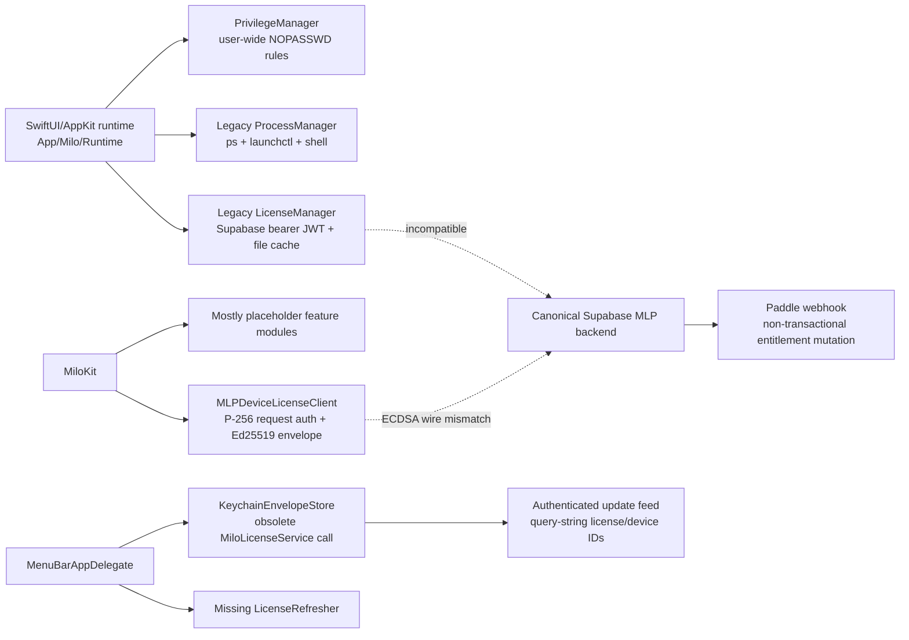
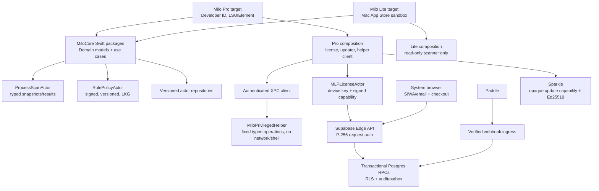

# Milo finalization plan for macOS 27

**Audit date:** 2026-07-22
**Requested output name:** `July27plan.md`
**Audited app checkout:** `/Volumes/Internal HD/Developer/Pkill`
**Canonical backend checkout:** `/Volumes/Internal HD/Developer/monomacaw/website`
**Validation host:** macOS 27.0 Developer Beta 4 (`26A5388g`), Apple M2 Pro, arm64
**Audited toolchain:** installed Xcode 27 beta 1 (`27A5194q`), macOS 27 beta 1 SDK (`26A5353p`), Swift 6.4. Apple released Xcode 27 beta 4 (`27A5228h`) on 2026-07-20; the installed toolchain must be updated and every build/test result repeated before it can be labeled Beta 4 evidence.
**Change policy for this audit:** no application, package, backend, build, or test code was changed. This document is the only intentional repository file created.

---

## 1. Executive verdict

Milo is **not releasable, not beta-ready, and not currently buildable from the audited checkout**. The repository is in the middle of an uncommitted architectural migration. The new `MiloKit` licensing work, the legacy runtime, the website backend, the updater, and the binary-hardening layer do not form one coherent executable system.

The immediate release decision is **NO-GO**. This is based on reproduced evidence, not code-style preference:

1. The root app build fails because `LicenseRefresher` does not exist (`App/Milo/Runtime/MenuBarAppDelegate.swift:90,114`).
2. The MiloKit test build fails because `MLP1GoldenVectorTests` calls a removed initializer (`Packages/MiloKit/Tests/MiloLicenseTests/MLP1GoldenVectorTests.swift:46`).
3. `App/Milo/AppDelegate.swift:106` calls another obsolete `MiloLicenseService` initializer/API and will fail after the first compiler error is removed.
4. Strict SwiftLint reports two current violations; the zero-violation requirement is not met.
5. The active app uses a legacy bearer-token license request while the canonical backend requires signed P-256 device requests. Production licensing cannot complete.
6. The new Swift client emits a DER-encoded ECDSA signature while Deno WebCrypto expects IEEE P1363/raw `r || s`. Device-authenticated requests cannot verify.
7. The current process termination path has a PID-reuse time-of-check/time-of-use race and can escalate from `TERM` to `KILL` without proving it is still targeting the scanned executable.
8. The privilege design installs user-wide `NOPASSWD` sudoers rules. That grants every process running as the user access to those root commands; this is not an acceptable production boundary.
9. The Paddle webhook can grant an entitlement from client-controlled `custom_data`, does not enforce an allowlisted Paddle price/product, marks an event effectively processed before non-transactional mutations complete, and has no event-order protection.
10. The executable-hash hardening scheme is internally inconsistent and cannot succeed as designed. It hashes `salt + binary` in the generator, hashes only the binary at runtime, never embeds the generated object in the build, and is self-referential if the digest is embedded into the binary being hashed.
11. The canonical website dependency audit reports **13 known vulnerabilities: 9 high, 2 moderate, and 2 low**. Direct and transitive findings include Astro, `devalue`, `sharp`, `svgo`, `undici`, Vite, and `ws`.
12. The existing app/DMG artifacts are stale or ad hoc signed, not notarized/stapled, and were built against different SDK/version states. They do not prove the audited source works.
13. The Mac App Store Lite product does not exist as a separate target and the current privileged functionality cannot be submitted in a sandboxed target.

The application should not be “finished” by patching the compiler errors and shipping. That would preserve unsafe termination, a broken license protocol, a privilege-escalation design, misleading metrics, and unreviewed system mutations. The required outcome is a controlled convergence onto one architecture with explicit security and product boundaries.

### Brutally honest security statement

No client-side DRM is “unhackable,” and code-signature checks do not make it so. A determined attacker controlling the host can patch branches, hook functions, replay older state, or replace the execution environment. Ed25519 is useful because it makes server-issued data unforgeable without the private key; it does not make the consumer binary unmodifiable. Milo's defensible boundary is:

- server-authoritative subscription and device state;
- short-lived, context-bound, signed offline capabilities;
- narrowly scoped backend value such as current signed rules and updates;
- safe failure behavior and anti-rollback controls;
- Developer ID signing, Hardened Runtime, notarization, and Sparkle signatures;
- anomaly detection, rate limits, revocation, auditability, and rapid key rotation.

The product, documentation, and threat model must stop describing client enforcement as mathematically unbreakable. Cryptographic verification can be mathematically specified and tested; the entire client execution path cannot be made mathematically tamper-proof on an attacker-owned Mac.

---

## 2. Audit scope, method, and limitations

### Audited

- Root repository structure, tracked/untracked migration state, branch/upstream, ignore rules, documentation, generated artifacts, and historical source tree.
- All active Swift and C sources under `App/` and `Packages/MiloKit/`.
- Swift Package manifests, resolved dependencies, app metadata, entitlements, build scripts, verification scripts, update code, and Sparkle packaging.
- Unit/red-team/self-test sources and current executable test count.
- GitHub Actions, Dependabot, branch-protection declaration, mirroring, changelog enforcement, and release governance.
- Canonical Supabase schema/migration, all MLP Edge Functions, shared cryptography/device authentication, Paddle webhook, website pairing flow, and current backend tests.
- Existing repo-local and installed app/DMG artifacts: identity, architecture, SDK/minimum OS, entitlements, nested signatures, Gatekeeper context, notarization/stapling, and version consistency.
- Local macOS 27 Beta 4 behavior, the installed Xcode 27 beta 1/Swift 6.4 toolchain, and Apple's current macOS 27 Beta 4/Xcode 27 Beta 4 release notes relevant to Milo.
- Read-only build, test, lint, dependency audit, fixture verification, plist validation, and diff-whitespace checks.

### Quantitative baseline

- 45 active Swift source files and approximately 14,516 Swift source lines.
- Three Swift test files with only six declared tests.
- Eight Supabase Edge Function endpoints and three backend test files.
- Seventeen `@unchecked Sendable` declarations.
- Zero current `try?`, `as!`, or lint-detected force unwraps in the active Swift source. This is good but does not compensate for the correctness/security blockers.
- Two strict SwiftLint violations at audit time:
  - `Packages/MiloKit/Sources/MiloLicense/LicenseService.swift:14`: function parameter count.
  - `Packages/MiloKit/Sources/MiloLicense/LicenseService.swift:610`: optional data-to-string conversion.
- Root build: failed.
- MiloKit test build: failed.
- Backend Vitest/Deno/lint/check suites: passed, but do not exercise the critical protocol and transactional failure modes identified below.
- MLP fixture hash verification: passed.
- Website `npm audit --omit=dev`: 13 vulnerabilities, including 9 high.

### Reproduced command and artifact evidence

| Check | Result |
|---|---|
| Root Swift build with installed Xcode 27 beta 1 and existing resolved dependencies | **Failed:** `MenuBarAppDelegate.swift:90:35: error: cannot find type 'LicenseRefresher' in scope`. Compilation also warned about `unsafeBitCast` at `LicenseService.swift:810`. This result must be repeated with the current Xcode 27 beta 4 toolchain. |
| `Packages/MiloKit` tests | **Failed to compile:** `MLP1GoldenVectorTests.swift:46:32: error: missing argument for parameter 'licensePublicKey' in call`. |
| Strict SwiftLint | **Failed:** two serious violations; no force-unwrap, forced-cast, or silent-`try` violation was found. SwiftLint must run with `DEVELOPER_DIR=/Applications/Xcode-beta.app/Contents/Developer` on this host because global `xcode-select` still points to Command Line Tools. |
| MLP golden fixture hash script | Passed. This checks fixture integrity only, not Swift/Deno ECDSA wire interoperability. |
| Canonical website Vitest/Deno/lint/type checks | Passed: 10 Vitest assertions across two files, six Deno tests, eight endpoint checks, and zero lint diagnostics across 62 files. Coverage does not include endpoint/database transaction and concurrency behavior. |
| Canonical website production dependency audit | **Failed:** 13 vulnerabilities: 9 high, 2 moderate, 2 low. |
| Plist/entitlement syntax and Git diff whitespace | Passed for active files. Syntax validity does not establish entitlement appropriateness. |

Artifact inspection produced the following state:

| Artifact | Observed state | Release conclusion |
|---|---|---|
| Repository `Milo.app` | `com.monomacaw.milo`, 2.0.0 (200), thin arm64, minimum macOS 13, linked SDK 13, ad hoc signature, no Team ID, Sparkle 2.9.1 present, placeholder Sparkle key, Apple Events entitlement, no notarization ticket. | Historical/non-release. It was not built from the current Xcode 27 source state. |
| `/Applications/Milo.app` | 1.0 (2), thin arm64, minimum macOS 13, linked SDK 26.2, ad hoc, no Team ID, no Sparkle framework/key. | Stale installed build and irrelevant to current-source correctness. |
| `Milo-1.0.dmg` and `Milo-2.0.0.dmg` | Image checksums validate, but images are unsigned, unstapled, and contain no usable notarization ticket. | Not distributable. |
| Gatekeeper result on audit host | Assessment reports acceptance only with `override=security disabled`. | Invalid release evidence; repeat on a clean default-security Mac with quarantine. |

The initial fully isolated scratch build also demonstrated that a clean machine must fetch the Sparkle binary dependency; it did not finish within the audit window. The decisive compiler failures above came from the existing resolved/check-out dependency cache. Phase 1 therefore requires a clean-clone, clean-cache build in CI, not reliance on the current machine's `.build` directories.

### Important limitations

“Every possible technical debt” cannot be proved by a finite static audit. Undiscovered defects, Apple beta regressions, vendor process changes, service-side configuration drift, and faults that only appear under load remain possible. This plan addresses every debt observed in the current tree and converts unknown debt into enforceable discovery gates: compiler warnings as errors, strict concurrency, linters, contract tests, fuzzing, mutation testing, sanitizers, clean-machine release validation, security review, and production telemetry that excludes personal data.

The host is not a valid final release oracle: System Integrity Protection and Gatekeeper assessment are disabled, and Apple Intelligence services have already been modified. A local `spctl` acceptance on this machine says `override=security disabled`; it does not establish distributability. Destructive behavior must be validated in clean, disposable macOS VMs or dedicated Macs with default security settings.

Both the app and canonical website checkouts were already dirty before this document was created. The app branch `codex/pre-release-hardening` has a deleted upstream and contains a large staged/unstaged/untracked migration. The backend's canonical MLP files are also uncommitted. Phase 0 must preserve and reconcile these changes before engineering proceeds.

---

## 3. Current system topology and coherence failure

There are three incompatible license/update state models:

1. `Packages/MiloKit/Sources/MiloLicense/LicenseService.swift`: the intended MLP-v1 P-256 device identity and Ed25519 license envelope system.
2. `App/Milo/Runtime/LicenseManager.swift`: the runtime actually used by the current UI, based on Supabase bearer tokens, an application-support file cache, and a different envelope interpretation.
3. `App/Milo/AppDelegate.swift`: a partial Keychain bootstrap/update path using obsolete MiloLicense APIs.

There are also two process-engine implementations. The package-level `MiloProcessEngine.ProcessManager` is a small placeholder with an unsynchronized counter; the production UI imports and uses the large legacy runtime manager. Most declared `MiloKit` products are not integrated. The modular architecture currently exists in the package graph, not in executable behavior.

---

## 4. P0 release blockers

Every item in this table blocks any external beta, paid release, or Mac App Store submission.

| ID | Pinpoint finding | Required resolution | Objective exit gate |
|---|---|---|---|
| P0-01 | Root build fails at `MenuBarAppDelegate.swift:90,114` because `LicenseRefresher` is undefined. | Choose the single MLP client, implement its refresh scheduler as an actor with explicit lifecycle/backoff, and remove all obsolete call sites. | Clean root Debug and Release builds with Xcode 27; no undeclared symbols or warnings. |
| P0-02 | MiloKit tests fail at `MLP1GoldenVectorTests.swift:46`; `AppDelegate.swift:106` has the same stale initializer/API class of defect. | Update the app and tests only after the target license API is frozen; eliminate duplicate bootstrap types. | All package and app tests compile and pass from clean DerivedData. |
| P0-03 | Legacy app sends bearer JWTs to `/license-refresh`, while the backend requires signed device headers. | Remove desktop Supabase sessions. Implement browser pairing and device-key enrollment end-to-end using one versioned MLP contract. | Black-box enrollment, activation, refresh, offline, revoke, quota, and recovery tests pass against a disposable Supabase environment. |
| P0-04 | Swift `SecKeyCreateSignature(...ecdsaSignatureMessageX962SHA256)` (`LicenseService.swift:769-779`) emits DER; Deno WebCrypto (`_shared/crypto.ts:113-129`) verifies raw P1363. | Standardize on one encoding in the written protocol. Prefer converting DER to fixed-width 64-byte P1363 on Swift, or explicitly convert server-side. Reject noncanonical forms. | Cross-language golden vectors generated by both Swift and Deno verify in both directions; malformed/high-S/length cases fail. |
| P0-05 | Runtime verification grants paid state after checking only signature, device ID, freshness, and protocol; it does not bind all signed claims to expected local context. | Verify app ID, user ID, device key ID, license ID, entitlement, device quota semantics, release/update entitlement, key ID, issue/expiry/server time, policy revision, blocklist revision, kill switches, and anti-rollback state. | A table-driven test exists for every claim and every rejection reason; capability checks live below the UI. |
| P0-06 | The `DEBUG`-or-`AD_HOC` compile condition grants Pro (`LicenseManager.swift:421-436`). QA cannot exercise real denial/failure paths. | Remove entitlement bypass from ordinary QA. If a demo mode is required, make it a separate signed build configuration with an explicit local fixture and no production endpoints. | Release and QA binaries contain no unconditional paid unlock; CI checks symbols/strings/configuration. |
| P0-07 | Process termination uses captured PIDs, sleeps, then sends `SIGKILL` without revalidating identity (`ProcessManager.swift:635-655`). | Introduce immutable process identity and revalidate PID, start time, executable vnode/file ID, path, signature validity, Team ID/designated requirement, and policy immediately before every signal. | Deterministic PID-reuse tests prove an unrelated replacement process is never signaled. |
| P0-08 | `/bin/kill` status 1 is treated as success (`ProcessManager.swift:100-105`), conflating permission, disappearance, and other errors. | Call Darwin `kill`, capture `errno`, and return a typed per-target outcome. Do not escalate after ambiguous failure. | EPERM, ESRCH, invalid target, timeout, exited, and replaced-target tests all produce distinct outcomes. |
| P0-09 | `PrivilegeManager.swift:93-102` installs user-wide `NOPASSWD` permissions for root maintenance commands. | Remove sudoers installation and shell-based escalation. Use a separately signed, narrow privileged helper registered via `SMAppService`, with authenticated XPC and fixed operation types. | No `/etc/sudoers.d/milo`; helper has no network, shell, or arbitrary executable API; adversarial XPC tests reject unauthenticated/malformed clients. |
| P0-10 | Paddle trusts `custom_data.user_id/app_id`, never allowlists price/product, and performs non-transactional mutations (`paddle-webhook/index.ts:70-168`). | Resolve customer/user ownership server-side; allowlist Paddle environment/product/price/currency; process each event through one serializable, idempotent Postgres RPC/state machine with pending/processed/failed state and ordering protection. | Official Paddle fixtures, replay, concurrent duplicate, out-of-order, retry-after-midtransaction-failure, refund, cancel, resubscribe, and wrong-product tests pass. |
| P0-11 | Enrollment creates a device key then separately marks the challenge complete (`device-enroll-complete/index.ts:45-70`). A failure/race can strand or duplicate enrollment. | Move challenge lock, token/expiry/attempt validation, unique key insertion, completion, and audit append into one transactional RPC. | Concurrent completion/retry tests yield exactly one key and one terminal challenge state. |
| P0-12 | Executable self-hash is unusable (`Integrity.c:9-54`, `embed-hashes.swift:19-44`), and the build never wires it in. | Delete the self-referential whole-file hash design. Rely on OS code signing/notarization and signed server capabilities; use separately signed resource manifests only where they protect external mutable resources. | Release hardening has an explicit threat model and every enabled check has a deterministic positive and negative test. |
| P0-13 | Launch integrity runs after `AppState` construction and a failure only sets UserDefaults (`MenuBarAppDelegate.swift:104-116`). | Do not market this as an absolute entry-point crash defense. Gate sensitive operations on a typed integrity state and offer a recoverable diagnostic/reinstall path. | Tampered/ad hoc test builds cannot execute licensed destructive operations; legitimate signed builds never enter a crash loop. |
| P0-14 | Scan failure returns empty arrays (`ProcessManager.swift:397-402,488-493`), while UI can display “System Clean” (`DedicatedWindowView.swift:453-458`). | Model scans as `success`, `partial`, `permissionDenied`, `unsupported`, `cancelled`, or `failed`; never translate failure into “clean.” | Fault-injection UI tests verify every terminal state and recovery action. |
| P0-15 | Broad cache deletion removes nearly every item under `~/Library/Caches` (`MemoryManager.swift:44-94`). macOS 27 increases cross-team/XProtect denials. | Remove broad cache clearing from the product. If any cache tool remains, restrict it to Milo-owned data or explicit user-selected app data with preview and exact per-item results. | No default operation traverses/deletes unrelated developer data; denial is not mislabeled as success. |
| P0-16 | The “debloat” catalog can disable security/update/cloud/location/password/audio/system services and cannot restore exact prior state. | Replace it with a typed, evidence-backed “System Tuning” subsystem; remove unsafe/obsolete recipes; journal exact pre-state; apply one reversible change at a time; verify and roll back. Never require disabling SIP. | Every retained recipe is version-bounded, reviewed, reversible, tested on clean macOS versions, and has an explicit risk classification. |
| P0-17 | Existing bundles/DMGs are ad hoc, stale, not notarized/stapled, and not tied to current source. Gatekeeper is disabled on the audit host. | Create a deterministic Developer ID archive/export/notarization pipeline and validate on a clean default-security machine with quarantine applied. | Signed nested code, Hardened Runtime, Team ID, architectures, entitlements, notary ticket, stapling, Gatekeeper launch, updater, and source revision all verify. |
| P0-18 | The website dependency graph has 9 high-severity known vulnerabilities. | Upgrade direct dependencies and regenerate the lockfile intentionally; assess every advisory's exploitability; add automated audit/Dependabot policy. | Production dependency audit has zero unaccepted high/critical findings; any temporary exception is owner/date/CVE scoped and expires. |
| P0-19 | App Store Lite target does not exist; direct-build privileged code cannot pass sandbox review. | Build a separate sandboxed Lite target with compile-time capability separation and independent utility. Exclude helper, termination, Paddle, Sparkle, fingerprinting, and privileged/system mutation code. | `com.monomacaw.milo.lite` archive passes sandbox/entitlement inspection and App Review test plan; no Pro-only symbols or frameworks are present. |
| P0-20 | The checkout migration and canonical backend contract are uncommitted and branch/upstream metadata is inconsistent. | Preserve snapshots, decide authoritative branches/repos, review the migration, and commit an immutable MLP protocol/schema version before parallel work. | Clean reviewed branches, correct origin/protection configuration, reproducible baseline tag, and coordinated app/backend contract version. |

---

## 5. Complete technical-debt register

The P0 table contains release-stopping defects. The register below covers the remaining observed debt and the required solution. IDs are stable backlog identifiers; do not close an ID without its stated evidence.

### 5.1 Repository, ownership, and configuration

- **REP-01 — In-flight tree replacement:** the tracked `Milo/Sources` and repo-local Supabase implementation are deleted while their replacements under `App/`, `Packages/`, `Tests/`, and `.github/` are untracked. Solution: create a protected migration branch, inventory ownership per file, review staged/unstaged state, and land one coherent migration commit series. Gate: fresh clone contains the same active source graph and builds without relying on ignored files.
- **REP-02 — Deleted upstream:** the current branch tracks a remote branch marked `[gone]`. Solution: establish the supported integration branch and protection before more changes. Gate: `git status` reports a live upstream.
- **REP-03 — Repository identity drift:** `.github/branch-protection.json` names `monomacaw/pkill`, while origin is `burakoskay/Milo.git`. Solution: choose the canonical GitHub organization/repository, move or rename deliberately, then update every workflow, badge, link, protection command, Sparkle URL, support URL, and deployment secret. Gate: one repository identity is referenced everywhere.
- **REP-04 — Documentation drift:** README SQL/examples use fields and channels that do not match the current schema; CHANGELOG claims TLS SPKI pinning and per-build salt behavior not implemented in the active path; stale `GEMINI.md`, historical audit, scripts, and artifact names create ambiguity. Solution: documentation-as-code checks against schema/CLI and a release documentation review. Gate: every security/product claim maps to a test or is removed.
- **REP-05 — Secrets bootstrap is local-only:** `Secrets.swift` is correctly ignored, but clean CI/release builds have no typed, documented injection path. Solution: generate a non-secret `BuildConfiguration.swift` from validated CI inputs, place secrets only in Keychain/CI secret stores/server environment, and fail closed on missing/malformed configuration without printing values. Gate: a clean CI build succeeds with ephemeral secrets and logs contain names/status only.
- **REP-06 — Build products consume workspace state:** root `.build` exceeds 1 GB and package `.build` exceeds 300 MB; manual packaging uses repository paths. Solution: isolated DerivedData/staging directories, cleanup traps, cache policy, and never package from a dirty build directory. Gate: two clean builds from the same commit produce equivalent manifests.
- **REP-07 — Old artifacts coexist with source:** repo-local `Milo.app`, DMGs, icons/build caches, screenshots, data, and ignored Claude worktrees complicate audits. Solution: keep release artifacts in an external immutable release store, retain only source assets/fixtures, and add an artifact inventory command. Gate: source checkout contains no ambiguous distributable binary.
- **REP-08 — No immutable releases:** README promises SemVer tags but no tags exist. Solution: signed annotated tags, changelog-to-tag verification, release provenance, and rollback metadata. Gate: every distributed build maps to a signed tag and commit.
- **REP-09 — No CODEOWNERS despite claimed protection:** add owners for cryptography, backend migrations/RPCs, helper/XPC, process rules, entitlements, release workflow, and legal/privacy documents. Gate: protected paths require specialist review.
- **REP-10 — License/legal entity consistency:** Developer ID is under an individual while monomacaw is the DBA. Solution: have counsel/accounting confirm seller name, EULA, privacy controller, Paddle merchant-of-record language, App Store seller identity, support contact, tax/refund wording, and trademark use. Gate: legal documents and store metadata identify roles consistently.

### 5.2 Package and target architecture

- **ARC-01 — MiloKit façade modules are placeholders:** most declared products are tiny structs and are not imported by the app. Solution: either implement real bounded modules or remove premature products. Do not preserve empty abstraction layers. Gate: each product has a public contract, consumers, tests, and an owner.
- **ARC-02 — Duplicate implementations:** runtime and MiloKit both define process/license/update concepts. Solution: use a strangler migration with protocols and adapters, move one vertical slice at a time, and delete the replaced implementation in the same phase. Gate: one implementation per domain concept.
- **ARC-03 — Duplicate Sparkle dependencies:** root and MiloKit declare Sparkle separately with a wide `from:` constraint. Solution: make the app target the sole composition owner, pin an intentionally reviewed exact version/revision and checksum, and keep Sparkle out of Lite. Gate: one resolved Sparkle graph and update compatibility suite.
- **ARC-04 — Root concurrency is weaker than package concurrency:** MiloKit enables complete strict concurrency/warnings-as-errors while the app uses targeted checking. Solution: turn on Swift 6 language mode, complete concurrency, warnings-as-errors, actor data-race checks in debug, and incremental migration annotations only with tracked expiry. Gate: no unreviewed concurrency warnings and no blanket `@unchecked Sendable`.
- **ARC-05 — No Xcode product graph:** a hand-built SwiftPM executable is insufficient for Pro/Lite/helper/UI tests/archive/export. Solution: keep SwiftPM for domain packages but add a checked-in Xcode workspace/project containing Pro, Lite, Helper, unit, integration, and UI test targets. Update ignore rules to allow these project files. Gate: `xcodebuild archive` is canonical.
- **ARC-06 — Minimum OS and architecture policy is implicit:** current deployment is macOS 13, artifact architectures vary, and Xcode 27 changes defaults for macOS 27 targets. Solution: document support policy using customer analytics. Recommended initial policy: Pro supports macOS 13–27 with availability-gated 27 UI; ship arm64 and x86_64 for supported pre-28 systems. Reassess Intel before macOS 28. Lite may choose a newer floor if justified by real data. Gate: declared support matches binaries and test matrix.
- **ARC-07 — Composition constructs heavy singletons eagerly:** `MiloApp`/`AppState` instantiate large managers, including the ~2,000-line tuning catalog, during launch. Solution: a composition root injects lazy actors/services and an immutable capability set. Gate: launch performs no process scan, shell command, defaults query, network request, or catalog probing on the main actor.

### 5.3 Authentication, licensing, and cryptography

- **LIC-01 — Three license stores/contracts:** converge on MLP-v1 and delete legacy bearer/file/Keychain bootstrap duplicates after a one-time tested migration. Gate: exactly one source of truth exposes an explicit state machine.
- **LIC-02 — Desktop holds Supabase access JWT:** it stores a bearer token in Keychain, restores it without server validation, and decodes claims without verifying signature/issuer/audience/expiry. Solution: browser owns SIWA/email session; desktop owns only a device private key and opaque enrollment state. Gate: no Supabase JWT/cookie exists in the app process or Keychain.
- **LIC-03 — Magic-link token in custom URL:** `milo:` callbacks can expose bearer material and scheme ownership is weaker than HTTPS universal links. Solution: browser pairing code/device authorization flow; callback contains no access token. Enforce state nonce, expiry, one-time use, exact HTTPS origin/path, and replay resistance. Gate: scheme hijack/replay tests cannot authenticate.
- **LIC-04 — Paddle WebKit in the Mac app:** in-app checkout broadens the attack surface and blurs browser/server ownership. Solution: open the system browser to a short-lived server-created checkout session. Gate: no Paddle client token or checkout WebView in Pro; Lite contains no external purchase flow prohibited by review policy.
- **LIC-05 — Incomplete envelope binding:** verify every signed claim against expected local/server state, as listed in P0-05. Treat unknown fields/versions according to an explicit forward-compatibility policy. Gate: property-based decoding tests and a claim validation matrix.
- **LIC-06 — `signingKeyId` ignored:** implement an embedded trusted-key ring, activation/deprecation windows, overlap rotation, emergency revoke, and a signed minimum accepted key/policy revision. Gate: old/new/unknown/revoked key tests pass without locking out legitimate offline users.
- **LIC-07 — Offline/clock rollback is underspecified:** store a monotonic receipt anchor, last server time, last issued time, last policy/blocklist revision, and bounded grace policy in Keychain. Never trust wall clock alone. Gate: clock-forward/backward, sleep, timezone, restore, and stale-envelope tests have documented outcomes.
- **LIC-08 — `past_due` grants Pro implicitly:** make grace length a server policy with explicit UI, retry, expiration, and recovery semantics. Gate: state-transition table covers active/trial/past-due/expired/cancelled/refunded/revoked.
- **LIC-09 — Cloud policies are cleared, not applied:** verified legacy payload calls `clearCloudSignatures` and never populates signed rules. Solution: decode a schema-versioned signed policy, validate and atomically stage it, enforce monotonic revisions/expiry, preserve last-known-good, and expose stale/disabled status. Gate: rollback/corruption/partial-download/kill-switch tests.
- **LIC-10 — Key generation fallback hides all Secure Enclave errors:** classify unsupported hardware, transient Keychain denial, access-control failure, duplicate/race, locked Keychain, and corruption. Software fallback must be explicit, non-exportable where possible, and policy-approved. Gate: every OSStatus maps to a safe user outcome and audit event.
- **LIC-11 — Enrollment crash window:** current client deletes pending registration/saves registration before activation completion. Persist an explicit resumable transaction journal and make server operations idempotent. Gate: process termination at every step can resume or cleanly restart.
- **LIC-12 — Keychain update patterns are non-atomic:** avoid delete-then-add; use `SecItemUpdate` with duplicate/race handling and data-protection access groups scoped per target. Gate: injected Keychain failures never erase the only valid state.
- **LIC-13 — Device fingerprint lifecycle:** serial-number-derived identity changes after repair and creates privacy/support risk. Make the device key the primary identity; use hardware hash only as server-side abuse signal with a documented reset/recovery flow and no use in Lite. Gate: logic board replacement, restore, VM clone, new user, and account transfer cases are tested.
- **LIC-14 — Network client policy:** replace `URLSession.shared` with injected ephemeral sessions, request/resource timeouts, connectivity behavior, redirect rejection, exact HTTPS host allowlist, body-size caps during streaming, status/content-type validation, exponential backoff with jitter, cancellation, and redacted logging. Gate: URLProtocol/real TLS integration tests cover all failures.
- **LIC-15 — Update feed leaks stable identifiers in query parameters:** `MiloUpdates.swift:44-45` includes license/device hashes in URLs, which can appear in proxies and logs. Use signed request headers or opaque short-lived update capability tokens. Gate: URL/log capture contains no stable user/device/license identifier.
- **LIC-16 — Pinning claim/strategy conflict:** code does not implement claimed TLS SPKI pinning. Prefer ATS-valid TLS plus signed application payloads. If pinning remains a requirement, deploy backup pins, rotation/expiry, kill switch, and a rehearsed recovery path. Gate: no documentation claim exceeds implementation.
- **LIC-17 — Unsafe cast:** replace `unsafeBitCast` at `LicenseService.swift:810` with an ownership-safe Core Foundation bridge/downcast and test lifetime semantics. Gate: strict lint/static analysis and ASan pass.
- **LIC-18 — Cryptographic protocol specification is incomplete:** publish canonical JSON rules, Unicode/number handling, base64url padding, ECDSA encoding/low-S decision, signed-request bytes, nonce/timestamp windows, error codes, key rotation, and test vectors. Gate: versioned protocol package is consumed by Swift/Deno tests and changing it requires review.

### 5.4 Backend, database, and payments

- **BE-01 — Canonical backend is outside and unversioned relative to app:** use a contract package/spec submodule or generated fixtures pinned by commit. Gate: app PR cannot merge against an incompatible backend contract.
- **BE-02 — RLS is enabled but no policies are declared:** default denial is useful, but it is not a full proof. Add explicit negative tests for `anon` and `authenticated` on every table/function; retain service-role-only RPC grants and fixed `search_path`. Consider `FORCE ROW LEVEL SECURITY` where operationally appropriate. Gate: automated role matrix proves no unauthorized read/write/execute.
- **BE-03 — Service-role code ignores query errors:** every `.select`, `.update`, `.upsert`, audit append, and policy read must handle error and row-count expectations. Gate: database fault injection cannot return success after partial state.
- **BE-04 — Unbounded request bodies:** stream/cap every JSON and webhook body before parsing; validate content type and reject unknown/oversized fields. Gate: oversized/slow-body tests return bounded 4xx without memory growth.
- **BE-05 — Enrollment abuse controls:** enrollment start is unauthenticated and the schema's `attempt_count` is not enforced by approval/completion. Add IP/device/account rate limits, bounded expiry, attempt increment/lockout, entropy checks, CAPTCHA/Turnstile where appropriate, and cleanup. Gate: brute-force/load tests demonstrate limits without account enumeration.
- **BE-06 — Nonce retention:** add TTL cleanup, partitioning or bounded table strategy, and indexes aligned to replay lookup. Gate: expired nonce volume cannot degrade authenticated requests and replay remains rejected.
- **BE-07 — License policy reads hide errors:** `_shared/license.ts:27-40` discards errors. Fail closed or serve last-known-good from an explicit version; never issue an apparently complete envelope from partial data. Gate: each failed dependency has a tested response.
- **BE-08 — Blocklist revision is a row count:** `_shared/license.ts:66` is not monotonic and cannot detect replacement/reordering. Store a monotonic revision/event sequence signed into envelopes. Gate: delete/add/restore cannot roll clients backward unnoticed.
- **BE-09 — Kill switches are hard-coded empty:** define a schema, authorization, scope, reason, issue/expiry, staged rollout, and emergency recovery. Gate: kill switches are signed, audited, reversible, and tested before use.
- **BE-10 — Policy JSON is not schema-validated:** validate at write and read against a versioned JSON Schema with size/count limits and semantic checks. Gate: malformed or dangerous policies cannot be activated.
- **BE-11 — Signing private key is a raw environment hex string:** move production keys to a managed signing service/HSM-equivalent where feasible, separate environments, enforce dual-control rotation, never log material, and alert on anomalous signing. Gate: documented rotation/recovery drill and key-access audit.
- **BE-12 — Default key ID `local-dev`:** production startup/deploy must reject default IDs and missing environment bindings. Gate: deployment policy prevents production with sandbox keys/URLs/price IDs.
- **BE-13 — Paddle event lifecycle is incorrect:** add `received_at`, `processing_started_at`, `processed_at nullable`, `failed_at`, `attempt_count`, last error class, payload hash, environment, and sequence/version. Only mark processed in the same transaction as entitlement changes. Gate: retries recover from every injected failure.
- **BE-14 — Paddle ownership/product validation:** never trust client-provided user/app as authority. Maintain server-created checkout/customer mapping and an allowlist of Paddle product/price/environment/currency/interval. Gate: a cheaper or foreign product cannot grant Milo.
- **BE-15 — Out-of-order webhooks:** compare Paddle occurrence time and preferably subscription version/status precedence under row lock. Gate: an older event cannot overwrite a newer state.
- **BE-16 — Cancellation permanently blocklists devices:** cancellation is not fraud. Preserve paid-through date and revoke entitlement when appropriate; reserve blocklist for abuse/chargeback policy with appeal and expiry. Gate: cancel/resubscribe restores legitimate access without manual DB surgery.
- **BE-17 — Event coverage and status fallback:** map all relevant Paddle events explicitly; unknown events are recorded/alerted, not silently treated as expired. Gate: official fixture matrix is exhaustive for the configured product.
- **BE-18 — Audit chain operations are not universally checked:** make audit append part of the same transaction for security-sensitive mutations, or use a reliable outbox. Monitor chain continuity. Gate: mutation cannot claim success without an auditable event.
- **BE-19 — Function deployment policy is not evident as code:** check in per-function JWT verification/public endpoint configuration, CORS/origin policy, secrets/environment mapping, rate limits, and deployment commands. Gate: fresh environment deployment reproduces security settings.
- **BE-20 — Update metadata validation:** validate appcast URL origin, artifact SHA-256, Ed25519 signature, version/build monotonicity, channel, minimum OS, rollout percentage, expiry, and rollback. Gate: invalid/stale/cross-channel releases cannot be served.
- **BE-21 — Backend observability:** structured request IDs, redacted security events, webhook lag/failure, enrollment abuse, signing latency, nonce rejects, update errors, and audit-chain alerts. Gate: runbooks have actionable SLO alerts without storing raw tokens/fingerprints.
- **BE-22 — Dependency vulnerabilities:** upgrade safely rather than blindly running an automated force fix; run unit/integration/browser/security tests and regenerate SBOM. Gate: lockfile audit policy and recurring Dependabot/Renovate review.

### 5.5 Binary hardening and trust boundaries

- **HARD-01 — False “absolute entry point” premise:** current code checks from `applicationDidFinishLaunching` after state construction and does not exit. Rewrite the threat model and remove contradictory comments. Gate: docs, code, and tests describe the same behavior.
- **HARD-02 — Self-signature checks are patchable:** retain them only as defense-in-depth, not authorization. Server capabilities and helper client authentication must be independently enforced. Gate: bypassing a UI check cannot call a privileged/licensed operation.
- **HARD-03 — `exit(173)` is not a security architecture:** abrupt termination creates support/crash-loop risk and does not prevent a patch. Use a non-destructive restricted state with verified reinstall guidance; reserve termination for OS-required failure. Gate: corruption/tamper test yields a clear terminal UI and no privileged execution.
- **HARD-04 — Anti-debug constructor harms diagnostics:** `PT_DENY_ATTACH` complicates legitimate crash analysis and is trivially patchable. Remove it or confine it to a separately justified risk control with symbolicated crash support. Gate: release crash reports remain useful.
- **HARD-05 — Anti-instrumentation logic is ineffective/fragile:** do not depend on local-port/proc/exception-port heuristics. If retained as fraud signals, handle false positives and never destroy user data. Gate: threat-model review and measured false-positive rate.
- **HARD-06 — C boundary lacks modern audit:** import the C module normally rather than `_silgen_name`; enable Clang warnings, analyzers, UBSan/ASan, fuzzing, and adopt Xcode 27 bounds safety file by file where supported. Gate: sanitizer/fuzz corpus passes and public headers have audited bounds contracts.
- **HARD-07 — Build flags remove unwind metadata:** preserve crash diagnostics unless a measured, reviewed reason exists. Gate: production crash is symbolicated end-to-end with archived dSYM.
- **HARD-08 — Hard-coded Team ID/bundle requirement:** centralize signed build identity by configuration and test all nested components. Gate: helper, app, updater, XPC services, and frameworks satisfy designated requirements.
- **HARD-09 — Resource integrity:** policies/rules are signed data; local static assets may use a separately generated signed manifest. Never hash a binary into itself. Gate: mutated external resource is rejected with last-known-good fallback.

### 5.6 Process discovery and termination safety

- **PROC-01 — `ps` text parsing:** replace with `libproc`/`sysctl` typed enumeration and bounded per-process metadata collection. Gate: unusual spaces, Unicode, long commands, zombie/short-lived processes, permission denial, and churn tests.
- **PROC-02 — No process command timeout/output cap:** `CommandRunner.swift:73` can wait indefinitely and buffer unbounded output. Every subprocess must have deadline, cancellation, output cap, process-group cleanup, and typed termination. Gate: hung/streaming child tests remain bounded.
- **PROC-03 — Signature metadata is not validity:** `SecCodeCopySigningInformation` is called without `SecStaticCodeCheckValidity`. Validate signature and designated requirement before policy match. Gate: forged metadata/ad hoc/tampered binaries never qualify for destructive action.
- **PROC-04 — Static name/path heuristics are destructive:** heuristic-only matches may be displayed for review but never killed automatically or privileged. Gate: a destructive target requires an exact signed rule or explicit one-time user confirmation with identity preview.
- **PROC-05 — Unstable identity:** `ProcessItem` receives a fresh UUID per scan. Use stable identity derived from process start instance plus canonical rule ID and reconcile snapshots. Gate: selection and UI diff remain correct across scans.
- **PROC-06 — Self/protected process protection:** central invariant rejects PID 0/1, Milo, helper, loginwindow/security processes, kernel/protected targets, ambiguous identities, invalid signatures, and rules outside OS range. Gate: invariant tests cannot be bypassed through vendor/batch/tuning routes.
- **PROC-07 — Signal escalation is unconditional:** send TERM once, wait asynchronously with deadline, observe exit, and send KILL only if the same identity remains and policy/user approved escalation. Gate: graceful exits never receive KILL.
- **PROC-08 — Batch semantics:** return a per-target outcome, support cancellation, and never treat partial completion as blanket success. Gate: UI and audit record exact success/failure/skipped/replaced states.
- **PROC-09 — Launchd operations are non-transactional:** replace mixed modern/deprecated commands with a version-aware typed launchd client; snapshot state, execute exact domain operation, verify, and roll back when safe. Gate: every toggle has a result and UI does not pre-commit state.
- **PROC-10 — Broad related-label changes:** a rule may act only on explicitly signed/verified related labels, not a fuzzy vendor parent. Gate: policy review records blast radius and rollback per label.
- **PROC-11 — Directory errors are swallowed:** launch item scan must report permission/missing/parse errors as partial results. Gate: UI shows coverage and error details, never an empty-success state.
- **PROC-12 — Rule catalog drift:** current static names include Apple/private and creative-tool licensing/audio services that can break professional workflows. Build a signed versioned rule registry containing Team ID/designated requirement, signing/bundle ID, path, launch label/domain, OS min/max, strategy, risk, rationale, reversibility, evidence URL/date, revision, and expiry. Gate: no production rule without two-person review and clean-VM evidence.
- **PROC-13 — Unknown/new macOS services:** unknowns are informational only. Never infer “telemetry” or “bloat” from a name. Gate: classification wording is factual and reversible.
- **PROC-14 — Performance/energy:** incremental scans, debounce, cancellation, QoS, and an explicit CPU/energy budget. Gate: idle CPU under an agreed threshold, no wakeup storm, bounded scan latency/memory, and Instruments evidence on low/high process counts.

### 5.7 Privileged helper and command execution

- **PRIV-01 — Sudoers removal:** ship a one-time safe cleanup path for existing `/etc/sudoers.d/milo`/legacy entries, requiring explicit authorization and exact ownership/content validation. Gate: upgrade leaves no legacy rule.
- **PRIV-02 — Helper registration:** use `SMAppService.daemon` on the macOS 13 minimum, bundle the daemon correctly, account for macOS 27 quarantine behavior, and expose user approval/status/recovery. Gate: install/update/remove survive reboot and work with default SIP/Gatekeeper.
- **PRIV-03 — XPC client authentication:** helper validates audit token, Team ID, bundle ID, designated requirement, code validity, protocol version, and calling user/session for every connection. Reject app translocation/mismatched builds as designed. Gate: hostile local client test suite.
- **PRIV-04 — Minimal API:** typed operations only: terminate a fully described process identity, exact launchd operation, or a small audited maintenance action. No shell strings, arbitrary paths, executables, environment, globbing, or network. Gate: protocol schema has no generic command escape hatch.
- **PRIV-05 — Defense inside helper:** re-resolve/revalidate targets, enforce allow/deny policy independently, rate-limit, set timeouts/resource caps, clear environment, use absolute APIs, drop privilege when possible, and produce append-only redacted audit events. Gate: compromised UI cannot expand helper authority.
- **PRIV-06 — Version compatibility:** app/helper perform protocol and build compatibility handshake; updater handles coordinated replacement and rollback. Gate: old app/new helper and new app/old helper fail safely with recovery.
- **PRIV-07 — AppleScript/shell removal:** remove `osascript` privileged shell construction and command token parser from security-sensitive paths. Gate: shell injection surface absent from shipped binaries.

### 5.8 System tuning, memory, and filesystem behavior

- **TUNE-01 — Monolithic catalog:** split catalog data from execution and keep recipes declarative, schema-validated, versioned, and signed if cloud-delivered. Gate: UI never executes raw strings.
- **TUNE-02 — `|| true` creates false success:** prohibit error suppression. Each step produces a typed result and verification. Gate: failure injection cannot display success.
- **TUNE-03 — Revert does not restore user state:** journal exact prior value, absence, type, domain, host/current-user scope, service state, timestamp, recipe version, and verification result before applying. Encrypt/protect sensitive journal content. Gate: rollback restores exact prior state after restart.
- **TUNE-04 — Partial multi-command mutation:** preflight, apply transactionally where possible, otherwise stop and execute compensating rollback. Gate: crash/failure at every step has a tested recovery.
- **TUNE-05 — Unsafe recipes:** remove global quarantine disabling, automatic-update disabling, crash/diagnostic suppression, all-volume Spotlight disable, password/iCloud/location/Screen Time/Bluetooth/remote services, security reductions, and any recipe whose benefit is unmeasured or behavior private/unstable. Gate: security and product review approve every retained recipe.
- **TUNE-06 — No “Apply All” for high-risk changes:** group only independent low-risk changes; require per-change informed consent for anything with workflow impact. Gate: confirmations state exact effect, scope, reversibility, and likely side effects.
- **TUNE-07 — Apple Intelligence scripts:** retire the asymmetric broad SIGKILL/sudo scripts from product distribution or move them to a clearly labeled lab-only repository. Do not instruct users to disable SIP. Gate: release bundle/docs contain no SIP-disable workflow.
- **MEM-01 — Memory pressure formula is invalid:** use DispatchSource memory pressure and correct `host_statistics64`/VM accounting; label metrics according to Apple's definitions. Gate: values reconcile within tolerance against Activity Monitor/`memory_pressure` on supported OSes.
- **MEM-02 — “App memory”/cache labels are inaccurate:** define source/formula/unit and avoid presenting inferred categories as facts. Gate: metric specification and tests use captured fixtures.
- **MEM-03 — Purge memory:** remove `/usr/sbin/purge` as a user feature; macOS manages memory and forced purge can reduce performance. Gate: no privilege or claim related to “freeing RAM.”
- **MEM-04 — DNS flush:** retain only if core product value justifies it; otherwise remove unrelated maintenance surface. If retained, exact user intent, no persistent sudoers, typed result. Gate: no marketing claim beyond operation performed.
- **FS-01 — macOS 27 cross-team/XProtect denial:** model access denial separately from missing/corrupt, never probe TCC DB, never ask to disable protections, and link the correct Privacy & Security recovery. Gate: default-deny tests produce truthful UI.
- **FS-02 — Report export bypasses save panel:** use `NSSavePanel`/SwiftUI file export with cancellation, sandbox-compatible security scope for Lite, conflict handling, encoding/error detail, and macOS 27 keyboard/focus tests. Gate: no direct Desktop write assumption.

### 5.9 State, concurrency, persistence, and observability

- **STATE-01 — `AppState` is `@unchecked Sendable` instead of main-actor isolated:** mark UI state `@MainActor`; move work to actors/services; remove manual dispatch helpers. Gate: complete concurrency checking passes.
- **STATE-02 — Singleton data races:** replace 17 unchecked declarations with actors, immutable values, locks only where proven, or justified audited wrappers. The package process counter is currently unsynchronized. Gate: Thread Sanitizer and stress tests report no races.
- **STATE-03 — Overlapping scans:** use a single scan actor, cancellation token/generation, coalescing, and discard stale results. Gate: rapid manual/timer/view changes cannot publish out-of-order state.
- **STATE-04 — Timer/background truth:** define whether monitoring continues with panel closed. Start/stop based on application lifecycle and setting, not view visibility; update quit wording. Gate: behavior, battery budget, settings, and copy agree.
- **STATE-05 — Capability gating only in UI:** enforce license/product capability inside each use case/helper operation. Gate: direct calls/tests cannot execute Pro operations in Lite/unlicensed states.
- **PERSIST-01 — Flat JSON lacks schema/migration:** version Stats/Whitelist/settings/tuning journal, validate limits/types, migrate transactionally, quarantine corrupt data, retain backup, and expose recovery. Gate: fixtures from every shipped version upgrade without loss.
- **PERSIST-02 — Atomic write durability/permissions:** stage in same directory, set owner-only mode/data protection, synchronize as warranted, atomically replace, and verify. Gate: simulated disk-full/permission/crash tests preserve one valid copy.
- **PERSIST-03 — Whitelist keys are names:** use canonical signed identity/rule ID, not display/process name. Gate: rename/collision cannot whitelist an unrelated executable.
- **PERSIST-04 — Stats are misleading:** current code sums instantaneous CPU/RSS and estimates battery hours. Remove counterfactual savings. Store only actual actions, observed before/after values with window/method, failures, and user-readable history. Gate: every displayed statistic has a documented equation and uncertainty.
- **PERSIST-05 — History/totals diverge:** either derive aggregates from retained events or maintain a consistent versioned aggregate with reconciliation. Gate: truncation never changes vendor/total consistency unexpectedly.
- **OBS-01 — Logging privacy can be bypassed by callers:** `MiloLog` supports public strings, so define typed redaction and prohibit tokens, URLs with queries, raw fingerprints, email/user/license IDs, process command lines, and backend payloads. Gate: automated log-capture secret tests.
- **OBS-02 — Errors lose diagnostic context:** use stable error codes, underlying OSStatus/errno/HTTP request ID internally, localized user message, and safe support export. Gate: support can diagnose without secrets.
- **OBS-03 — Notification errors ignored:** handle authorization and delivery result, respect denied/provisional states, and account for macOS 27's notification dismissal known issue without retry spam. Gate: notification state-machine tests.
- **OBS-04 — No privacy-preserving crash/update telemetry decision:** explicitly decide opt-in crash reporting and operational metrics; document collection, retention, processor, deletion, and no-sale policy. Gate: privacy manifest/policy/store disclosure match runtime traffic.

### 5.10 UI, accessibility, localization, and macOS 27

- **UI-01 — Duplicate screens:** consolidate `ContentView` and `DedicatedWindowView` onto shared presentation components/state. Gate: one behavior test matrix covers menu panel and window.
- **UI-02 — Fixed 360×520 panel:** support content growth, localization, accessibility text, display notches/menu-bar placement, multiple screens, Stage Manager, full-screen spaces, and status-item screen rather than main screen. Gate: screenshot/UI tests across sizes/displays.
- **UI-03 — Empty Settings scene:** make SwiftUI `Settings` the canonical settings experience or remove it; manual menu and scene must not diverge. Gate: Command-Comma opens the complete settings UI.
- **UI-04 — Settings snapshots are not reactive:** bind to an observable main-actor store and represent pending/applying/enabled/denied/requires-approval/error. Gate: external/service status changes update without reopening.
- **UI-05 — Unhandled UI states:** every scan, license, pairing, helper, update, rule sync, persistence, tuning, notification, and network operation needs idle/loading/success/empty/partial/denied/offline/expired/cancelled/error/retry. Gate: state catalog with UI tests; no false “clean.”
- **UI-06 — Accessibility:** labels/hints/values, stable focus order, keyboard-only operation, Full Keyboard Access, VoiceOver tabs, menu semantics, Reduce Motion, Reduce Transparency, Increase Contrast, color-independent status, and adequate hit targets. Gate: Accessibility Inspector plus Xcode 27 `XCUIVoiceOverService` tests.
- **UI-07 — Localization:** move hard-coded strings to String Catalogs, define pluralization/formatting, test pseudo-localization and RTL. Gate: no user-facing literal outside approved exceptions.
- **UI-08 — Native macOS 27 appearance:** current material wrapper is not sufficient proof of refreshed-system conformance. Prefer system SwiftUI/AppKit controls, semantic materials, spacing, toolbar/tab roles, and native glass only where it communicates hierarchy. Availability-gate 27 behavior with a stable macOS 13 fallback. Gate: visual review on 13, latest stable, 26, and 27.
- **UI-09 — Menu images changed:** macOS 27-linked AppKit/SwiftUI hides most symbol images in menu/context items. Audit each menu and explicitly preserve only object/concept icons using the new visibility APIs; do not fight platform action-menu conventions. Gate: screenshot and VoiceOver tests on 26/27.
- **UI-10 — Semantic tabs:** use macOS 27 `.tabs` picker/segmented roles for tab navigation and fall back accessibly. Gate: VoiceOver announces tabs, not generic segmented values.
- **UI-11 — Open/save behavior:** test report export focus, tab order, keyboard Recents, cancellation, and non-sheet resizing on 27. Gate: keyboard-only save UI passes.
- **UI-12 — Icon generation:** create an Icon Composer 2 asset that renders correctly in both sharper 2027 and original generations while retaining legacy icon resources. Gate: icon QA at all required sizes/appearances.
- **UI-13 — Product language:** replace “bloat,” speculative “telemetry,” “RAM/battery saved,” “all tweaks available,” “cloud blocking,” and “monitoring in background” wherever implementation cannot prove them. Gate: claim-to-evidence review for app, website, store, and support.
- **UI-14 — Destructive consent:** preview exact process identity, publisher, rule reason, likely app impact, signal/launch action, reversibility, and per-target result. Do not use fear or coercive wording. Gate: usability review with developers and music-production users.

### 5.11 Pro/Lite product separation and App Store compliance

- **DIST-01 — Compile-time product capabilities:** define `MiloCore`, `MiloProApp`, `MiloLiteApp`, and `MiloPrivilegedHelper`. Lite must not link prohibited code. Gate: binary symbol/import/entitlement scan confirms separation.
- **DIST-02 — Independent Lite utility:** the scanner must deliver truthful, useful results within sandbox limits; it cannot be a marketing shell. Prototype process visibility under sandbox before committing the product claim. Gate: a sandbox feasibility report and real on-device coverage/error evidence.
- **DIST-03 — Lite restrictions:** no process termination, root/helper, launchd mutation, broad filesystem traversal, Paddle checkout/WebView, Sparkle, serial fingerprint, external installer, hidden features, or instructions to weaken macOS security. Gate: static and runtime review.
- **DIST-04 — External purchase messaging:** App Review rules and storefront entitlements change. Obtain current policy/legal review before adding a Pro download/purchase CTA. A support/product website link must not turn Lite into a catalog. Gate: reviewed metadata and App Review notes; no assumption of acceptance.
- **DIST-05 — Sandbox/privacy:** `com.apple.security.app-sandbox`, only necessary entitlements, separate bundle ID/app group decision, privacy manifest, App Privacy answers, network/data flow inventory, and deletion/account management links. Gate: archive entitlement/privacy report passes.
- **DIST-06 — MAS updates:** use the App Store update mechanism, never Sparkle. Gate: no Sparkle framework/feed key in Lite bundle.
- **DIST-07 — Review readiness:** final functionality, live backend, demo/review mode approved by Apple if account access is needed, accurate screenshots/metadata, and detailed non-obvious scanner limitations. Gate: internal App Review checklist against current guidelines.

### 5.12 Build, signing, update, release, and supply chain

- **REL-01 — Destructive in-place build script:** replace repo-root deletion/output with `mktemp`/explicit staging, cleanup traps, restrictive umask, and validated paths. Gate: build never deletes user source/artifacts and can run concurrently.
- **REL-02 — Version extraction is brittle:** centralize marketing/build versions in Xcode settings and validate monotonicity against release/backend/appcast. Gate: one source of version truth.
- **REL-03 — Entitlement drift:** checked-in per-target entitlements are reviewed; build scripts do not invent capabilities. Gate: archive entitlements exactly match approved manifest.
- **REL-04 — No Developer ID archive/export:** archive with Xcode 27, Developer ID Application identity, Hardened Runtime, secure timestamp, and correct nested signing order. Gate: `codesign --verify --deep --strict --verbose=4` plus designated-requirement and entitlement checks.
- **REL-05 — No universal policy:** build Pro/helper/Sparkle for arm64+x86_64 while older Intel OS support remains; ensure helper protocol parity. A macOS 27-only target defaults arm64 under Xcode 27. Gate: `lipo`/Mach-O inspection matches support policy.
- **REL-06 — Missing dSYM/source map retention:** archive dSYMs and build metadata securely for every released binary/framework/helper. Gate: sample crash symbolication.
- **REL-07 — Notarization/stapling:** notarize final DMG, wait for accepted status, staple app/DMG where applicable, validate ticket offline, retain notarization log. Gate: clean quarantined machine installs and launches with Gatekeeper enabled.
- **REL-08 — DMG integrity/presentation:** sign/notarize/staple, validate volume name/layout/license, prevent writable injected content, publish SHA-256 and size over HTTPS. Gate: artifact verification script checks all contents.
- **REL-09 — Sparkle chain:** offline Ed25519 sign the exact artifact, protect private key outside CI where possible, publish atomically, validate appcast schema/TLS/channel/minimum OS/rollout, and test rollback/recovery. Gate: clean old release updates to new release and rejects tampered/cross-channel artifacts.
- **REL-10 — QA parity:** ad hoc builds cannot be the final QA vehicle because `AD_HOC` changes security/license behavior. Use Developer ID-signed QA/staging backend with production-equivalent feature paths. Gate: release candidate tested is byte-identical or manifest-equivalent to shipped artifact.
- **REL-11 — SBOM/provenance:** generate CycloneDX/SPDX for Swift/JS/Deno/bundled frameworks, dependency licenses, hashes, compiler/SDK, commit, build host, and notarization IDs; sign provenance. Gate: attached to every release.
- **REL-12 — Reproducibility:** pin dependencies and remote Deno imports by vetted version/integrity, forbid floating refs, and compare normalized artifacts. Gate: independent rebuild has explainable differences only (signature/timestamp/notary).
- **REL-13 — Secret scanning:** run gitleaks/equivalent over full history and artifacts; rotate any exposed credentials; scan binary strings/logs. Gate: zero live secret findings.
- **REL-14 — Artifact verification script is incomplete:** verify bundle IDs/versions/build/architectures/min OS/linked SDK, Team ID, Hardened Runtime flags, forbidden entitlements, nested signatures, Sparkle key/feed, secrets/debug sections, notarization/staple/quarantine launch, helper identity, and Lite exclusion. Gate: script fails on each seeded defect.
- **REL-15 — Existing artifacts:** mark current `Milo.app`, `/Applications/Milo.app`, `Milo-1.0.dmg`, and `Milo-2.0.0.dmg` non-release and remove/move only after preserving any needed forensic metadata. Gate: no one can mistake them for the release candidate.

### 5.13 Tests, CI, and engineering governance

- **TEST-01 — Six Swift tests are grossly insufficient:** add unit, contract, integration, security, performance, UI, accessibility, migration, and release tests. Gate: critical state-machine branches are 100% covered; domain/security modules target at least 90% meaningful branch coverage, with justified exclusions.
- **TEST-02 — Production `SelfTestRunner` mutates real state:** move tests out of the binary. Non-destructive diagnostics may remain only through injected read-only services. Gate: release binary contains no destructive self-test flag/path.
- **TEST-03 — Self-test skips count as success:** CI must fail on unexpected skips; environment-required suites declare explicit prerequisites. Gate: zero silent skips.
- **TEST-04 — Broken test path/fixture:** update deleted source path assumptions and fix the literal `milo-selftest-\(UUID().uuidString)` fixture name. More importantly, replace global temp/defaults/singletons with isolated test dependencies. Gate: parallel/repeated tests never collide or mutate user state.
- **TEST-05 — No process safety tests:** fake process table and helper boundary must cover PID reuse, exit between scan/signal, signature change, privilege denial, hung process, signal outcomes, batch partials, and self/protected targets. Gate: all deterministic and race-stressed.
- **TEST-06 — No backend endpoint/DB tests:** run Supabase locally with migrations and real roles; test RLS, RPC grants, concurrency, rollback, replay, quotas, enrollment, revocation, policy errors, and audit chain. Gate: ephemeral environment suite in CI.
- **TEST-07 — No payment contract suite:** verify official Paddle signatures/fixtures and all lifecycle/order/retry/product mappings. Gate: webhook state-machine coverage and sandbox end-to-end purchase test.
- **TEST-08 — No cryptographic negative/fuzz corpus:** shared golden vectors plus malformed base64/JSON/timestamps/signatures/keys/nonces, canonicalization, length limits, key rotation, downgrade, and replay. Gate: Swift/Deno fuzzing and property tests pass.
- **TEST-09 — No UI/accessibility tests:** add Pro/Lite menu bar/window/settings/pairing/license/helper/error/update flows, VoiceOver, keyboard, localization, screenshots, and state restoration. Gate: macOS 27 UI suite plus supported fallback suite.
- **TEST-10 — No performance/leak baseline:** use XCTest metrics/Instruments for launch, idle CPU/wakeups, scan latency, memory growth, network retries, actor contention, helper lifetime, and 24-hour soak. Gate: explicit SLOs and regression thresholds.
- **TEST-11 — No sanitizer matrix:** ASan/UBSan/TSan where compatible, static analyzer, Clang analyzer, C bounds audit, and fuzz jobs. Gate: clean security lanes.
- **CI-01 — Required checks do not exist:** branch protection names `lint-and-format`, `red-team`, `static-analysis`, `verify-build`, and `migration-validation`, but workflows only provide conventional/changelog/mirror/unit. Implement real jobs, then require exact check names. Gate: protection API reflects actual checks.
- **CI-02 — Actions are tag-pinned:** pin third-party actions to reviewed commit SHAs and use minimal permissions. Gate: workflow security lint passes.
- **CI-03 — Unit only on macOS 15:** matrix includes supported stable floors, current stable, macOS 26, and macOS 27 Beta/RC on controlled runners; Intel coverage for older support and Apple Silicon primary. Gate: documented green matrix.
- **CI-04 — No release workflow:** add manually approved environment-protected archive/sign/notarize/verify/publish sequence with separation of duties and immutable artifacts. Gate: dry-run/rehearsal succeeds.
- **CI-05 — Mirror can overwrite all refs:** replace `git push --mirror` with scoped protected backup or require explicit governance/credentials isolated from PRs. Gate: compromise cannot rewrite protected release refs in both origins.
- **CI-06 — Dependabot misses root Swift package:** monitor root SwiftPM, nested package, GitHub Actions, npm, Deno/Supabase imports, and any Xcode packages. Gate: scheduled dependency reports with owner/SLA.
- **CI-07 — Changelog scope incomplete:** include `Tools`, manifests, entitlements, helper, rules, database, workflows, and release configuration; security-only changes still need release notes where user-visible. Gate: path-aware check.
- **CI-08 — No merge-quality policy:** conventional commits are not a substitute for review. Require code owners, signed commits/tags as chosen, linear history, stale approval dismissal, conversation resolution, deployment environment protection, and administrator enforcement. Gate: audited branch settings exported as code.

---

## 6. macOS 27 Beta 4 impact plan

The source of truth is Apple's [macOS 27 Golden Gate Beta 4 release notes](https://developer.apple.com/documentation/macos-release-notes/macos-27-release-notes) and [Xcode 27 Beta 4 release notes](https://developer.apple.com/documentation/xcode-release-notes/xcode-27-release-notes). Beta behavior can change before RC/GM; repeat this review at each beta that is used for release qualification and at GM.

| Apple change | Milo exposure | Required action and test |
|---|---|---|
| AppKit/SwiftUI reduce symbol images in menu bars and macOS context menus when linked with recent SDKs. | Milo is primarily a status/menu-bar app with symbol-heavy actions. | Audit every NSMenu/SwiftUI Menu under Xcode 27. Preserve only object/concept icons through the new preferred image visibility APIs. Screenshot and VoiceOver test 26 vs 27. |
| AppKit adds semantic segmented/tab roles; SwiftUI adds `.tabs` picker behavior with better VoiceOver semantics. | Milo has tab-like segmented navigation. | Adopt with availability fallback; verify spoken role, selection, and keyboard traversal. |
| Open/save panels receive keyboard, focus, resizing, and type-handling changes. | Current report export bypasses a panel and writes to Desktop. | Move to native save UI and test tab order, Command-Shift-F Recents, cancellation, type extension, and multi-space/window behavior. |
| SwiftUI `@State` becomes a macro with source-compatibility exceptions and lazy initialization behavior. | State-heavy views may expose initialization/extension/generic inference defects under Xcode 27. | Compile every view in Swift 6.4, remove declaration+initializer double assignment, add explicit initializers/types where required, and test lifecycle semantics. |
| macOS 27 launchd no longer loads quarantined launch agent/daemon plists. | Milo scans/toggles launch items and will install a helper daemon. | Ensure the signed installer/helper flow does not leave quarantine on bundled/installed plists; never strip quarantine from arbitrary third-party plists. Test clean downloaded DMG installation. |
| Cross-team app/app-group data access is denied by default; XProtect may restrict commonly targeted app data. | Cache clearing, scanning, and vendor-data access can fail without a prompt. | Remove broad deletion, classify denial truthfully, avoid retries/prompt assumptions, and test with default SIP/privacy settings. |
| Apps can no longer access the local TCC database. | Any future permission detection shortcut would fail; current product wording already overgeneralizes TCC errors. | Use supported APIs and operation results only; add a static forbidden-API check for TCC DB paths/queries. |
| Stricter TLS 1.2/ATS requirements apply to select system update/install processes. | Pro updater/download hosting must remain compatible; managed Macs may expose server misconfiguration. | Audit monomacaw/Supabase/Paddle/appcast/DMG TLS with current ATS-grade certificates/ciphers; avoid ATS exceptions; test update/install behind managed-network conditions. |
| Apps previously forced to “Open using Rosetta” now launch natively; Rosetta is not automatically restored. Intel software is on a path to incompatibility in macOS 28, except legacy games. | Music producers may have Intel audio plugins/loaders. Milo's catalog can misclassify vendor daemons during this transition. | Prefer native arm64 execution; never require Rosetta; inventory architecture in scan UI without killing unknown compatibility helpers; test Universal Pro on Intel-supported OS and native arm64 on 27. Plan macOS 28 rule review. |
| Xcode 27 runs only on Apple Silicon. macOS 27 deployment targets no longer include x86_64 by default, while the SDK can back-deploy Universal apps to macOS 12+. | Current build is thin arm64 and support floor is macOS 13. | Set `ARCHS`/`ONLY_ACTIVE_ARCH` explicitly per target/configuration and assert architecture in CI/artifact verification. |
| Xcode 27 includes Swift 6.4 and new concurrency Instruments. | Current app has 17 unchecked sendability declarations and mixed queue/actor state. | Complete Swift 6 migration, actor isolation, TSan, and concurrency profiling before release. |
| Xcode 27 adds C bounds-safety adoption and security-settings audit tooling. | MiloHardening contains hand-written C with pointer/length APIs. | Audit headers, add bounds annotations gradually, compile/analyze/fuzz, and review hardened build settings. |
| Xcode 27 adds `XCUIVoiceOverService`. | Current UI has no VoiceOver automation. | Add focus/spoken-output/navigation tests for status menu, tabs, lists, confirmations, errors, and settings. |
| Icon Composer 2 supports sharper 2027 rendering while retaining original generation. | Existing icon pipeline is manual/legacy. | Produce and QA a dual-generation icon asset; keep legacy compatibility for supported OSes. |
| Notification Center has a Beta 4 known issue where some notifications cannot be dismissed. | Milo can create immediate detection notifications and ignores delivery errors. | Rate-limit/deduplicate notifications, never use notification dismissal as state, and document/test the beta limitation. Re-test at GM. |
| Unified logs created on macOS 27 require a sufficiently new reader. | Support bundles may be inspected on older support Macs. | Export user-readable redacted diagnostics rather than assuming older Console tools can parse raw archives. |

Also monitor Apple's [SwiftUI updates](https://developer.apple.com/documentation/updates/swiftui), [system requirements](https://developer.apple.com/xcode/system-requirements/), [App Sandbox documentation](https://developer.apple.com/documentation/security/app-sandbox), [SMAppService](https://developer.apple.com/documentation/servicemanagement/smappservice), [helper migration guidance](https://developer.apple.com/documentation/servicemanagement/updating-helper-executables-from-earlier-versions-of-macos), [notarization guidance](https://developer.apple.com/documentation/security/notarizing-macos-software-before-distribution), [privacy manifests](https://developer.apple.com/documentation/bundleresources/privacy-manifest-files), and the live [App Review Guidelines](https://developer.apple.com/app-store/review/guidelines/).

Privacy manifests describe collected data across Apple platforms. Apple's current required-reason API list is platform-specific and must be checked at submission time; do not invent a macOS required-reason declaration that Apple does not require. Milo should still ship an accurate `PrivacyInfo.xcprivacy`, produce an Xcode privacy report, and keep App Store disclosures, policy, and network behavior identical.

---

## 7. Target architecture while keeping the current stack

Keep Swift, SwiftUI/AppKit, Swift Package Manager, CryptoKit/Security, C only where justified, Supabase/Postgres/Deno, Paddle for the direct product, and Sparkle for direct updates. The problem is not the stack; it is incoherent ownership and unsafe boundaries.

### Required domain boundaries

1. **MiloDomain:** immutable IDs/models, state machines, errors, capabilities, no AppKit/network/filesystem.
2. **MiloProcessEngine:** read-only scanner and identity validation; no root or UI.
3. **MiloRulePolicy:** signed schema, matching, monotonic revision, last-known-good storage.
4. **MiloLicense:** device key, pairing, signed capability verification, offline/rotation state.
5. **MiloPersistence:** versioned actor repositories and migration/journaling.
6. **MiloHelperProtocol:** Codable/NSSecureCoding fixed requests/responses with strict size/version limits.
7. **MiloProApp:** AppKit/SwiftUI composition, Sparkle, helper client, browser flows.
8. **MiloLiteApp:** sandboxed read-only composition; cannot import/link Pro-only modules.
9. **MiloPrivilegedHelper:** independent policy enforcement and OS APIs, no user UI/network/shell.

### Alternatives worth considering

| Alternative | Recommendation |
|---|---|
| StoreKit subscription for a full MAS product | Not suitable for the unsandboxed process-control feature set. Consider only if a genuinely sandbox-compatible paid product emerges. |
| Rust privileged helper | Do not introduce now. Rust can improve some memory-safety properties but adds toolchain, FFI, signing, review, and hiring debt. A minimal Swift/Objective-C XPC helper using typed Darwin APIs is the lower-risk current-stack choice. |
| The Composable Architecture | Optional, not required. First establish domain state machines, dependency injection, and actor isolation. Adding TCA during the migration may increase churn without solving the security boundaries. |
| GRDB/SQLite for local history | Reasonable if event history/query/migrations outgrow small files. Use only after the truthful stats model is specified; otherwise versioned Codable repositories are adequate. |
| Certificate pinning | Default recommendation is ATS-valid TLS plus signed application payloads. Pin only with backup pins and rehearsed remote rotation because a bad pin is an availability incident. |
| Endpoint Security framework | Do not assume entitlement approval. Milo does not need continuous security-event monitoring to provide explicit user-triggered process control. Use supported `libproc`/XPC first. |

---

## 8. Ordered implementation plan

No phase may be declared complete solely because code was written. Each phase ends with evidence and a merge/release gate. P0 defects are resolved before UI polish or marketing work.

### Phase 0 — Freeze, preserve, and make decisions

1. [x] Create read-only snapshots/patch bundles of both dirty checkouts and record current branch/commit/status without copying active ignored secrets. **Completed 2026-07-23:** `/Volumes/Internal HD/Developer/_codex_backups/milo-phase0-20260723-014443` contains permission-restricted repository bundles, exact Git indexes and their uncommitted blobs, staged/unstaged patches, non-ignored working-tree archives, status/HEAD records, and SHA-256 checksums for both checkouts. A no-checkout restore reproduced both repositories' exact file hashes and porcelain-v2 status; ignored secret-bearing paths were excluded from the working-tree archives.
2. [x] Decide the canonical GitHub repository, integration branch, product name/bundle IDs, Team ID configuration, backend repository ownership, and release approvers. **Completed 2026-07-23.**
   - [x] **Live GitHub state verified 2026-07-23:** the only accessible repositories are private `burakoskay/Milo` and `burakoskay/monomacaw-website`, both defaulting to `main`. No `monomacaw` organization membership or accessible `monomacaw/*` repository exists. The app repository has one active ruleset requiring pull requests and resolved conversations but zero approvals/status checks; the backend has no protection. Each repository has one direct administrator and no release environment or release.
   - [x] **Current integration ancestry verified 2026-07-23:** local `codex/pre-release-hardening` is already an ancestor of live `main`, its tree equals live `main`, and its remote branch is gone. The dirty migration therefore requires a new branch based on `main`; the obsolete branch must not be revived.
   - [x] **Existing product authority verified 2026-07-23:** source, build configuration, and canonical database agree on product `Milo`, Pro bundle ID `com.monomacaw.milo`, and app ID `milo`. The canonical backend ADR states that `/Volumes/Internal HD/Developer/monomacaw/website` owns MLP/backend schemas and app repositories consume that contract.
   - [x] **Repository ownership decided 2026-07-23:** keep the private canonical repositories under `burakoskay` until a real `monomacaw` organization exists. Any future transfer requires a rehearsed migration of rulesets, Actions permissions/secrets, environments, release URLs, signing automation, and branch references; the nonexistent `monomacaw/pkill` target is not authoritative.
   - [x] **Apple team identity verified live 2026-07-23:** the active paid individual Apple Developer Program membership uses Team ID `8N738727QB`. The installed development certificate's subject `OU` independently matches `8N738727QB`; `883MM2YM4N` is only the suffix shown in that certificate's display name and is incorrectly hard-coded as a Team ID in the current source/build tooling. Treat every `883MM2YM4N` trust/build requirement as a P0 defect to replace with the verified Team ID through validated configuration.
   - [x] **Tracked Team ID enforcement corrected 2026-07-23:** the app project, packaging script, C code-signing requirement, release verifier, and engineering runbook now consistently require `8N738727QB`; a tracked-source search contains no remaining `883MM2YM4N` requirement outside this historical plan evidence. The ignored local compatibility `Secrets.swift` file is not consumed or mutated.
   - [x] **Apple App IDs registered and reverified live 2026-07-23:** explicit `com.monomacaw.milo` (`Milo Pro`) exists under Team `8N738727QB` with Sign in with Apple enabled as the primary App ID. Explicit `com.monomacaw.milo.lite` (`Milo Lite`) exists with no optional capability enabled; Apple's unremovable default In-App Purchase service for explicit App IDs is not authority to link StoreKit or offer purchases in Lite. Developer ID Application certificate creation and target-specific provisioning/profile generation remain release-engineering work; the account still has only its development certificate and no profiles at this checkpoint.
   - [x] **Release governance decided 2026-07-23:** the founder is the sole human release approver until a second qualified reviewer exists. Compensating controls are mandatory protected-branch PRs, non-bypassable required CI/security/protocol/artifact gates, signed and provenance-bound release artifacts/tags, an immutable release evidence bundle, and an explicit cooling-off re-review by the founder from a clean checkout. High-risk cryptographic, privileged-helper, payment, and update boundaries remain ineligible for a public-production claim until independent external review is obtained or a qualified second approver is added; the solo-founder policy is not represented as equivalent to two-person review.
3. [x] Approve the threat model: attacker capabilities, protected assets, offline grace, device quota/recovery, revocation, privacy, and acceptable false positives. **Approved by the founder 2026-07-23.**
   - [x] **Existing policy/implementation reconciled 2026-07-23:** the canonical MLP fixture and backend issue seven-day envelopes and declare a two-device quota; public product/privacy copy promises user-managed device removal, hashed hardware identifiers, and no app telemetry. The current threat model does not specify failure behavior, recovery abuse controls, billing revocation timing, or destructive-action false-positive tolerance. Current code also incorrectly blocklists normal user-revoked devices for 24 hours and permanently blocklists every device on cancellation/refund; those are policy defects, not approved behavior.
   - [x] **Frozen policy approved 2026-07-23:** seven-day signed offline capability from verified server time; full Pro continues only through the envelope expiry, then degrades to truthful read-only scanning until refresh succeeds. Clock rollback never extends validity. Two active Macs; user revocation invalidates that key and frees a slot immediately. Permit at most two self-service replacement activations per rolling 30 days per license; further recovery requires an authenticated, reason-recorded, audited support override. Cancellation retains entitlement through paid-through; refund/chargeback revokes entitlement but never device-blocklists; fingerprint blocklisting is reserved for documented fraud/abuse with reason, expiry, appeal, and audit. No process inventory/usage telemetry or raw hardware identifier leaves the Mac. Unknown, stale, heuristic-only, or identity-mismatched targets are never eligible for destructive action; the acceptable false-positive count for signaling or launchd mutation is zero.
4. [x] Approve product capability matrix for Pro vs Lite and minimum OS/Intel support policy. **Approved by the founder 2026-07-23.**
   - [x] **Platform facts reconciled 2026-07-23:** project directives and manifests set a macOS 13 floor; Apple documents that macOS 27 identifies Intel-only software that will stop running in macOS 28, while the installed Xcode 27 beta can back-deploy. Therefore a macOS 13–27 support claim requires arm64 and x86_64 artifacts on pre-27 Intel systems and native arm64 qualification on 27. The current root build is not sufficient evidence because it is thin/incoherent and was tested with stale Xcode beta 1.
   - [x] **Frozen matrix approved 2026-07-23:** Pro is a Developer ID/notarized `LSUIElement` app for macOS 13–27, Universal where Intel OS support is claimed, with read-only scan, signed-rule classification, authenticated helper-mediated process/launchd actions, MLP licensing, system-browser authentication/checkout, and Sparkle; replace AppleScript elevation and remove the Apple Events entitlement. Lite is a separately compiled Mac App Store sandbox target, also macOS 13–27/Universal until evidence justifies a higher floor, with independent read-only scanner utility and bundled rules only; it has no helper/root/process signals/launchd mutation, broad filesystem access, hardware fingerprint, licensing/account requirement, Sign in with Apple, Paddle, Sparkle, downloaded executable policy, or in-app Pro purchase/download CTA. Lite uses bundled rules and remains blocked from submission until a sandbox prototype proves truthful useful process visibility. Any future Pro promotion inside Lite requires a new storefront-specific App Review/legal decision and explicit matrix revision.
5. [x] Mark existing bundles/DMGs non-release and prevent accidental publication. **Completed 2026-07-23:** the ignored repository-root `Milo-1.0.dmg`, `Milo-2.0.0.dmg`, and `Milo.app` were moved intact to owner-only recovery archive `/Volumes/Internal HD/Developer/_codex_backups/milo-phase0-nonrelease-20260723`; `NON_RELEASE.md` records their original paths, SHA-256 evidence, defects, and recovery boundary. Destination hashes were reverified, no publishable app/DMG/pkg/zip/archive remains at repository root, and the existing `.gitignore` excludes these artifact classes. The unrelated stale `/Applications/Milo.app` install was not modified and is not release evidence.
6. [x] Freeze MLP-v1 specification and create cross-language fixtures before changing implementation. **Completed 2026-07-23:** the website-owned normative contract now fixes exact UTF-8/body bytes, canonical base64url, millisecond UTC timestamps, 32-byte nonces, normalized authority/request-target rules, redirect rejection, canonical low-`s` 64-byte P-256 P1363 signatures, strict Apple DER conversion, Ed25519 envelope bytes/key-ring behavior, seven-day entitlement, quota/recovery, and revocation/privacy policy. ADR 0002 records the pre-launch DER/WebCrypto interoperability correction; the reviewed threat model and Milo product capability matrix make failure states and Pro/Lite enforcement explicit. Canonical fixture SHA-256 values are `b0adf8c7b392956922c3da8af3be04491b4d699eb07e16aa967caa5f7ef39b41` (Ed25519 envelope) and `8de345e5869ec29091b409efeb88fa5338254c358cbdc8c9bb690b666cc5f5dc` (P-256 signed request). Website contract tests pass 8/8; the byte-for-byte consumer verifier passes both fixtures; after isolating Sparkle from the domain test bundle, the complete MiloKit aggregate runner passes all 8 Swift tests.

**Exit gate: [x] Completed 2026-07-23.** Both migration worktrees are clean and pushed; draft PRs [Milo #8](https://github.com/burakoskay/Milo/pull/8) and [monomacaw-website #1](https://github.com/burakoskay/monomacaw-website/pull/1) are open against `main` with all required checks green. Remote annotated baseline tags `baseline/milo-pre-finalization-2026-07-23` and `baseline/monomacaw-website-pre-finalization-2026-07-23` are protected from deletion/non-fast-forward updates. Live `main` rulesets `15930742` (Milo) and `19590124` (website) are active with no bypass actors, `current_user_can_bypass: never`, required PR/thread resolution, stale-review dismissal, linear history, and strict required checks (`unit-tests`, `conventional-commits`, `changelog-check`; `verify`). Decision records, the product/capability matrix, frozen MLP contract, fixtures, and threat model are committed on the migration branches. These are migration controls, not production-readiness evidence.

### Phase 1 — Restore a coherent, warning-free build

1. [x] Update to the current Xcode 27 beta, verify its signed Apple distribution, select it explicitly with `DEVELOPER_DIR`, record Xcode/SDK/Swift build identifiers, and rerun every baseline build/test. Never relabel beta 1 evidence as beta 4 evidence; repeat again at RC/GM. **Completed for beta 4 on 2026-07-23:** Apple’s authenticated Xcode 27 beta 4 XIP (SHA-256 `808582beef282213b3a5a1132338ea7f866010a819543fcc91ab12f24c15919d`) validated as signed Apple Software through Apple Root CA, and the expanded app passed deep strict code-signature verification plus Gatekeeper assessment before and after installation. `/Applications/Xcode-beta.app` is build `27A5228h`; the macOS 27 SDK is build `26A5388f`; Swift is `6.4 (swiftlang-6.4.0.27.1)`. First-launch components installed successfully. Beta 1 build `27A5194q` remains recoverable at `/Volumes/Internal HD/Developer/_toolchains/Xcode-beta1-27A5194q.app`; the signed XIP is retained outside the repository. After cleaning both SwiftPM build trees and explicitly setting `DEVELOPER_DIR`, both MLP fixture hashes matched, root tests passed 1/1, MiloKit tests passed 8/8, root and MiloKit Release builds completed without warnings, and strict SwiftLint reported zero violations. Repeat this gate at RC/GM as required.
2. [x] Add the canonical Xcode workspace/project while retaining SwiftPM domain packages. **Completed 2026-07-23:** added a tracked `Milo.xcworkspace`, generated-and-tracked `Milo.xcodeproj`, canonical XcodeGen 2.46.0 specification, and version-locked generation script while preserving `Packages/MiloKit` as a local Swift package dependency. Regeneration is byte-deterministic (current sorted project/workspace aggregate SHA-256 `cfd7c05974962eaaf30b978a002aa45784b8f2683ea54e6c0e36681ce9df2887`). A clean unsigned Xcode 27 beta 4 Release build passes with no warning diagnostics and produces `Milo.app` as a Universal `arm64`/`x86_64` binary with macOS 13.0 minimum, macOS 27 SDK, the expected identifier/category/menu-bar metadata, and only the declared resources/system linkage. The `MiloPro` target, shared scheme references, and filesystem product are all aligned to `Milo.app`. Xcode beta 4 itself emits an internal `DVTAssertions` launch-session warning after building and before running passing XCTest bundles; it is not allowlisted or misreported as an app diagnostic and must be retested with every subsequent Xcode seed/RC.
3. [x] Define Pro, Lite, Helper, unit, integration, and UI test targets/configurations. **Completed 2026-07-23:** the canonical generated project now has explicit `MiloPro`, `MiloLite`, `MiloPrivilegedHelper`, `MiloRedTeamTests`, `MiloUnitTests`, `MiloIntegrationTests`, and `MiloLiteUITests` targets under shared strict Swift 6 Debug/Release settings, with Swift and C-family warnings fatal. `MiloPro` remains the only direct-distribution app target and embeds a Universal helper plus its launch plist at Apple's `SMAppService` daemon bundle locations; its shared scheme launches/profiles `Milo.app`, never the helper. The current helper is deliberately non-authoritative: it advertises only its fixed Mach service and rejects every XPC connection, with no command/shell/process API until Phase 7 supplies authenticated protocol and policy enforcement. `MiloLite` is separately compiled, sandboxed, networkless, and depends only on AppKit/SwiftUI; its read-only scanner states its AppKit visibility limits and it contains no MiloKit, licensing, Paddle, Sparkle, helper, fingerprint, or mutation dependency. Its source entitlements contain only App Sandbox and its privacy manifest declares no tracking, collection, domains, or required-reason API use. Release builds disable Xcode base-entitlement injection per Apple's distribution guidance; a clean ad-hoc-signed Release proved Lite's final signature contains only `com.apple.security.app-sandbox` and no `get-task-allow`, while deep strict verification also passed for Pro and its nested helper. Clean Xcode 27 beta 4 Debug tests pass 7/7 for each Pro and Lite scheme with zero failures/skips; strict repository SwiftLint reports 0 violations across 63 Swift files. Clean unsigned Release builds produce warning-free Universal `arm64`/`x86_64` Pro, Lite, and helper binaries with macOS 13 minimum and macOS 27 SDK. Bundle-layout, plist, privacy-manifest, strong-framework, forbidden-string, and process-control undefined-symbol scans pass; the Lite bundle has only its executable, Info/PkgInfo, and privacy manifest. This checkpoint defines and enforces compile-time product boundaries only: sandbox usefulness/coverage remains open in Phase 12, and no functional privileged operation exists until Phases 6–7 pass their security gates.
4. [x] Repair the source migration: choose active files, remove stale duplicates, update obsolete initializers, and implement or remove `LicenseRefresher` according to the frozen MLP API. **Completed 2026-07-23:** the Pro runtime now has one licensing architecture: a main-actor `LicenseManager` adapter over `MLPDeviceLicenseClient`, with explicit fail-closed configuration, verified Keychain restore, browser-approved enrollment start/completion, signed device refresh, visible error/busy/pairing/active/locked states, system-browser account links, and local disconnect. The prior 471-line bearer-JWT/raw-fingerprint/file-cache manager, 620-line desktop Supabase/Sign in with Apple/magic-link `CheckoutManager`, embedded Paddle/WebKit checkout, custom `milo://` callback, native Sign in with Apple entitlement, Paddle/Supabase client configuration, and unconditional Debug/Ad Hoc Pro unlock are removed. `LicenseRefresher` remains deliberately removed: MLP has one device client owner, and Phase 3 must implement refresh scheduling only after its server-time/rollback/backoff semantics are proven; no second partial refresher is retained. MiloKit now publishes only `MiloDomain`, `MiloHardening`, `MiloLicense`, `MiloUpdates`, and `MiloSparkle`; ten unused feature-shaped placeholders and the duplicate unsynchronized package `ProcessManager` are deleted. The ignored local `Runtime/Secrets.swift` is excluded from both canonical build graphs through Xcode exclusion and an explicit SwiftPM source allowlist; its contents were not inspected or migrated. Regression tests freeze the no-desktop-session/no-embedded-checkout boundary, required public-only plist surface, entitlement/framework removal, active MLP client, and absence of placeholder products. Root tests pass 5/5, MiloKit tests pass 8/8, Xcode Pro tests pass 11/11, and Lite tests pass 7/7 with zero failures/skips; strict SwiftLint reports 0 violations across 53 Swift files. Warning-free Universal Release builds produce `arm64`/`x86_64` Pro, Lite, and helper binaries with macOS 13 minimum and macOS 27 SDK; deep ad-hoc signature verification passes, Pro has no Sign in with Apple or `get-task-allow`, Lite retains only App Sandbox, and the Pro release binary/plist scan finds no legacy markers or AuthenticationServices/WebKit linkage. Regeneration is byte-deterministic with current project/workspace aggregate SHA-256 `0c321a6826d36a5c9d81b6f3a5e8c1224d7478f61f9ab08d33aba416b11070f7`. This closes source selection only; the frozen DER-to-low-s-P1363, key-ring, clock/rollback, hardened transport, and refresh-scheduler work remains explicitly gated by Phase 3, and authenticated Sparkle composition remains Phase 1 item 5.
   - [x] **Baseline convergence completed 2026-07-23:** removed the nonexistent `LicenseRefresher` composition, deleted the stale pre-verification Keychain/update bootstrap, and restored a compiling root app without weakening the frozen MLP verifier. Full replacement of the legacy runtime license manager remains open.
5. [x] Consolidate Sparkle ownership and dependency pinning. **Completed 2026-07-26:** the Pro app now obtains every update through the enrolled MLP device key, validates an authenticated HTTPS appcast descriptor and exact lowercase SHA-256, downloads with a bounded ephemeral redirect-rejecting client, and exposes only the verified unchanged bytes through a random loopback-only one-shot bridge. `MiloSparkle` owns the exactly pinned Sparkle 2.9.4 binary boundary; `MiloUpdates` remains framework-free; the root package has no direct Sparkle dependency; Lite has no updater source, product, linkage, framework, helper, or licensing payload. Static `SUFeedURL`, automatic checks/installation, profiling, remote release notes, and signed-feed failure expiry are disabled; signed feed and pre-extraction verification remain mandatory. Xcode 27 beta 4 regeneration is deterministic. Root red-team tests pass 8/8, MiloKit tests pass 17/17, the Pro scheme passes 14/14, the Lite scheme passes 7/7 including the previously blocked UI launch test, and strict SwiftLint reports zero violations across 57 files. Warning-free Universal Release builds prove `arm64`/`x86_64` Pro, helper, Lite, and Sparkle binaries; Pro links one Sparkle load command per architecture and Lite's four-file bundle contains only its executable, Info/PkgInfo, and privacy manifest. The authenticated scheduler remains intentionally manual until Phase 3 proves refresh and clock semantics; no unauthenticated fallback exists.
   - [x] **Package boundary completed 2026-07-23:** isolated the Sparkle binary framework in `MiloSparkle`, kept update policy in framework-free `MiloUpdates`, removed the root package's duplicate direct Sparkle dependency, pinned the minimum to the verified current 2.9.4 release, and made the aggregate SwiftPM runner load and pass.
6. [x] Turn on Swift 6, complete concurrency, warnings-as-errors, strict SwiftLint, and Xcode security warnings incrementally with tracked exceptions only. **Completed 2026-07-26:** every canonical Xcode target remains in Swift 6 language mode with complete concurrency and fatal Swift/C-family warnings, and the root SwiftPM graph now advances from targeted to complete checking to match MiloKit. UI and persisted-state owners are main-actor isolated; immutable/stateless services use checked `Sendable`; `MLPDeviceLicenseClient` is an actor; and background callbacks explicitly return to the main actor. The six remaining shipping `@unchecked Sendable` conformances are limited to audited lock-, serial-queue-, or immutable Objective-C bridge boundaries, each with an adjacent `SAFETY:` invariant. Red-team tests reject undocumented unchecked conformances, `nonisolated(unsafe)`, `@preconcurrency`, downgraded concurrency modes, or removal of current Xcode hardening defaults. `ALWAYS_SEARCH_USER_PATHS=NO`, Objective-C weak references, strict Objective-C messaging, and user-script sandboxing now match the installed Xcode 27 beta 4 project template. Fresh root tests pass 11/11, MiloKit passes 17/17, Pro passes 17/17, and Lite passes 7/7; Xcode static analysis passes both product graphs; TSan reports no races across passing Pro and Lite suites (24 tests total); strict SwiftLint reports 0 violations across 58 Swift files; forbidden `try?`, `as!`, and force-unwrap scans are empty. Warning-free root/MiloKit Release builds and Universal `arm64`/`x86_64` Pro, Lite, and helper builds pass. Generation is byte-deterministic with aggregate project/workspace SHA-256 `7f41424f56d63e86f8df60a696ab7b263770ffc6955561c6512619c649e823a8`. Tracked beta-toolchain exceptions: Xcode 27 beta 4 emits its previously recorded internal `DVTAssertions` launch-session warning during passing XCTest runs, and its TSan stub-executor driver emits a duplicate `@executable_path` warning even though the visible link command and Milo settings contain one entry; neither appears in normal Debug/Release product builds, and both must be rechecked at the next seed/RC.
   - [x] **Current SwiftPM baseline completed 2026-07-23:** root Debug tests, MiloKit aggregate tests, and root Release build pass with no compiler warnings under the explicitly selected installed Xcode 27 beta toolchain; strict SwiftLint reports zero violations. The canonical Xcode targets, complete-concurrency migration, and current-beta rerun remain open.
7. [x] Establish validated configuration generation for non-secret endpoints/IDs and secure secret injection. **Completed 2026-07-26:** Pro, Lite, and the privileged helper now have explicit tracked Debug/Release `.xcconfig` files with centralized Team ID and per-target bundle identity; XcodeGen maps all six combinations and regenerates byte-deterministically with project/workspace SHA-256 `e6523f954d9f4bf0c86a7eb936c9ee682c783e4179f090322e050bb4e9e041c0`. Pro Debug uses the public MLP golden-fixture key and an RFC 2606 `.invalid` origin, so development cannot touch production accidentally. Pro Release resolves only to `https://monomacaw.com` and deliberately contains no default license or Sparkle key. The runtime rejects missing/unknown environments, rejects the production origin in Debug development mode, rejects development mode outside Debug, removes the prior silent production fallback, and keeps browser account links pinned independently to the production website. A permission-restricted generator accepts only `development` or `production`, validates exact HTTPS-origin shape and canonical 32-byte Ed25519 public-key encodings, requires both public keys for production, emits only redacted status, and fails with exit 78 before creating output on incomplete production input. Private backend/Paddle/license-signing/Sparkle material is prohibited from client configuration; Developer ID and notarization credentials remain Keychain-backed. `build_app.sh` now selects a complete Xcode toolchain explicitly, consumes the generated validated values, builds the canonical `MiloPro` Xcode product instead of reconstructing a divergent SwiftPM bundle, preserves the embedded helper/Sparkle graph, and signs nested code inside-out. Artifact verification now requires the production environment, exact production origin, well-formed MLP/Sparkle public keys, and optional equality with release inputs. Regression tests freeze every mapping, identity, environment, placeholder, forbidden secret surface, generator failure/redaction behavior, canonical packaging path, and Lite exclusion. Root tests pass 16/16, Pro passes 21/21, Lite passes 7/7, and strict SwiftLint reports 0 violations across 59 Swift files. End-to-end Debug packaging resolves the `.invalid` origin and 43-character test public key; an ad-hoc Universal Release proof using explicit disposable public fixture keys produces `arm64`/`x86_64` app, helper, and Sparkle binaries plus a DMG, with deep strict signature verification passing and no warning diagnostics. No production key value was discovered, inferred, printed, or committed: a real distributable release remains fail-closed until the authoritative public MLP and Sparkle keys are supplied explicitly, then independently reviewed under the Phase 3 key-ring and Phase 13 release gates.
   - [x] **Case-sensitive reproducibility correction completed 2026-07-26:** a clean clone exposed the local case-insensitive checkout's stale `milo_black.png` project reference. The canonical tracked resource and generated reference are now both `Milo_black.png`, guarded by an integration regression test. The corrected generated project SHA-256 is `f1cabf96ba1c876eee873de4b807f49e8314af2fcf522b10ac73d12b34a2e549`; this supersedes the item-completion hash above.
   - [x] **Reproducible baseline completed 2026-07-23:** the tracked app no longer references the ignored local `Secrets.swift` type. Client-visible values now have a tracked bundle-configuration schema, signed packaging requires every currently consumed value, the verified Team ID is used by the packaging script, and a secret-free checkout compiles in CI. Final per-target generated configuration, environment separation, and removal of the legacy desktop Supabase/Paddle path remain open.

**Exit gate:** clean-clone Debug/Release Pro and Lite builds, helper build, all existing tests pass, zero warnings and zero lint violations. No behavioral release claim yet.

### Phase 2 — Build the state/error/concurrency foundation

1. [ ] Define exhaustive domain states and typed errors for scan, process action, launchd, helper, license, pairing, payment handoff, update, policy sync, persistence, tuning, export, and notification.
2. [ ] Mark UI models `@MainActor`; replace shared mutable singletons with injected actors/services.
3. [ ] Add cancellation, generation, deadlines, and resource caps to every asynchronous/subprocess operation.
4. [ ] Introduce capability enforcement at use-case boundaries.
5. [ ] Implement structured redacted logging and support diagnostics.

**Exit gate:** complete concurrency and TSan stress suite pass; every async operation reaches a documented terminal state; no unreviewed `@unchecked Sendable`.

### Phase 3 — Make MLP-v1 cryptographically interoperable

1. [ ] Specify exact request bytes, timestamps, nonce, base64url, ECDSA P1363 representation, canonical signed envelope bytes, and Ed25519 key ring.
2. [ ] Implement Swift DER↔P1363 conversion if using Security.framework ECDSA output; enforce fixed widths/canonical signatures.
3. [ ] Add bidirectional Swift/Deno golden vectors and negative corpus.
4. [ ] Implement full envelope-context validation, key rotation, anti-rollback, server-time anchor, and bounded offline grace.
5. [ ] Replace `URLSession.shared` with an injected hardened client.
6. [ ] Implement crash-safe resumable enrollment and Keychain state.

**Exit gate:** cross-language contract suite, fuzz suite, clock/rollback/replay/rotation suite, and clean-device enrollment all pass.

### Phase 4 — Make backend mutations transactional and abuse-resistant

1. [ ] Add incremental migrations; never edit the initial migration as a substitute for forward migration.
2. [ ] Create transactional RPCs for enrollment completion, activation, revoke/recovery, Paddle event processing, audit append/outbox, and quota enforcement.
3. [ ] Add explicit RLS/role tests and query error handling.
4. [ ] Add request size/content-type validation, rate limits, attempt counters, nonce cleanup, and input schemas.
5. [ ] Replace blocklist row count with monotonic policy revision; validate policy JSON; implement signed kill-switch governance.
6. [ ] Move signing key custody/rotation to production-grade secret management and prohibit default/sandbox configuration in production.

**Exit gate:** disposable Supabase environment passes migrations up/down policy as supported, RLS matrix, concurrency/fault injection, replay, quota, enrollment, policy, and audit-chain suites.

### Phase 5 — Rebuild Paddle entitlement processing

1. [ ] Establish server-side customer/user/app mapping when checkout is created.
2. [ ] Allowlist production/sandbox price/product/environment/currency/interval.
3. [ ] Introduce event lifecycle and serializable/idempotent processing RPC with event-order guard.
4. [ ] Specify subscription state machine, grace, paid-through, cancel, refund, chargeback, resubscribe, and appeal policy.
5. [ ] Process device blocklisting only for explicit abuse/fraud policy, not normal cancellation.
6. [ ] Add official fixtures, sandbox end-to-end, monitoring, retry/dead-letter, and reconciliation job against Paddle API.

**Exit gate:** payment matrix passes; simulated mid-transaction crash recovers; nightly reconciliation detects and repairs drift with audit trail.

### Phase 6 — Replace process scanning and destructive action core

1. [ ] Implement typed `libproc` scanner with explicit coverage/results.
2. [ ] Define stable `ProcessIdentity` and validate current code signature/designated requirement.
3. [ ] Implement versioned signed rule schema and safe matching priority.
4. [ ] Build helper protocol and independent policy validator.
5. [ ] Implement TERM/observe/revalidate/KILL flow with typed `errno` outcomes, cancellation, and audit.
6. [ ] Make unknown/heuristic targets read-only and protect self/system/PID 1 invariants.
7. [ ] Add deterministic PID-reuse, churn, signature, partial access, and batch tests.

**Exit gate:** no shell/`ps` parsing in core path; red-team suite proves wrong-process termination is prevented.

### Phase 7 — Replace sudoers with the privileged helper

1. [ ] Build minimal helper and authenticated XPC handshake.
2. [ ] Register through `SMAppService` with explicit user approval and status/recovery UI.
3. [ ] Remove generic command runner/AppleScript/sudoers paths from production.
4. [ ] Add exact cleanup/migration of legacy sudoers entries.
5. [ ] Test app/helper version skew, upgrades, reboot, uninstall, denied approval, quarantine, default SIP, and hostile clients.

**Exit gate:** no persistent sudoers rule, no arbitrary command API, and clean-machine helper security review passes.

### Phase 8 — Replace cloud/static process rules

1. [ ] Audit every existing target against current vendor signatures, OS ownership, user value, and impact.
2. [ ] Remove speculative, private, overly broad, or audio/licensing-critical matches.
3. [ ] Populate reviewed versioned rules with exact identities, OS bounds, risk, rationale, evidence, expiry, and rollback.
4. [ ] Implement signed delivery, last-known-good cache, monotonic revision, staged rollout, emergency disable, and public Lite subset.
5. [ ] Establish recurring macOS beta/vendor review and false-positive report workflow.

**Exit gate:** every destructive rule has two-person approval and clean-VM evidence; expired/untrusted rules cannot act.

### Phase 9 — Replace “debloat” with safe system tuning

1. [ ] Remove unsafe and unrelated recipes before rebuilding the executor.
2. [ ] Define typed recipe schema, inventory/preflight, dry-run, exact prior-state journal, apply, verify, rollback, and crash recovery.
3. [ ] Use supported APIs where available; version-bound private defaults only if benefit is proven, warning is explicit, and exact rollback exists.
4. [ ] Remove forced memory purge, broad cache deletion, security-disable instructions, and “Apply All” for risky changes.
5. [ ] Lab-test retained recipes on clean macOS 13/current stable/26/27 snapshots.

**Exit gate:** no raw shell recipes in shipped policy; every retained operation is evidence-backed, bounded, reversible, and truthful.

### Phase 10 — Make persistence and metrics truthful

1. [ ] Define versioned stores/migrations for license support state, policy cache, whitelist, settings, action history, and tuning journal.
2. [ ] Add atomic durability, owner-only permissions, corruption quarantine, backup/recovery, size retention, and test injection.
3. [ ] Key whitelist/history by canonical identity/rule, not display name.
4. [ ] Delete counterfactual battery/RAM “saved” statistics; report only observed actions and measured before/after data with method/uncertainty.
5. [ ] Implement user export/deletion and privacy retention rules.

**Exit gate:** upgrade/corruption/disk-full/crash fixtures pass and every displayed number is mathematically specified.

### Phase 11 — Build final macOS 27 UX and accessibility

1. [ ] Consolidate duplicate views and define the complete state catalog.
2. [ ] Rebuild responsive panel/window/settings layouts using native semantic components and availability fallbacks.
3. [ ] Adopt macOS 27 menu image/tab/open-save changes intentionally.
4. [ ] Add String Catalogs, pluralization, pseudo-localization, RTL, keyboard, VoiceOver, Reduce Motion/Transparency, Increase Contrast, and color-independent states.
5. [ ] Produce Icon Composer 2 dual-generation asset.
6. [ ] Rewrite all product copy to evidence-backed, non-alarmist language.

**Exit gate:** design/accessibility review and automated UI/screenshot/VoiceOver matrix pass on supported OSes.

### Phase 12 — Create genuine Milo Lite

1. [ ] Prototype and document what a sandboxed app can reliably scan on current supported macOS versions.
2. [ ] Implement independent-use Lite UI around that proven capability and explicit limitations.
3. [ ] Compile out all Pro-only modules/frameworks/symbols; add sandbox/privacy entitlements and manifest.
4. [ ] Create separate bundle ID, signing profile, store metadata, privacy answers, support URL, review account/mode, and App Review notes.
5. [ ] Get current policy review for any website/Pro messaging; do not promise acceptance.

**Exit gate:** sandbox feasibility and binary inspection pass, App Review checklist is complete, and Lite remains useful with no conversion click.

### Phase 13 — Harden CI and release engineering

1. [ ] Implement exact protected checks: format/lint, builds, unit, contract, RLS/migrations, red-team, static analysis, dependency/secret scan, sanitizers/fuzz, UI/accessibility, artifact verification.
2. [ ] Pin actions/dependencies, minimize workflow permissions, secure environments, and add CODEOWNERS.
3. [ ] Build the supported OS/architecture matrix with controlled macOS 27 runners.
4. [ ] Implement archive, Developer ID signing, Hardened Runtime, dSYM/SBOM/provenance, notarization, stapling, DMG, Sparkle signing/appcast, publication, and rollback.
5. [ ] Validate a quarantined release candidate on a clean machine with SIP/Gatekeeper enabled.

**Exit gate:** a release rehearsal produces an independently verified, non-published candidate from a clean tag.

### Phase 14 — Security, privacy, and product acceptance

1. [ ] Independent security review of MLP, webhook/RLS, helper/XPC, process TOCTOU, rule supply chain, updater, build secrets, and privacy data flow.
2. [ ] Fix all critical/high findings; medium findings require explicit owner/deadline before release, not silent acceptance.
3. [ ] Complete privacy policy/EULA/subprocessor/retention/deletion/refund/support and truthful marketing review.
4. [ ] Conduct usability testing with power users, developers, and music producers, focusing on false positives and recovery.
5. [ ] Run 24-hour/7-day soak and failure drills: backend outage, signing-key rotation, revoked update, policy rollback attempt, Paddle delay, helper denial, disk full, Keychain locked, network interception.

**Exit gate:** signed security report, privacy/data inventory, support runbooks, zero unresolved release-blocking findings, and product acceptance.

### Phase 15 — Beta, release, and operations

1. [ ] Internal dogfood on clean machines, then a small signed/notarized Pro cohort using staging-to-production migration rehearsal.
2. [ ] Roll out signed rules and app releases gradually with kill switches and rollback that were tested beforehand.
3. [ ] Monitor crashes, wrong-target prevention, helper failures, license refresh, webhook lag, update success, and false-positive reports using privacy-preserving aggregates.
4. [ ] Re-run Apple macOS/Xcode/App Review release-note review at RC/GM and update compatibility/rules.
5. [ ] Submit Lite only after the sandbox product and metadata are final; release Pro independently through the notarized direct channel.
6. [ ] Conduct post-release review and convert every incident into a regression test/runbook update.

**Exit gate:** staged metrics remain inside SLOs, no P0/P1 regression, rollback is ready, support is staffed, and final go/no-go is recorded.

---

## 9. Required validation matrix

### Operating system and hardware

- macOS 13 minimum, each behavior-changing supported major, latest stable, macOS 26, and macOS 27 RC/GM.
- Apple Silicon primary; Intel hardware/runner for any claimed Intel support.
- Standard user and administrator account; FileVault on; SIP and Gatekeeper enabled.
- Fresh install, upgrade from every shipped version, reinstall, uninstall, second local user, repaired/replaced device identity, restored backup, VM clone policy.
- Single/multiple displays, menu bar on secondary display, full-screen spaces, Stage Manager, sleep/wake, fast user switching, login/logout, reboot.

### Process and privilege safety

- PID reuse and identity replacement at every signal boundary.
- Unsigned/ad hoc/tampered/validly signed wrong-Team/wrong-bundle processes.
- Protected/system/self/PID 1, zombie, exiting, inaccessible, long-path/Unicode, and process storms.
- TERM success, TERM ignored, EPERM, ESRCH, timeout, cancellation, helper crash, app/helper version skew.
- LaunchAgent/Daemon user/system domains, quarantined plists, malformed plists, denied approval, partial filesystem visibility.

### Licensing and backend

- SIWA and email browser pairing; cancellation, expiry, replay, brute force, concurrent completion.
- Secure Enclave available/unavailable/locked, software-key policy, Keychain errors, crash at every persistence step.
- Active/trial/past-due/expired/cancelled/refunded/revoked, quota full, replacement/recovery, offline grace, clock rollback, stale policy, key rotation.
- TLS errors, redirects, captive portal, offline/slow/large/truncated/wrong-content response, backend 4xx/5xx/rate limit.
- Paddle wrong signature/timestamp/environment/product/price/user; duplicates, ordering, retries, reconciliation, sandbox/production separation.
- RLS role matrix, service-role query errors, nonce replay/cleanup, transactional rollback, audit continuity.

### Updates and distribution

- Fresh downloaded DMG with quarantine, drag-install, launch, helper approval, updater from each supported predecessor.
- Tampered DMG/appcast/artifact/signature, expired certificate, wrong Team/bundle/channel/min OS/architecture.
- Update entitlement valid/expired, rollout cohort, interrupted download/install, rollback, app/helper coordinated update.
- MAS Lite archive and installed receipt/sandbox behavior; prove Sparkle/helper/Pro code absence.

### UI, accessibility, and privacy

- Every state in the UI state catalog, keyboard-only, VoiceOver, Increase Contrast, Reduce Motion/Transparency, large accessibility text, RTL/pseudo-locales.
- Menu icon behavior and semantic tabs on 26/27; save panel changes on 27.
- Network/log/privacy capture confirms no bearer token, raw hardware identifier, email, license ID, device hash, policy secret, or Paddle secret leaks.
- Account data export/deletion, local reset, corrupted store recovery, and support diagnostic redaction.

---

## 10. Release SLOs and definition of done

Final numeric performance budgets should be measured on representative hardware and then frozen. The following quality gates are non-negotiable:

1. Clean clone builds Pro/Lite/helper in Debug and Release with Xcode 27 and the supported fallback compiler policy.
2. Zero compiler warnings, zero strict SwiftLint violations, zero unexpected test skips, zero `!`, `try?`, or `as!` in production Swift.
3. Zero unreviewed `@unchecked Sendable`; zero TSan/ASan/UBSan/static-analyzer findings.
4. All P0/P1 debts closed with linked evidence. High/critical security or dependency findings are zero.
5. Critical security/domain state branches have 100% tests; meaningful branch coverage is at least 90% for license, helper protocol/policy, process identity/action, payment state, rule verification, and migrations.
6. Swift/Deno cryptographic and API contract tests are bidirectional and version-pinned.
7. Wrong-process termination invariant passes deterministic race, fuzz, and stress suites.
8. Backend security mutations are transactional/idempotent; RLS role matrix and webhook reconciliation pass.
9. Pro release is Developer ID signed with Hardened Runtime/timestamp, notarized, stapled, quarantined-clean-machine verified, and update-tested.
10. Lite is sandboxed and contains no Pro-only implementation, payment, updater, helper, or device fingerprint.
11. Idle CPU, wakeups, memory, launch time, scan time, network retry, and helper lifetime meet agreed SLOs with Instruments evidence and no 24-hour leak trend.
12. All destructive actions have exact preview, consent, identity revalidation, typed result, audit record, and recovery/rollback where applicable.
13. Every user-visible claim, metric, privacy disclosure, EULA term, and support statement matches observable behavior.
14. Clean macOS 27 RC/GM validation is complete with SIP/Gatekeeper enabled; Beta 4 alone is not sufficient.
15. Release tag, SBOM, provenance, dSYMs, notarization record, checksums, appcast signature, migration version, backend deploy, rollback artifact, and runbooks are archived.

### Operational SLOs to set from measured baselines

- Crash-free sessions and launch success.
- Idle CPU/wakeups and resident memory after 24 hours.
- Scan p50/p95/p99 duration by process count, with zero stale-result publication.
- Zero known wrong-target actions; any suspected event automatically halts destructive rule rollout.
- License refresh/enrollment success and bounded offline behavior.
- Webhook processing latency, retry depth, reconciliation drift, and audit-chain continuity.
- Update download/install success and rollback readiness.
- False-positive rule rate and median disable/fix turnaround.

---

## 11. Immediate next action

Do **not** begin with visual polish, App Store metadata, DRM obfuscation, or another packaging script patch. Begin with Phase 0, then Phase 1, then resolve the client/backend contract and transactional backend before any destructive functionality is considered usable.

The first implementation pull request should be a **baseline convergence PR**: preserve the migration, establish the canonical project/targets and strict build gates, remove duplicate/stale composition paths, and make the repository compile without pretending that licensing or process control is complete. The next PRs should follow the phase boundaries above so security-critical changes remain reviewable and reversible.

Until P0-03 through P0-12 are closed, do not distribute even a paid private beta capable of terminating processes or changing system state. A read-only internal scanner build can be used to gather compatibility evidence only if it is stripped of paid unlock bypasses, privileged operations, unsafe tuning/cache tools, and misleading success/clean claims.

---

## 12. Source references

Primary Apple references used for macOS 27 planning:

- [macOS 27 Golden Gate Beta 4 Release Notes](https://developer.apple.com/documentation/macos-release-notes/macos-27-release-notes)
- [Xcode 27 Beta 4 Release Notes](https://developer.apple.com/documentation/xcode-release-notes/xcode-27-release-notes)
- [SwiftUI updates](https://developer.apple.com/documentation/updates/swiftui)
- [Xcode system requirements](https://developer.apple.com/xcode/system-requirements/)
- [App Sandbox](https://developer.apple.com/documentation/security/app-sandbox)
- [SMAppService](https://developer.apple.com/documentation/servicemanagement/smappservice)
- [Updating helper executables from earlier versions of macOS](https://developer.apple.com/documentation/servicemanagement/updating-helper-executables-from-earlier-versions-of-macos)
- [Notarizing macOS software before distribution](https://developer.apple.com/documentation/security/notarizing-macos-software-before-distribution)
- [Privacy manifest files](https://developer.apple.com/documentation/bundleresources/privacy-manifest-files)
- [App Review Guidelines](https://developer.apple.com/app-store/review/guidelines/)

Repository evidence is cited inline by path and line number. Backend references point to the canonical sibling checkout at `/Volumes/Internal HD/Developer/monomacaw/website`; they must be converted into commit-pinned links after Phase 0 establishes the canonical repositories and commits.
