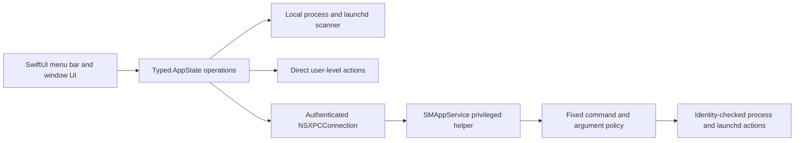

# Milo

Milo is a local-first macOS menu bar utility for finding and controlling unwanted background processes, launch items, Apple Intelligence services, and selected system tuning options. The current **Development Preview** is designed for a complete local demonstration: every Pro capability is unlocked, and scanning and local actions do not depend on an account, Paddle, Supabase, or an internet connection.

> The Development Preview is a signed development build, not a paid production release. Commercial licensing, public updates, notarized distribution, and the Mac App Store Lite funnel remain under development and are documented in [ROADMAP.md](ROADMAP.md).

## What works in the Development Preview

- Live process scanning with CPU and memory measurements.
- Static and locally available signed-rule process detection.
- Exact-process termination with `SIGTERM` followed by bounded `SIGKILL` fallback.
- PID-reuse protection using the executable path and kernel process start time before every signal.
- Launch item inspection and enable/disable controls.
- Memory purge and DNS flush actions.
- Reversible system tuning controls with risk and SIP labels.
- Process whitelist and local usage statistics.
- Menu bar and dedicated-window presentation modes.
- All Pro UI and actions without sign-in, payment, or network licensing.

## Permission model

Milo does **not** install a sudoers rule and does **not** use AppleScript password prompts.

Normal user processes are controlled directly. Actions that genuinely require root use an embedded, separately signed helper registered through Apple's `SMAppService` API. The helper accepts only Milo's signed app, exposes a fixed command policy, rejects shell execution, bounds requests and output, and revalidates process identity itself.

Setup is deliberately one-time and user controlled:

1. Drag `Milo.app` to `/Applications` and open it.
2. Click **Enable** in the background-helper banner.
3. If macOS opens **System Settings → General → Login Items & Extensions**, approve Milo once.
4. Return to Milo. Opening the popover or window refreshes helper status automatically.

If approval is declined, scanning and nonprivileged features remain usable. Milo reports that a system action needs the helper; it never retries registration in a loop and never falls back to repeated password dialogs.

## Build the preview

Requirements:

- macOS 27 Developer Beta 4 or a compatible macOS release.
- Xcode 27 beta at `/Applications/Xcode-beta.app`.
- An Apple Development signing identity for Team `8N738727QB` when testing the helper registration path.

Run:

```bash
Tools/build-development-preview.sh
```

The script performs a clean `Preview` build, verifies the app and helper signatures and identifiers, runs a deterministic six-check preview smoke suite, and creates:

```text
dist/Milo-Development-Preview.dmg
```

It does not install or launch Milo automatically and does not inspect other installed applications.

To build without packaging:

```bash
export DEVELOPER_DIR=/Applications/Xcode-beta.app/Contents/Developer
xcodebuild \
  -workspace Milo.xcworkspace \
  -scheme MiloPro \
  -configuration Preview \
  -destination 'platform=macOS,arch=arm64' \
  build
```

## Verification

The fast local verification spine is:

```bash
export DEVELOPER_DIR=/Applications/Xcode-beta.app/Contents/Developer
swift test
swift test --package-path Packages/MiloKit
xcodebuild \
  -workspace Milo.xcworkspace \
  -scheme MiloPro \
  -configuration Debug \
  -destination 'platform=macOS,arch=arm64' \
  CODE_SIGNING_ALLOWED=NO \
  test
```

The project uses Swift 6 complete concurrency checking, treats compiler warnings as errors, and enforces source-level security regression tests. The generated Xcode project is committed; changes to `project.yml` must be followed by `Tools/generate-xcode-project.sh` and the generated project must be committed with it.

## Architecture



The reusable cryptography, domain, licensing, update-policy, and Sparkle boundaries live in `Packages/MiloKit`. Preview mode keeps the production architecture compiled and testable but makes no backend calls and disables software updates at runtime.

## Interview demo flow

1. Open Milo and point out the explicit **Development Preview** badge.
2. Show that the home screen scans locally and reports failures separately from a clean result.
3. Select a detected non-system target and review the confirmation before termination.
4. Explain the PID/start-time identity check and graceful TERM/KILL sequence.
5. Show the helper banner and Settings status; explain that root actions use one approved helper rather than recurring password prompts.
6. Open **System Tuning** and show reversible controls, SIP locks, and risk levels.
7. Switch between menu bar and dedicated-window modes.
8. Use this README and [ROADMAP.md](ROADMAP.md) to distinguish the working preview from production operations still in progress.

For a predictable interview, use disposable test processes and avoid changing system-level or SIP-gated settings on a presentation machine unless you have rehearsed the exact rollback.

## Repository map

| Path | Responsibility |
|---|---|
| `App/Milo/Runtime` | Pro and Development Preview UI and application coordination |
| `Helper/MiloPrivilegedHelper` | Narrow privileged helper and XPC policy |
| `App/MiloLite` | Sandboxed, read-only Mac App Store prototype |
| `Packages/MiloKit` | Domain, hardening, licensing, update policy, and Sparkle integration |
| `Tests` | Red-team, unit, integration, and UI regression tests |
| `Tools` | Deterministic generation, verification, signing, and packaging tools |
| `July27plan.md` | Full production finalization audit and tracked execution plan |

## Scope and limitations

- Preview licensing is intentionally local and unconditional. It is not DRM and must never be represented as the commercial entitlement system.
- Preview updates are disabled. The DMG must be rebuilt for a new preview.
- The DMG is Apple Development signed for local testing; it is not a Developer ID notarized public release.
- Apple and vendor launchd labels can change. A missing or protected service returns a failure instead of broadening the target match.
- SIP-protected changes remain locked while SIP is enabled. Milo does not disable SIP.
- Some system tuning changes affect Apple features. Review the risk label and use the provided revert action.
- Helper approval is controlled by macOS and cannot be bypassed. Milo can open the correct Settings pane but cannot click approval for the user.

## Product status

The Development Preview is the local, interview-ready product slice. The commercial release is still a separate release program with backend, payment, licensing, update, notarization, clean-machine, security-review, and operational gates. No unfinished commercial component is hidden behind a fake success state.

See [ROADMAP.md](ROADMAP.md) for the timeless product roadmap and [July27plan.md](July27plan.md) for the exhaustive technical plan.
