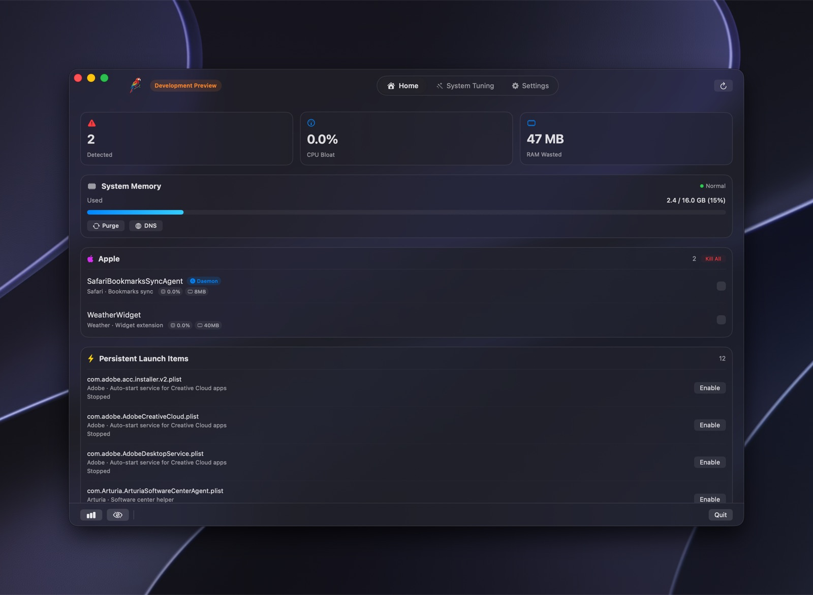
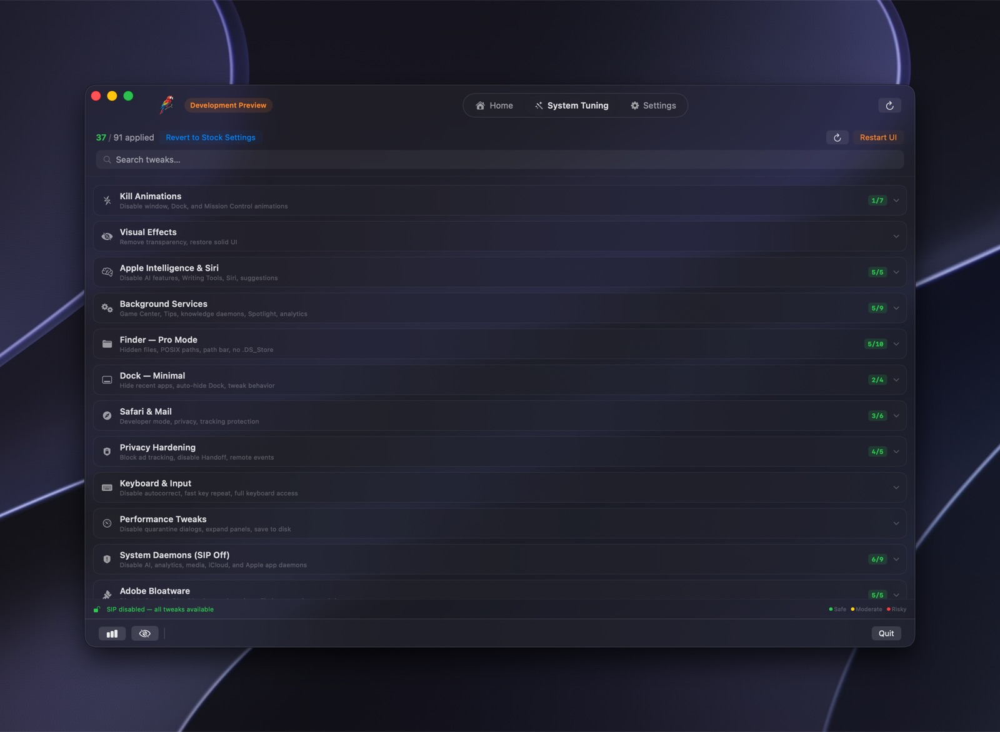
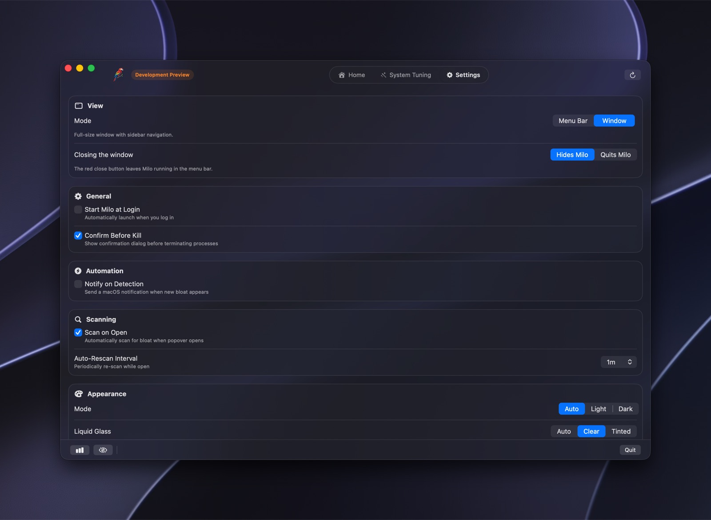
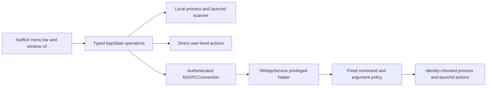

<div align="center">

# Milo

**A local-first macOS utility for taking back control of background processes.**

Milo finds the background processes, launch agents, telemetry daemons, and Apple Intelligence
services running on your Mac, shows you what each one actually costs you in CPU and memory, and
lets you stop the ones you did not ask for.

[](https://github.com/burakoskay/Milo/releases/latest)
[](#building-from-source)
[](#building-from-source)

</div>

<br>

<div align="center">
  
</div>

<br>

> [!IMPORTANT]
> This is a **Development Preview**. It is a signed development build, not a paid release.
> Every local capability is unlocked with no account, payment, or network dependency. It is
> **not notarized**, so macOS will warn on first launch — see [Installing](#installing).
> Commercial licensing, updates, and notarized distribution are tracked in [ROADMAP.md](ROADMAP.md).

## What it does

**Sees what is actually running.** Milo scans for known background processes, telemetry agents,
and launch items, groups them by vendor, and measures each one's real CPU and memory cost.

**Measures CPU honestly.** CPU is sampled the way Activity Monitor does it — by differentiating
cumulative task CPU time across two observations. Tools that read `ps -o %cpu` report a
*lifetime average*, which makes a daemon that was busy at login and has idled for hours look
permanently idle.

**Terminates the exact process you selected.** Every action carries a `ProcessIdentity` — PID,
absolute executable path, and kernel process start time. That identity is revalidated
immediately before `SIGTERM` and again before `SIGKILL`. A PID is not an identity; PIDs get
reused, and Milo will not signal a process whose identity no longer matches.

**Tells the truth about what happened.** If launchd restarts an on-demand agent after Milo
terminates it, that is reported as a restart, not as a failure. It is a different outcome and
calls for a different fix — disabling the launch item rather than killing the process again.

**Asks for one permission, once.** No sudoers rule. No repeated password prompts.

<table>
<tr>
<td width="50%"></td>
<td width="50%"></td>
</tr>
<tr>
<td align="center"><b>System Tuning</b> — reversible tweaks with explicit risk labels and SIP awareness</td>
<td align="center"><b>Settings</b> — menu bar or window mode, both fully featured</td>
</tr>
</table>

## Installing

1. Download the DMG from [Releases](https://github.com/burakoskay/Milo/releases/latest).
2. Drag `Milo.app` to `/Applications` and open it.
3. **First launch will be blocked.** The preview is signed with an Apple Development
   certificate, not a notarized Developer ID certificate, so Gatekeeper will refuse it.
   Right-click the app → **Open** → **Open**, or allow it under
   **System Settings → Privacy & Security**.
4. Milo appears in the menu bar. Scanning works immediately.
5. For system-level actions only, click **Enable** in the background-helper banner once.

Step 3 is expected, not a defect. Notarization is [on the roadmap](ROADMAP.md); until then this
is a build for people who are willing to inspect what they run.

## Permission model

Milo does **not** install a sudoers rule and does **not** use AppleScript password prompts.

Ordinary user processes are signalled directly. Actions that genuinely require root go through
an embedded, separately signed helper registered via Apple's `SMAppService` API. The helper:

- accepts connections only from the signed Milo app, verified by Team ID and signing identifier
- refuses to run if the calling process is root
- exposes a fixed command and argument grammar, with no shell execution anywhere
- bounds request size, output size, and execution deadline
- independently revalidates process identity before every privileged signal

If you decline approval, scanning and all user-level features keep working. Milo reports that a
specific action needs the helper. It never retries registration in a loop.

Apple owns the final approval step. Milo can open the correct Settings pane; it cannot click it
for you, and does not try.

## Architecture



Exactly one presentation surface — the menu bar panel or the dedicated window — owns a SwiftUI
hosting controller at a time. Both roots bind alerts to the same state, so two live hosts would
each present the same confirmation and force the inactive window on screen.

Reusable cryptography, domain, licensing, and update-policy code lives in `Packages/MiloKit`.
Preview builds keep the production architecture compiled and tested but make no backend calls.

| Path | Responsibility |
|---|---|
| `App/Milo/Runtime` | Application UI and coordination |
| `Helper/MiloPrivilegedHelper` | Privileged helper and XPC policy |
| `App/MiloLite` | Sandboxed, read-only App Store prototype |
| `Packages/MiloKit` | Domain, hardening, licensing, update policy |
| `Tests` | Red-team, unit, integration, and UI regression tests |
| `Tools` | Generation, verification, signing, and packaging |

## Building from source

Requires macOS 13.0+ to run; macOS 26/27 and a matching Xcode to build.

```bash
export DEVELOPER_DIR=/Applications/Xcode-beta.app/Contents/Developer
Tools/build-development-preview.sh
```

That performs a clean `Preview` build, verifies app and helper signatures and exact bundle
identifiers, runs a six-check packaged-app smoke suite, and produces
`dist/Milo-Development-Preview.dmg` with a verified checksum.

Verification spine:

```bash
swift test
swift test --package-path Packages/MiloKit
xcodebuild -workspace Milo.xcworkspace -scheme MiloPro -configuration Debug \
  -destination 'platform=macOS,arch=arm64' CODE_SIGNING_ALLOWED=NO test
```

The project uses Swift 6 complete concurrency checking, treats compiler warnings as errors, and
enforces source-level security regression tests — including assertions that the privileged
helper contains no shell invocation and that process identity checks cannot be removed.

`project.yml` is canonical. After editing it, run `Tools/generate-xcode-project.sh` and commit
the regenerated project alongside it.

## Keyboard shortcuts

| Action | Shortcut |
|---|---|
| Rescan now | <kbd>⌘R</kbd> |
| Select all detected | <kbd>⇧⌘A</kbd> |
| Deselect all | <kbd>⇧⌘D</kbd> |
| Kill selected | <kbd>⌘K</kbd> |
| Kill all detected | <kbd>⇧⌘K</kbd> |
| Settings | <kbd>⌘,</kbd> |
| Show Milo | <kbd>⌘0</kbd> |
| Quit | <kbd>⌘Q</kbd> |

Plain <kbd>⌘A</kbd> is deliberately left to the text field editor.

## Scope and limitations

Stated plainly, because a tool that signals processes should not overstate what it knows:

- **Not notarized.** The DMG is Apple Development signed for local use, not a public installer.
- **Preview licensing is unconditional and local.** It is not DRM and must not be described as
  the commercial entitlement system.
- **Updates are disabled** in preview builds. Rebuild or download a new release.
- **SIP-protected changes stay locked** while SIP is enabled. Milo does not disable SIP.
- **launchd-managed agents restart on demand.** Terminating them is temporary by design;
  disabling the launch item is the durable fix.
- **Apple and vendor launchd labels change between releases.** A missing or protected service
  returns a failure rather than broadening the match.
- **Some tuning changes affect Apple features.** Check the risk label and use the revert action.
- **System Tuning has not been validated on clean VMs across every supported macOS release.**

## Roadmap

Commercial licensing, notarized distribution, the Mac App Store Lite funnel, and the reversible
system-tuning matrix are in progress and tracked in **[ROADMAP.md](ROADMAP.md)**. Nothing
unfinished is hidden behind a fake success state in the shipping UI.

## Security

Security policy and reporting: **[SECURITY.md](SECURITY.md)**.

## License

Copyright © monomacaw. All rights reserved.
